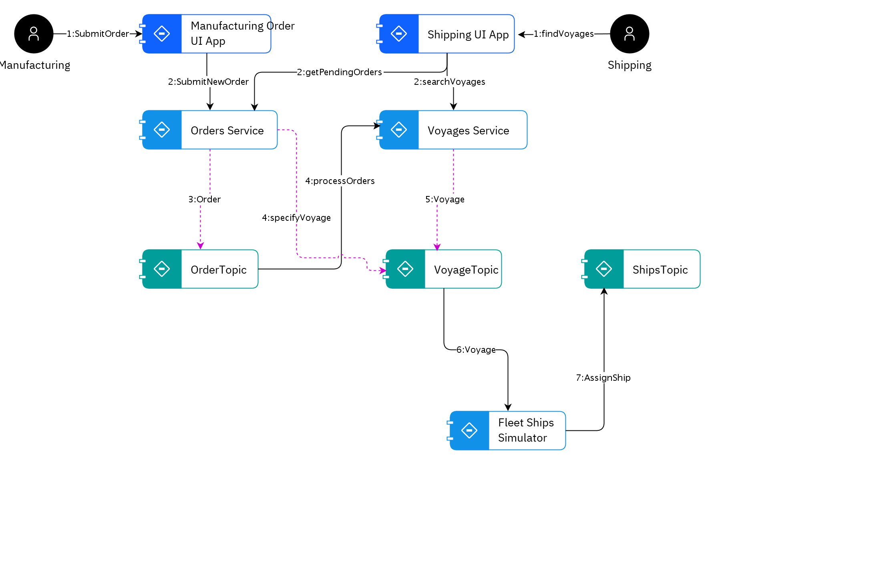

## Diagram

### Name

Event Architecture

### Description

## Element

[Expand all](#){ .md-button .diff-line }

### Actor

    

Manufacturing

<table>
    <caption></caption>
    <thead>
        <tr>
            <th></th>
            <th></th>
        </tr>
    </thead>
    <tr>
        <td> <strong>Name</strong> </td>
        <td>Manufacturing</td>
    </tr>
    <tr>
        <td> <strong>Description</strong> </td>
        <td></td>
    </tr>
    <tr>
        <td> <strong>Type</strong> </td>
        <td>Human</td>
    </tr>
    <tr>
        <td> <strong>Generic Group</strong> </td>
<td>
        
</td>
    </tr>
</table>

    

Shipping

<table>
    <caption></caption>
    <thead>
        <tr>
            <th></th>
            <th></th>
        </tr>
    </thead>
    <tr>
        <td> <strong>Name</strong> </td>
        <td>Shipping</td>
    </tr>
    <tr>
        <td> <strong>Description</strong> </td>
        <td></td>
    </tr>
    <tr>
        <td> <strong>Type</strong> </td>
        <td>Human</td>
    </tr>
    <tr>
        <td> <strong>Generic Group</strong> </td>
<td>
        
</td>
    </tr>
</table>

    

### Subsystem

    

### Logical Component

    

Fleet Ships Simulator

<table>
    <caption></caption>
    <thead>
        <tr>
            <th></th>
            <th></th>
        </tr>
    </thead>
    <tr>
        <td> <strong>Name</strong> </td>
        <td>Fleet Ships Simulator</td>
    </tr>
    <tr>
        <td> <strong>Description</strong> </td>
        <td></td>
    </tr>
</table>

    

Manufacturing Order UI App

<table>
    <caption></caption>
    <thead>
        <tr>
            <th></th>
            <th></th>
        </tr>
    </thead>
    <tr>
        <td> <strong>Name</strong> </td>
        <td>Manufacturing Order UI App</td>
    </tr>
    <tr>
        <td> <strong>Description</strong> </td>
        <td></td>
    </tr>
</table>

    

Orders Service

<table>
    <caption></caption>
    <thead>
        <tr>
            <th></th>
            <th></th>
        </tr>
    </thead>
    <tr>
        <td> <strong>Name</strong> </td>
        <td>Orders Service</td>
    </tr>
    <tr>
        <td> <strong>Description</strong> </td>
        <td></td>
    </tr>
</table>

    

OrderTopic

<table>
    <caption></caption>
    <thead>
        <tr>
            <th></th>
            <th></th>
        </tr>
    </thead>
    <tr>
        <td> <strong>Name</strong> </td>
        <td>OrderTopic</td>
    </tr>
    <tr>
        <td> <strong>Description</strong> </td>
        <td></td>
    </tr>
</table>

    

Shipping UI App

<table>
    <caption></caption>
    <thead>
        <tr>
            <th></th>
            <th></th>
        </tr>
    </thead>
    <tr>
        <td> <strong>Name</strong> </td>
        <td>Shipping UI App</td>
    </tr>
    <tr>
        <td> <strong>Description</strong> </td>
        <td></td>
    </tr>
</table>

    

ShipsTopic

<table>
    <caption></caption>
    <thead>
        <tr>
            <th></th>
            <th></th>
        </tr>
    </thead>
    <tr>
        <td> <strong>Name</strong> </td>
        <td>ShipsTopic</td>
    </tr>
    <tr>
        <td> <strong>Description</strong> </td>
        <td></td>
    </tr>
</table>

    

Voyages Service

<table>
    <caption></caption>
    <thead>
        <tr>
            <th></th>
            <th></th>
        </tr>
    </thead>
    <tr>
        <td> <strong>Name</strong> </td>
        <td>Voyages Service</td>
    </tr>
    <tr>
        <td> <strong>Description</strong> </td>
        <td></td>
    </tr>
</table>

    

VoyageTopic

<table>
    <caption></caption>
    <thead>
        <tr>
            <th></th>
            <th></th>
        </tr>
    </thead>
    <tr>
        <td> <strong>Name</strong> </td>
        <td>VoyageTopic</td>
    </tr>
    <tr>
        <td> <strong>Description</strong> </td>
        <td></td>
    </tr>
</table>

    

### Component Event

    

AssignShip

<table>
    <caption></caption>
    <thead>
        <tr>
            <th></th>
            <th></th>
        </tr>
    </thead>
    <tr>
        <td> <strong>Name</strong> </td>
        <td>AssignShip</td>
    </tr>
    <tr>
        <td> <strong>Description</strong> </td>
        <td></td>
    </tr>
    <tr>
        <td> <strong>Number</strong> </td>
        <td>7</td>
    </tr>
</table>

    

findVoyages

<table>
    <caption></caption>
    <thead>
        <tr>
            <th></th>
            <th></th>
        </tr>
    </thead>
    <tr>
        <td> <strong>Name</strong> </td>
        <td>findVoyages</td>
    </tr>
    <tr>
        <td> <strong>Description</strong> </td>
        <td></td>
    </tr>
    <tr>
        <td> <strong>Number</strong> </td>
        <td>1</td>
    </tr>
</table>

    

getPendingOrders

<table>
    <caption></caption>
    <thead>
        <tr>
            <th></th>
            <th></th>
        </tr>
    </thead>
    <tr>
        <td> <strong>Name</strong> </td>
        <td>getPendingOrders</td>
    </tr>
    <tr>
        <td> <strong>Description</strong> </td>
        <td></td>
    </tr>
    <tr>
        <td> <strong>Number</strong> </td>
        <td>2</td>
    </tr>
</table>

    

Order

<table>
    <caption></caption>
    <thead>
        <tr>
            <th></th>
            <th></th>
        </tr>
    </thead>
    <tr>
        <td> <strong>Name</strong> </td>
        <td>Order</td>
    </tr>
    <tr>
        <td> <strong>Description</strong> </td>
        <td></td>
    </tr>
    <tr>
        <td> <strong>Number</strong> </td>
        <td>3</td>
    </tr>
</table>

    

processOrders

<table>
    <caption></caption>
    <thead>
        <tr>
            <th></th>
            <th></th>
        </tr>
    </thead>
    <tr>
        <td> <strong>Name</strong> </td>
        <td>processOrders</td>
    </tr>
    <tr>
        <td> <strong>Description</strong> </td>
        <td></td>
    </tr>
    <tr>
        <td> <strong>Number</strong> </td>
        <td>4</td>
    </tr>
</table>

    

searchVoyages

<table>
    <caption></caption>
    <thead>
        <tr>
            <th></th>
            <th></th>
        </tr>
    </thead>
    <tr>
        <td> <strong>Name</strong> </td>
        <td>searchVoyages</td>
    </tr>
    <tr>
        <td> <strong>Description</strong> </td>
        <td></td>
    </tr>
    <tr>
        <td> <strong>Number</strong> </td>
        <td>2</td>
    </tr>
</table>

    

specifyVoyage

<table>
    <caption></caption>
    <thead>
        <tr>
            <th></th>
            <th></th>
        </tr>
    </thead>
    <tr>
        <td> <strong>Name</strong> </td>
        <td>specifyVoyage</td>
    </tr>
    <tr>
        <td> <strong>Description</strong> </td>
        <td></td>
    </tr>
    <tr>
        <td> <strong>Number</strong> </td>
        <td>4</td>
    </tr>
</table>

    

SubmitNewOrder

<table>
    <caption></caption>
    <thead>
        <tr>
            <th></th>
            <th></th>
        </tr>
    </thead>
    <tr>
        <td> <strong>Name</strong> </td>
        <td>SubmitNewOrder</td>
    </tr>
    <tr>
        <td> <strong>Description</strong> </td>
        <td></td>
    </tr>
    <tr>
        <td> <strong>Number</strong> </td>
        <td>2</td>
    </tr>
</table>

    

SubmitOrder

<table>
    <caption></caption>
    <thead>
        <tr>
            <th></th>
            <th></th>
        </tr>
    </thead>
    <tr>
        <td> <strong>Name</strong> </td>
        <td>SubmitOrder</td>
    </tr>
    <tr>
        <td> <strong>Description</strong> </td>
        <td></td>
    </tr>
    <tr>
        <td> <strong>Number</strong> </td>
        <td>1</td>
    </tr>
</table>

    

Voyage

<table>
    <caption></caption>
    <thead>
        <tr>
            <th></th>
            <th></th>
        </tr>
    </thead>
    <tr>
        <td> <strong>Name</strong> </td>
        <td>Voyage</td>
    </tr>
    <tr>
        <td> <strong>Description</strong> </td>
        <td></td>
    </tr>
    <tr>
        <td> <strong>Number</strong> </td>
        <td>5</td>
    </tr>
</table>

    

Voyage

<table>
    <caption></caption>
    <thead>
        <tr>
            <th></th>
            <th></th>
        </tr>
    </thead>
    <tr>
        <td> <strong>Name</strong> </td>
        <td>Voyage</td>
    </tr>
    <tr>
        <td> <strong>Description</strong> </td>
        <td></td>
    </tr>
    <tr>
        <td> <strong>Number</strong> </td>
        <td>6</td>
    </tr>
</table>

    

