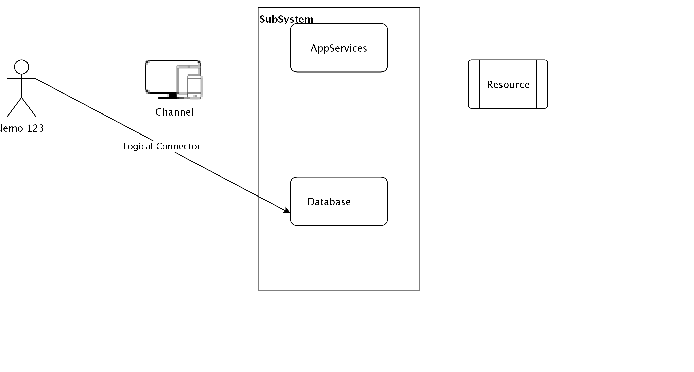

## Diagram

### Name

My Enterprise View

### Description

## Element

[Expand all](#){ .md-button .diff-line }

### Actor

    

demo 123

<table>
    <caption></caption>
    <thead>
        <tr>
            <th></th>
            <th></th>
        </tr>
    </thead>
    <tr>
        <td> <strong>Name</strong> </td>
        <td>demo 123</td>
    </tr>
    <tr>
        <td> <strong>Description</strong> </td>
        <td>All about demo123</td>
    </tr>
    <tr>
        <td> <strong>Type</strong> </td>
        <td>Human</td>
    </tr>
    <tr>
        <td> <strong>Generic Group</strong> </td>
<td>
        
</td>
    </tr>
</table>

    

### Subsystem

    

SubSystem

<table>
    <caption></caption>
    <thead>
        <tr>
            <th></th>
            <th></th>
        </tr>
    </thead>
    <tr>
        <td> <strong>Name</strong> </td>
        <td>SubSystem</td>
    </tr>
    <tr>
        <td> <strong>Description</strong> </td>
        <td></td>
    </tr>
</table>

    

### Logical Component

    

AppServices

<table>
    <caption></caption>
    <thead>
        <tr>
            <th></th>
            <th></th>
        </tr>
    </thead>
    <tr>
        <td> <strong>Name</strong> </td>
        <td>AppServices</td>
    </tr>
    <tr>
        <td> <strong>Description</strong> </td>
        <td></td>
    </tr>
</table>

    

AppServices2

<table>
    <caption></caption>
    <thead>
        <tr>
            <th></th>
            <th></th>
        </tr>
    </thead>
    <tr>
        <td> <strong>Name</strong> </td>
        <td>AppServices2</td>
    </tr>
    <tr>
        <td> <strong>Description</strong> </td>
        <td></td>
    </tr>
</table>

    

Channel

<table>
    <caption></caption>
    <thead>
        <tr>
            <th></th>
            <th></th>
        </tr>
    </thead>
    <tr>
        <td> <strong>Name</strong> </td>
        <td>Channel</td>
    </tr>
    <tr>
        <td> <strong>Description</strong> </td>
        <td></td>
    </tr>
</table>

    

Resource

<table>
    <caption></caption>
    <thead>
        <tr>
            <th></th>
            <th></th>
        </tr>
    </thead>
    <tr>
        <td> <strong>Name</strong> </td>
        <td>Resource</td>
    </tr>
    <tr>
        <td> <strong>Description</strong> </td>
        <td></td>
    </tr>
</table>

    

### Logical Connector

    

Logical Connector

<table>
    <caption></caption>
    <thead>
        <tr>
            <th></th>
            <th></th>
        </tr>
    </thead>
    <tr>
        <td> <strong>Name</strong> </td>
        <td>Logical Connector</td>
    </tr>
    <tr>
        <td> <strong>Description</strong> </td>
        <td></td>
    </tr>
</table>

    

