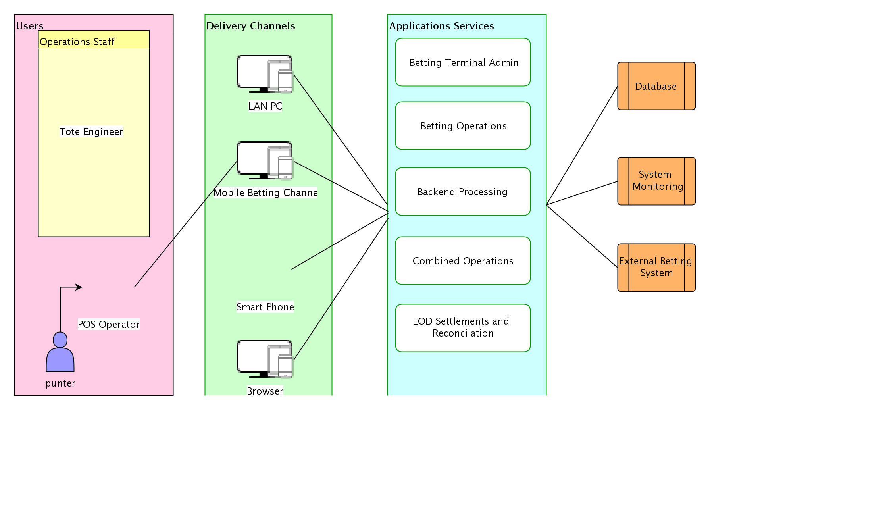

## Diagram

### Name

A sample Enterprise View

### Description

## Element

[Expand all](#){ .md-button .diff-line }

### Actor

    

POS Operator

<table>
    <caption></caption>
    <thead>
        <tr>
            <th></th>
            <th></th>
        </tr>
    </thead>
    <tr>
        <td> <strong>Name</strong> </td>
        <td>POS Operator</td>
    </tr>
    <tr>
        <td> <strong>Description</strong> </td>
        <td></td>
    </tr>
    <tr>
        <td> <strong>Type</strong> </td>
        <td>Human</td>
    </tr>
    <tr>
        <td> <strong>Generic Group</strong> </td>
<td>
        
</td>
    </tr>
</table>

    

punter

<table>
    <caption></caption>
    <thead>
        <tr>
            <th></th>
            <th></th>
        </tr>
    </thead>
    <tr>
        <td> <strong>Name</strong> </td>
        <td>punter</td>
    </tr>
    <tr>
        <td> <strong>Description</strong> </td>
        <td></td>
    </tr>
    <tr>
        <td> <strong>Type</strong> </td>
        <td>Human</td>
    </tr>
    <tr>
        <td> <strong>Generic Group</strong> </td>
<td>
        
</td>
    </tr>
</table>

    

Race Day Staff

<table>
    <caption></caption>
    <thead>
        <tr>
            <th></th>
            <th></th>
        </tr>
    </thead>
    <tr>
        <td> <strong>Name</strong> </td>
        <td>Race Day Staff</td>
    </tr>
    <tr>
        <td> <strong>Description</strong> </td>
        <td></td>
    </tr>
    <tr>
        <td> <strong>Type</strong> </td>
        <td>Human</td>
    </tr>
    <tr>
        <td> <strong>Generic Group</strong> </td>
<td>
        
</td>
    </tr>
</table>

    

Smart Phone

<table>
    <caption></caption>
    <thead>
        <tr>
            <th></th>
            <th></th>
        </tr>
    </thead>
    <tr>
        <td> <strong>Name</strong> </td>
        <td>Smart Phone</td>
    </tr>
    <tr>
        <td> <strong>Description</strong> </td>
        <td></td>
    </tr>
    <tr>
        <td> <strong>Type</strong> </td>
        <td>Human</td>
    </tr>
    <tr>
        <td> <strong>Generic Group</strong> </td>
<td>
        
</td>
    </tr>
</table>

    

Tote Engineer

<table>
    <caption></caption>
    <thead>
        <tr>
            <th></th>
            <th></th>
        </tr>
    </thead>
    <tr>
        <td> <strong>Name</strong> </td>
        <td>Tote Engineer</td>
    </tr>
    <tr>
        <td> <strong>Description</strong> </td>
        <td></td>
    </tr>
    <tr>
        <td> <strong>Type</strong> </td>
        <td>Human</td>
    </tr>
    <tr>
        <td> <strong>Generic Group</strong> </td>
<td>
        
</td>
    </tr>
</table>

    

### Subsystem

    

Applications Services

<table>
    <caption></caption>
    <thead>
        <tr>
            <th></th>
            <th></th>
        </tr>
    </thead>
    <tr>
        <td> <strong>Name</strong> </td>
        <td>Applications Services</td>
    </tr>
    <tr>
        <td> <strong>Description</strong> </td>
        <td></td>
    </tr>
</table>

    

Delivery Channels

<table>
    <caption></caption>
    <thead>
        <tr>
            <th></th>
            <th></th>
        </tr>
    </thead>
    <tr>
        <td> <strong>Name</strong> </td>
        <td>Delivery Channels</td>
    </tr>
    <tr>
        <td> <strong>Description</strong> </td>
        <td></td>
    </tr>
</table>

    

Operations Staff

<table>
    <caption></caption>
    <thead>
        <tr>
            <th></th>
            <th></th>
        </tr>
    </thead>
    <tr>
        <td> <strong>Name</strong> </td>
        <td>Operations Staff</td>
    </tr>
    <tr>
        <td> <strong>Description</strong> </td>
        <td></td>
    </tr>
</table>

    

Users

<table>
    <caption></caption>
    <thead>
        <tr>
            <th></th>
            <th></th>
        </tr>
    </thead>
    <tr>
        <td> <strong>Name</strong> </td>
        <td>Users</td>
    </tr>
    <tr>
        <td> <strong>Description</strong> </td>
        <td></td>
    </tr>
</table>

    

### Logical Component

    

Combined Operations

<table>
    <caption></caption>
    <thead>
        <tr>
            <th></th>
            <th></th>
        </tr>
    </thead>
    <tr>
        <td> <strong>Name</strong> </td>
        <td>Combined Operations</td>
    </tr>
    <tr>
        <td> <strong>Description</strong> </td>
        <td></td>
    </tr>
</table>

    

EOD Settlements and Reconcilation

<table>
    <caption></caption>
    <thead>
        <tr>
            <th></th>
            <th></th>
        </tr>
    </thead>
    <tr>
        <td> <strong>Name</strong> </td>
        <td>EOD Settlements and Reconcilation</td>
    </tr>
    <tr>
        <td> <strong>Description</strong> </td>
        <td></td>
    </tr>
</table>

    

Backend Processing

<table>
    <caption></caption>
    <thead>
        <tr>
            <th></th>
            <th></th>
        </tr>
    </thead>
    <tr>
        <td> <strong>Name</strong> </td>
        <td>Backend Processing</td>
    </tr>
    <tr>
        <td> <strong>Description</strong> </td>
        <td></td>
    </tr>
</table>

    

Betting Operations

<table>
    <caption></caption>
    <thead>
        <tr>
            <th></th>
            <th></th>
        </tr>
    </thead>
    <tr>
        <td> <strong>Name</strong> </td>
        <td>Betting Operations</td>
    </tr>
    <tr>
        <td> <strong>Description</strong> </td>
        <td></td>
    </tr>
</table>

    

Betting Terminal Admin

<table>
    <caption></caption>
    <thead>
        <tr>
            <th></th>
            <th></th>
        </tr>
    </thead>
    <tr>
        <td> <strong>Name</strong> </td>
        <td>Betting Terminal Admin</td>
    </tr>
    <tr>
        <td> <strong>Description</strong> </td>
        <td></td>
    </tr>
</table>

    

Browser

<table>
    <caption></caption>
    <thead>
        <tr>
            <th></th>
            <th></th>
        </tr>
    </thead>
    <tr>
        <td> <strong>Name</strong> </td>
        <td>Browser</td>
    </tr>
    <tr>
        <td> <strong>Description</strong> </td>
        <td></td>
    </tr>
</table>

    

Database

<table>
    <caption></caption>
    <thead>
        <tr>
            <th></th>
            <th></th>
        </tr>
    </thead>
    <tr>
        <td> <strong>Name</strong> </td>
        <td>Database</td>
    </tr>
    <tr>
        <td> <strong>Description</strong> </td>
        <td></td>
    </tr>
</table>

    

External Betting System

<table>
    <caption></caption>
    <thead>
        <tr>
            <th></th>
            <th></th>
        </tr>
    </thead>
    <tr>
        <td> <strong>Name</strong> </td>
        <td>External Betting System</td>
    </tr>
    <tr>
        <td> <strong>Description</strong> </td>
        <td></td>
    </tr>
</table>

    

LAN PC

<table>
    <caption></caption>
    <thead>
        <tr>
            <th></th>
            <th></th>
        </tr>
    </thead>
    <tr>
        <td> <strong>Name</strong> </td>
        <td>LAN PC</td>
    </tr>
    <tr>
        <td> <strong>Description</strong> </td>
        <td></td>
    </tr>
</table>

    

Mobile Betting Channel

<table>
    <caption></caption>
    <thead>
        <tr>
            <th></th>
            <th></th>
        </tr>
    </thead>
    <tr>
        <td> <strong>Name</strong> </td>
        <td>Mobile Betting Channel</td>
    </tr>
    <tr>
        <td> <strong>Description</strong> </td>
        <td></td>
    </tr>
</table>

    

System Monitoring

<table>
    <caption></caption>
    <thead>
        <tr>
            <th></th>
            <th></th>
        </tr>
    </thead>
    <tr>
        <td> <strong>Name</strong> </td>
        <td>System Monitoring</td>
    </tr>
    <tr>
        <td> <strong>Description</strong> </td>
        <td></td>
    </tr>
</table>

    

### Logical Connector

    

<table>
    <caption></caption>
    <thead>
        <tr>
            <th></th>
            <th></th>
        </tr>
    </thead>
    <tr>
        <td> <strong>Name</strong> </td>
        <td></td>
    </tr>
    <tr>
        <td> <strong>Description</strong> </td>
        <td></td>
    </tr>
</table>

    

<table>
    <caption></caption>
    <thead>
        <tr>
            <th></th>
            <th></th>
        </tr>
    </thead>
    <tr>
        <td> <strong>Name</strong> </td>
        <td></td>
    </tr>
    <tr>
        <td> <strong>Description</strong> </td>
        <td></td>
    </tr>
</table>

    

<table>
    <caption></caption>
    <thead>
        <tr>
            <th></th>
            <th></th>
        </tr>
    </thead>
    <tr>
        <td> <strong>Name</strong> </td>
        <td></td>
    </tr>
    <tr>
        <td> <strong>Description</strong> </td>
        <td></td>
    </tr>
</table>

    

<table>
    <caption></caption>
    <thead>
        <tr>
            <th></th>
            <th></th>
        </tr>
    </thead>
    <tr>
        <td> <strong>Name</strong> </td>
        <td></td>
    </tr>
    <tr>
        <td> <strong>Description</strong> </td>
        <td></td>
    </tr>
</table>

    

<table>
    <caption></caption>
    <thead>
        <tr>
            <th></th>
            <th></th>
        </tr>
    </thead>
    <tr>
        <td> <strong>Name</strong> </td>
        <td></td>
    </tr>
    <tr>
        <td> <strong>Description</strong> </td>
        <td></td>
    </tr>
</table>

    

<table>
    <caption></caption>
    <thead>
        <tr>
            <th></th>
            <th></th>
        </tr>
    </thead>
    <tr>
        <td> <strong>Name</strong> </td>
        <td></td>
    </tr>
    <tr>
        <td> <strong>Description</strong> </td>
        <td></td>
    </tr>
</table>

    

<table>
    <caption></caption>
    <thead>
        <tr>
            <th></th>
            <th></th>
        </tr>
    </thead>
    <tr>
        <td> <strong>Name</strong> </td>
        <td></td>
    </tr>
    <tr>
        <td> <strong>Description</strong> </td>
        <td></td>
    </tr>
</table>

    

<table>
    <caption></caption>
    <thead>
        <tr>
            <th></th>
            <th></th>
        </tr>
    </thead>
    <tr>
        <td> <strong>Name</strong> </td>
        <td></td>
    </tr>
    <tr>
        <td> <strong>Description</strong> </td>
        <td></td>
    </tr>
</table>

    

<table>
    <caption></caption>
    <thead>
        <tr>
            <th></th>
            <th></th>
        </tr>
    </thead>
    <tr>
        <td> <strong>Name</strong> </td>
        <td></td>
    </tr>
    <tr>
        <td> <strong>Description</strong> </td>
        <td></td>
    </tr>
</table>

    

