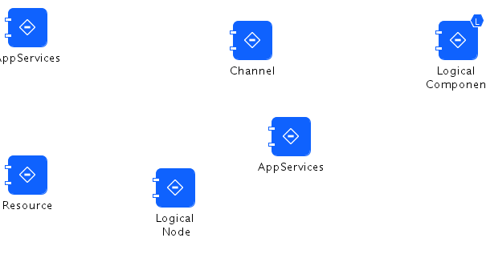

## Diagram

### Name

ev

### Description

### Reference(s)

## Element

[Expand all](#){ .md-button .diff-line }

### Actor

    

### Subsystem

    

### Logical Component

    

AppServices

<table>
    <caption></caption>
    <thead>
        <tr>
            <th></th>
            <th></th>
        </tr>
    </thead>
    <tr>
        <td> <strong>Name</strong> </td>
        <td>AppServices</td>
    </tr>
    <tr>
        <td> <strong>Description</strong> </td>
        <td></td>
    </tr>
    
</table>

    

Channel

<table>
    <caption></caption>
    <thead>
        <tr>
            <th></th>
            <th></th>
        </tr>
    </thead>
    <tr>
        <td> <strong>Name</strong> </td>
        <td>Channel</td>
    </tr>
    <tr>
        <td> <strong>Description</strong> </td>
        <td></td>
    </tr>
    
</table>

    

Logical Component

<table>
    <caption></caption>
    <thead>
        <tr>
            <th></th>
            <th></th>
        </tr>
    </thead>
    <tr>
        <td> <strong>Name</strong> </td>
        <td>Logical Component</td>
    </tr>
    <tr>
        <td> <strong>Description</strong> </td>
        <td></td>
    </tr>
    
    <tr>
        <td> <strong>Sub-Diagram</strong> </td>
        
        <td><a href="../../Services View/aodservices_3JVEqLReVhl">
                Logical Component : lc-1
        </a></td>
        
        
    </tr>
    
</table>

    

Logical Node

<table>
    <caption></caption>
    <thead>
        <tr>
            <th></th>
            <th></th>
        </tr>
    </thead>
    <tr>
        <td> <strong>Name</strong> </td>
        <td>Logical Node</td>
    </tr>
    <tr>
        <td> <strong>Description</strong> </td>
        <td></td>
    </tr>
    
</table>

    

Resource

<table>
    <caption></caption>
    <thead>
        <tr>
            <th></th>
            <th></th>
        </tr>
    </thead>
    <tr>
        <td> <strong>Name</strong> </td>
        <td>Resource</td>
    </tr>
    <tr>
        <td> <strong>Description</strong> </td>
        <td></td>
    </tr>
    
</table>

    

### Logical Connector

    

