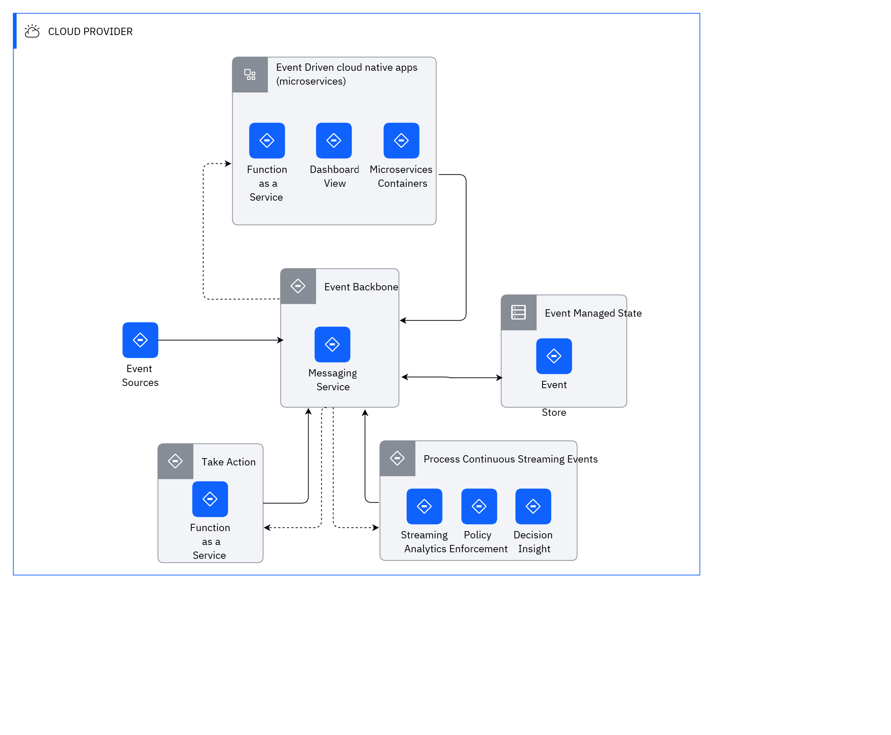

## Diagram

### Name

Event Driven RA

### Description

## Element

[Expand all](#){ .md-button .diff-line }

### Actor

    

### Subsystem

    

### Location

    

CLOUD PROVIDER

<table>
    <caption></caption>
    <thead>
        <tr>
            <th></th>
            <th></th>
        </tr>
    </thead>
    <tr>
        <td> <strong>Name</strong> </td>
        <td>CLOUD PROVIDER</td>
    </tr>
    <tr>
        <td> <strong>Description</strong> </td>
        <td></td>
    </tr>
</table>

    

### Logical Connection

    

<table>
    <caption></caption>
    <thead>
        <tr>
            <th></th>
            <th></th>
        </tr>
    </thead>
    <tr>
        <td> <strong>Name</strong> </td>
        <td></td>
    </tr>
    <tr>
        <td> <strong>Description</strong> </td>
        <td></td>
    </tr>
</table>

    

<table>
    <caption></caption>
    <thead>
        <tr>
            <th></th>
            <th></th>
        </tr>
    </thead>
    <tr>
        <td> <strong>Name</strong> </td>
        <td></td>
    </tr>
    <tr>
        <td> <strong>Description</strong> </td>
        <td></td>
    </tr>
</table>

    

<table>
    <caption></caption>
    <thead>
        <tr>
            <th></th>
            <th></th>
        </tr>
    </thead>
    <tr>
        <td> <strong>Name</strong> </td>
        <td></td>
    </tr>
    <tr>
        <td> <strong>Description</strong> </td>
        <td></td>
    </tr>
</table>

    

<table>
    <caption></caption>
    <thead>
        <tr>
            <th></th>
            <th></th>
        </tr>
    </thead>
    <tr>
        <td> <strong>Name</strong> </td>
        <td></td>
    </tr>
    <tr>
        <td> <strong>Description</strong> </td>
        <td></td>
    </tr>
</table>

    

<table>
    <caption></caption>
    <thead>
        <tr>
            <th></th>
            <th></th>
        </tr>
    </thead>
    <tr>
        <td> <strong>Name</strong> </td>
        <td></td>
    </tr>
    <tr>
        <td> <strong>Description</strong> </td>
        <td></td>
    </tr>
</table>

    

<table>
    <caption></caption>
    <thead>
        <tr>
            <th></th>
            <th></th>
        </tr>
    </thead>
    <tr>
        <td> <strong>Name</strong> </td>
        <td></td>
    </tr>
    <tr>
        <td> <strong>Description</strong> </td>
        <td></td>
    </tr>
</table>

    

<table>
    <caption></caption>
    <thead>
        <tr>
            <th></th>
            <th></th>
        </tr>
    </thead>
    <tr>
        <td> <strong>Name</strong> </td>
        <td></td>
    </tr>
    <tr>
        <td> <strong>Description</strong> </td>
        <td></td>
    </tr>
</table>

    

<table>
    <caption></caption>
    <thead>
        <tr>
            <th></th>
            <th></th>
        </tr>
    </thead>
    <tr>
        <td> <strong>Name</strong> </td>
        <td></td>
    </tr>
    <tr>
        <td> <strong>Description</strong> </td>
        <td></td>
    </tr>
</table>

    

### Logical Node

    

Dashboard View

<table>
    <caption></caption>
    <thead>
        <tr>
            <th></th>
            <th></th>
        </tr>
    </thead>
    <tr>
        <td> <strong>Name</strong> </td>
        <td>Dashboard View</td>
    </tr>
    <tr>
        <td> <strong>Description</strong> </td>
        <td></td>
    </tr>
    <tr>
        <td> <strong>Type</strong> </td>
        <td></td>
    </tr>
    <tr>
        <td> <strong>Primary Capability</strong> </td>
        <td>
            
        </td>
    </tr>
    <tr>
        <td> <strong>Implementation</strong> </td>
        <td>
            
        </td>
    </tr>
    <tr>
        <td> <strong>Architectural Decision</strong> </td>
        <td>
            
        </td>
    </tr>
    <tr>
        <td> <strong>Non Functional Requirement</strong> </td>
        <td>
            
        </td>
    </tr>
    <tr>
        <td> <strong>Generic Group</strong> </td>
        <td></td>
    </tr>
    <tr>
        <td> <strong>Sub-level Diagram</strong> </td>
        <td></td>
    </tr>
    <tr>
        <td> <strong>Related Diagrams</strong> </td>
        <td>
            
                
<a href="../../Usage Scenario/aodusagescenario_2Pehk6XxmV6_B18mG8_Wo">Event Based Usage Scenario</a>

            
                
<a href="../../Usage Scenario/aodusagescenario_3q5EeNfusXH_B18mG8_Wo">walkthrough EDA</a>

            
                
<a href="../../Usage Scenario/aodusagescenario_2YxgcceseZC_B18mG8_Wo">EDA example 2</a>

            
                
<a href="../../IT System View/aoditsystem_2Pc2gosPNmm_B18mG8_Wo">Event Driven RA</a>

            
        </td>
    </tr>
    <tr>
        <td> <strong>Related Elements</strong> </td>
        <td>
            
            
        </td>
    </tr>
</table>

    

Decision Insight

<table>
    <caption></caption>
    <thead>
        <tr>
            <th></th>
            <th></th>
        </tr>
    </thead>
    <tr>
        <td> <strong>Name</strong> </td>
        <td>Decision Insight</td>
    </tr>
    <tr>
        <td> <strong>Description</strong> </td>
        <td></td>
    </tr>
    <tr>
        <td> <strong>Type</strong> </td>
        <td></td>
    </tr>
    <tr>
        <td> <strong>Primary Capability</strong> </td>
        <td>
            
        </td>
    </tr>
    <tr>
        <td> <strong>Implementation</strong> </td>
        <td>
            
        </td>
    </tr>
    <tr>
        <td> <strong>Architectural Decision</strong> </td>
        <td>
            
        </td>
    </tr>
    <tr>
        <td> <strong>Non Functional Requirement</strong> </td>
        <td>
            
        </td>
    </tr>
    <tr>
        <td> <strong>Generic Group</strong> </td>
        <td></td>
    </tr>
    <tr>
        <td> <strong>Sub-level Diagram</strong> </td>
        <td></td>
    </tr>
    <tr>
        <td> <strong>Related Diagrams</strong> </td>
        <td>
            
                
<a href="../../Usage Scenario/aodusagescenario_2Pehk6XxmV6_B18mG8_Wo">Event Based Usage Scenario</a>

            
                
<a href="../../Usage Scenario/aodusagescenario_3q5EeNfusXH_B18mG8_Wo">walkthrough EDA</a>

            
                
<a href="../../Usage Scenario/aodusagescenario_2YxgcceseZC_B18mG8_Wo">EDA example 2</a>

            
                
<a href="../../IT System View/aoditsystem_2Pc2gosPNmm_B18mG8_Wo">Event Driven RA</a>

            
        </td>
    </tr>
    <tr>
        <td> <strong>Related Elements</strong> </td>
        <td>
            
            
        </td>
    </tr>
</table>

    

Event Backbone

<table>
    <caption></caption>
    <thead>
        <tr>
            <th></th>
            <th></th>
        </tr>
    </thead>
    <tr>
        <td> <strong>Name</strong> </td>
        <td>Event Backbone</td>
    </tr>
    <tr>
        <td> <strong>Description</strong> </td>
        <td></td>
    </tr>
    <tr>
        <td> <strong>Type</strong> </td>
        <td></td>
    </tr>
    <tr>
        <td> <strong>Primary Capability</strong> </td>
        <td>
            
        </td>
    </tr>
    <tr>
        <td> <strong>Implementation</strong> </td>
        <td>
            
        </td>
    </tr>
    <tr>
        <td> <strong>Architectural Decision</strong> </td>
        <td>
            
        </td>
    </tr>
    <tr>
        <td> <strong>Non Functional Requirement</strong> </td>
        <td>
            
        </td>
    </tr>
    <tr>
        <td> <strong>Generic Group</strong> </td>
        <td>
                
                
<strong>Tier,tier1</strong>[User-Defined]

                
Tier 1 stuff

                
            </td>
    </tr>
    <tr>
        <td> <strong>Sub-level Diagram</strong> </td>
        <td></td>
    </tr>
    <tr>
        <td> <strong>Related Diagrams</strong> </td>
        <td>
            
                
<a href="../../Usage Scenario/aodusagescenario_2Pehk6XxmV6_B18mG8_Wo">Event Based Usage Scenario</a>

            
                
<a href="../../Usage Scenario/aodusagescenario_3q5EeNfusXH_B18mG8_Wo">walkthrough EDA</a>

            
                
<a href="../../Usage Scenario/aodusagescenario_2YxgcceseZC_B18mG8_Wo">EDA example 2</a>

            
                
<a href="../../IT System View/aoditsystem_2Pc2gosPNmm_B18mG8_Wo">Event Driven RA</a>

            
        </td>
    </tr>
    <tr>
        <td> <strong>Related Elements</strong> </td>
        <td>
            
            
        </td>
    </tr>
</table>

    

Event Driven cloud native apps (microservices)

<table>
    <caption></caption>
    <thead>
        <tr>
            <th></th>
            <th></th>
        </tr>
    </thead>
    <tr>
        <td> <strong>Name</strong> </td>
        <td>Event Driven cloud native apps (microservices)</td>
    </tr>
    <tr>
        <td> <strong>Description</strong> </td>
        <td></td>
    </tr>
    <tr>
        <td> <strong>Type</strong> </td>
        <td></td>
    </tr>
    <tr>
        <td> <strong>Primary Capability</strong> </td>
        <td>
            
        </td>
    </tr>
    <tr>
        <td> <strong>Implementation</strong> </td>
        <td>
            
        </td>
    </tr>
    <tr>
        <td> <strong>Architectural Decision</strong> </td>
        <td>
            
        </td>
    </tr>
    <tr>
        <td> <strong>Non Functional Requirement</strong> </td>
        <td>
            
        </td>
    </tr>
    <tr>
        <td> <strong>Generic Group</strong> </td>
        <td>
                
                
<strong>Tier,tier2</strong>[User-Defined]

                
Tier2 stuff

                
            </td>
    </tr>
    <tr>
        <td> <strong>Sub-level Diagram</strong> </td>
        <td></td>
    </tr>
    <tr>
        <td> <strong>Related Diagrams</strong> </td>
        <td>
            
                
<a href="../../Usage Scenario/aodusagescenario_2Pehk6XxmV6_B18mG8_Wo">Event Based Usage Scenario</a>

            
                
<a href="../../Usage Scenario/aodusagescenario_3q5EeNfusXH_B18mG8_Wo">walkthrough EDA</a>

            
                
<a href="../../Usage Scenario/aodusagescenario_2YxgcceseZC_B18mG8_Wo">EDA example 2</a>

            
                
<a href="../../IT System View/aoditsystem_2Pc2gosPNmm_B18mG8_Wo">Event Driven RA</a>

            
                
<a href="../../IT System View/aoditsystem_34XIsXb9za1_B18mG8_Wo">Visualization Paper</a>

            
        </td>
    </tr>
    <tr>
        <td> <strong>Related Elements</strong> </td>
        <td>
            
            
        </td>
    </tr>
</table>

    

Event Managed State

<table>
    <caption></caption>
    <thead>
        <tr>
            <th></th>
            <th></th>
        </tr>
    </thead>
    <tr>
        <td> <strong>Name</strong> </td>
        <td>Event Managed State</td>
    </tr>
    <tr>
        <td> <strong>Description</strong> </td>
        <td></td>
    </tr>
    <tr>
        <td> <strong>Type</strong> </td>
        <td></td>
    </tr>
    <tr>
        <td> <strong>Primary Capability</strong> </td>
        <td>
            
        </td>
    </tr>
    <tr>
        <td> <strong>Implementation</strong> </td>
        <td>
            
        </td>
    </tr>
    <tr>
        <td> <strong>Architectural Decision</strong> </td>
        <td>
            
        </td>
    </tr>
    <tr>
        <td> <strong>Non Functional Requirement</strong> </td>
        <td>
            
        </td>
    </tr>
    <tr>
        <td> <strong>Generic Group</strong> </td>
        <td>
                
                
<strong>Tier,tier2</strong>[User-Defined]

                
Tier2 stuff

                
            </td>
    </tr>
    <tr>
        <td> <strong>Sub-level Diagram</strong> </td>
        <td></td>
    </tr>
    <tr>
        <td> <strong>Related Diagrams</strong> </td>
        <td>
            
                
<a href="../../Usage Scenario/aodusagescenario_2Pehk6XxmV6_B18mG8_Wo">Event Based Usage Scenario</a>

            
                
<a href="../../Usage Scenario/aodusagescenario_3q5EeNfusXH_B18mG8_Wo">walkthrough EDA</a>

            
                
<a href="../../Usage Scenario/aodusagescenario_2YxgcceseZC_B18mG8_Wo">EDA example 2</a>

            
                
<a href="../../IT System View/aoditsystem_2Pc2gosPNmm_B18mG8_Wo">Event Driven RA</a>

            
        </td>
    </tr>
    <tr>
        <td> <strong>Related Elements</strong> </td>
        <td>
            
            
        </td>
    </tr>
</table>

    

Event Sources

<table>
    <caption></caption>
    <thead>
        <tr>
            <th></th>
            <th></th>
        </tr>
    </thead>
    <tr>
        <td> <strong>Name</strong> </td>
        <td>Event Sources</td>
    </tr>
    <tr>
        <td> <strong>Description</strong> </td>
        <td></td>
    </tr>
    <tr>
        <td> <strong>Type</strong> </td>
        <td></td>
    </tr>
    <tr>
        <td> <strong>Primary Capability</strong> </td>
        <td>
            
        </td>
    </tr>
    <tr>
        <td> <strong>Implementation</strong> </td>
        <td>
            
        </td>
    </tr>
    <tr>
        <td> <strong>Architectural Decision</strong> </td>
        <td>
            
        </td>
    </tr>
    <tr>
        <td> <strong>Non Functional Requirement</strong> </td>
        <td>
            
        </td>
    </tr>
    <tr>
        <td> <strong>Generic Group</strong> </td>
        <td>
                
                
<strong>Tier,tier2</strong>[User-Defined]

                
Tier2 stuff

                
            </td>
    </tr>
    <tr>
        <td> <strong>Sub-level Diagram</strong> </td>
        <td></td>
    </tr>
    <tr>
        <td> <strong>Related Diagrams</strong> </td>
        <td>
            
                
<a href="../../Usage Scenario/aodusagescenario_2Pehk6XxmV6_B18mG8_Wo">Event Based Usage Scenario</a>

            
                
<a href="../../Usage Scenario/aodusagescenario_3q5EeNfusXH_B18mG8_Wo">walkthrough EDA</a>

            
                
<a href="../../Usage Scenario/aodusagescenario_2YxgcceseZC_B18mG8_Wo">EDA example 2</a>

            
                
<a href="../../IT System View/aoditsystem_2Pc2gosPNmm_B18mG8_Wo">Event Driven RA</a>

            
        </td>
    </tr>
    <tr>
        <td> <strong>Related Elements</strong> </td>
        <td>
            
            
        </td>
    </tr>
</table>

    

Event Store

<table>
    <caption></caption>
    <thead>
        <tr>
            <th></th>
            <th></th>
        </tr>
    </thead>
    <tr>
        <td> <strong>Name</strong> </td>
        <td>Event Store</td>
    </tr>
    <tr>
        <td> <strong>Description</strong> </td>
        <td>Event stores are database management systems implementing the concept of event sourcing. 
They persist all state changing events for an object together with a timestamp, thereby creating time series for individual objects. The current state of an object can be inferred by replaying all events for that object from time 0 till the current time. IBM® Db2 Event Store is an memory optimized database designed for massive structured data volumes and real-time analytics built on Apache SPARK and Apache Parquet Data Format.</td>
    </tr>
    <tr>
        <td> <strong>Type</strong> </td>
        <td></td>
    </tr>
    <tr>
        <td> <strong>Primary Capability</strong> </td>
        <td>
            
                
event store

            
        </td>
    </tr>
    <tr>
        <td> <strong>Implementation</strong> </td>
        <td>
            
        </td>
    </tr>
    <tr>
        <td> <strong>Architectural Decision</strong> </td>
        <td>
            
        </td>
    </tr>
    <tr>
        <td> <strong>Non Functional Requirement</strong> </td>
        <td>
            
        </td>
    </tr>
    <tr>
        <td> <strong>Generic Group</strong> </td>
        <td>
                
                
<strong>Tier,tier2</strong>[User-Defined]

                
Tier2 stuff

                
            </td>
    </tr>
    <tr>
        <td> <strong>Sub-level Diagram</strong> </td>
        <td></td>
    </tr>
    <tr>
        <td> <strong>Related Diagrams</strong> </td>
        <td>
            
                
<a href="../../Usage Scenario/aodusagescenario_2Pehk6XxmV6_B18mG8_Wo">Event Based Usage Scenario</a>

            
                
<a href="../../Usage Scenario/aodusagescenario_3q5EeNfusXH_B18mG8_Wo">walkthrough EDA</a>

            
                
<a href="../../Usage Scenario/aodusagescenario_2YxgcceseZC_B18mG8_Wo">EDA example 2</a>

            
                
<a href="../../IT System View/aoditsystem_2Pc2gosPNmm_B18mG8_Wo">Event Driven RA</a>

            
        </td>
    </tr>
    <tr>
        <td> <strong>Related Elements</strong> </td>
        <td>
            
            
        </td>
    </tr>
</table>

    

Function as a Service

<table>
    <caption></caption>
    <thead>
        <tr>
            <th></th>
            <th></th>
        </tr>
    </thead>
    <tr>
        <td> <strong>Name</strong> </td>
        <td>Function as a Service</td>
    </tr>
    <tr>
        <td> <strong>Description</strong> </td>
        <td></td>
    </tr>
    <tr>
        <td> <strong>Type</strong> </td>
        <td></td>
    </tr>
    <tr>
        <td> <strong>Primary Capability</strong> </td>
        <td>
            
                
function as a service

            
        </td>
    </tr>
    <tr>
        <td> <strong>Implementation</strong> </td>
        <td>
            
        </td>
    </tr>
    <tr>
        <td> <strong>Architectural Decision</strong> </td>
        <td>
            
        </td>
    </tr>
    <tr>
        <td> <strong>Non Functional Requirement</strong> </td>
        <td>
            
        </td>
    </tr>
    <tr>
        <td> <strong>Generic Group</strong> </td>
        <td></td>
    </tr>
    <tr>
        <td> <strong>Sub-level Diagram</strong> </td>
        <td></td>
    </tr>
    <tr>
        <td> <strong>Related Diagrams</strong> </td>
        <td>
            
                
<a href="../../Usage Scenario/aodusagescenario_2Pehk6XxmV6_B18mG8_Wo">Event Based Usage Scenario</a>

            
                
<a href="../../Usage Scenario/aodusagescenario_3q5EeNfusXH_B18mG8_Wo">walkthrough EDA</a>

            
                
<a href="../../Usage Scenario/aodusagescenario_2YxgcceseZC_B18mG8_Wo">EDA example 2</a>

            
                
<a href="../../IT System View/aoditsystem_2Pc2gosPNmm_B18mG8_Wo">Event Driven RA</a>

            
        </td>
    </tr>
    <tr>
        <td> <strong>Related Elements</strong> </td>
        <td>
            
            
        </td>
    </tr>
</table>

    

Messaging Service

<table>
    <caption></caption>
    <thead>
        <tr>
            <th></th>
            <th></th>
        </tr>
    </thead>
    <tr>
        <td> <strong>Name</strong> </td>
        <td>Messaging Service</td>
    </tr>
    <tr>
        <td> <strong>Description</strong> </td>
        <td>Publish/subscribe systems that send and receive messages, and that are reliable, scalable, and operate in near real time. 
</td>
    </tr>
    <tr>
        <td> <strong>Type</strong> </td>
        <td></td>
    </tr>
    <tr>
        <td> <strong>Primary Capability</strong> </td>
        <td>
            
        </td>
    </tr>
    <tr>
        <td> <strong>Implementation</strong> </td>
        <td>
            
        </td>
    </tr>
    <tr>
        <td> <strong>Architectural Decision</strong> </td>
        <td>
            
        </td>
    </tr>
    <tr>
        <td> <strong>Non Functional Requirement</strong> </td>
        <td>
            
        </td>
    </tr>
    <tr>
        <td> <strong>Generic Group</strong> </td>
        <td></td>
    </tr>
    <tr>
        <td> <strong>Sub-level Diagram</strong> </td>
        <td></td>
    </tr>
    <tr>
        <td> <strong>Related Diagrams</strong> </td>
        <td>
            
                
<a href="../../Usage Scenario/aodusagescenario_2Pehk6XxmV6_B18mG8_Wo">Event Based Usage Scenario</a>

            
                
<a href="../../Usage Scenario/aodusagescenario_3q5EeNfusXH_B18mG8_Wo">walkthrough EDA</a>

            
                
<a href="../../Usage Scenario/aodusagescenario_2YxgcceseZC_B18mG8_Wo">EDA example 2</a>

            
                
<a href="../../IT System View/aoditsystem_2Pc2gosPNmm_B18mG8_Wo">Event Driven RA</a>

            
        </td>
    </tr>
    <tr>
        <td> <strong>Related Elements</strong> </td>
        <td>
            
            
        </td>
    </tr>
</table>

    

Microservices Containers

<table>
    <caption></caption>
    <thead>
        <tr>
            <th></th>
            <th></th>
        </tr>
    </thead>
    <tr>
        <td> <strong>Name</strong> </td>
        <td>Microservices Containers</td>
    </tr>
    <tr>
        <td> <strong>Description</strong> </td>
        <td>An open source technology that lets an application be packaged with everything it needs to run the same in any environment. Containers offer the versatility of virtual machines, but at a much smaller footprint and cost. </td>
    </tr>
    <tr>
        <td> <strong>Type</strong> </td>
        <td></td>
    </tr>
    <tr>
        <td> <strong>Primary Capability</strong> </td>
        <td>
            
        </td>
    </tr>
    <tr>
        <td> <strong>Implementation</strong> </td>
        <td>
            
        </td>
    </tr>
    <tr>
        <td> <strong>Architectural Decision</strong> </td>
        <td>
            
        </td>
    </tr>
    <tr>
        <td> <strong>Non Functional Requirement</strong> </td>
        <td>
            
        </td>
    </tr>
    <tr>
        <td> <strong>Generic Group</strong> </td>
        <td></td>
    </tr>
    <tr>
        <td> <strong>Sub-level Diagram</strong> </td>
        <td></td>
    </tr>
    <tr>
        <td> <strong>Related Diagrams</strong> </td>
        <td>
            
                
<a href="../../Usage Scenario/aodusagescenario_2Pehk6XxmV6_B18mG8_Wo">Event Based Usage Scenario</a>

            
                
<a href="../../Usage Scenario/aodusagescenario_3q5EeNfusXH_B18mG8_Wo">walkthrough EDA</a>

            
                
<a href="../../Usage Scenario/aodusagescenario_2YxgcceseZC_B18mG8_Wo">EDA example 2</a>

            
                
<a href="../../IT System View/aoditsystem_2Pc2gosPNmm_B18mG8_Wo">Event Driven RA</a>

            
        </td>
    </tr>
    <tr>
        <td> <strong>Related Elements</strong> </td>
        <td>
            
            
        </td>
    </tr>
</table>

    

Policy Enforcement

<table>
    <caption></caption>
    <thead>
        <tr>
            <th></th>
            <th></th>
        </tr>
    </thead>
    <tr>
        <td> <strong>Name</strong> </td>
        <td>Policy Enforcement</td>
    </tr>
    <tr>
        <td> <strong>Description</strong> </td>
        <td></td>
    </tr>
    <tr>
        <td> <strong>Type</strong> </td>
        <td></td>
    </tr>
    <tr>
        <td> <strong>Primary Capability</strong> </td>
        <td>
            
        </td>
    </tr>
    <tr>
        <td> <strong>Implementation</strong> </td>
        <td>
            
        </td>
    </tr>
    <tr>
        <td> <strong>Architectural Decision</strong> </td>
        <td>
            
        </td>
    </tr>
    <tr>
        <td> <strong>Non Functional Requirement</strong> </td>
        <td>
            
        </td>
    </tr>
    <tr>
        <td> <strong>Generic Group</strong> </td>
        <td></td>
    </tr>
    <tr>
        <td> <strong>Sub-level Diagram</strong> </td>
        <td></td>
    </tr>
    <tr>
        <td> <strong>Related Diagrams</strong> </td>
        <td>
            
                
<a href="../../Usage Scenario/aodusagescenario_2Pehk6XxmV6_B18mG8_Wo">Event Based Usage Scenario</a>

            
                
<a href="../../Usage Scenario/aodusagescenario_3q5EeNfusXH_B18mG8_Wo">walkthrough EDA</a>

            
                
<a href="../../Usage Scenario/aodusagescenario_2YxgcceseZC_B18mG8_Wo">EDA example 2</a>

            
                
<a href="../../IT System View/aoditsystem_2Pc2gosPNmm_B18mG8_Wo">Event Driven RA</a>

            
        </td>
    </tr>
    <tr>
        <td> <strong>Related Elements</strong> </td>
        <td>
            
            
        </td>
    </tr>
</table>

    

Process Continuous Streaming Events

<table>
    <caption></caption>
    <thead>
        <tr>
            <th></th>
            <th></th>
        </tr>
    </thead>
    <tr>
        <td> <strong>Name</strong> </td>
        <td>Process Continuous Streaming Events</td>
    </tr>
    <tr>
        <td> <strong>Description</strong> </td>
        <td></td>
    </tr>
    <tr>
        <td> <strong>Type</strong> </td>
        <td></td>
    </tr>
    <tr>
        <td> <strong>Primary Capability</strong> </td>
        <td>
            
        </td>
    </tr>
    <tr>
        <td> <strong>Implementation</strong> </td>
        <td>
            
        </td>
    </tr>
    <tr>
        <td> <strong>Architectural Decision</strong> </td>
        <td>
            
        </td>
    </tr>
    <tr>
        <td> <strong>Non Functional Requirement</strong> </td>
        <td>
            
        </td>
    </tr>
    <tr>
        <td> <strong>Generic Group</strong> </td>
        <td></td>
    </tr>
    <tr>
        <td> <strong>Sub-level Diagram</strong> </td>
        <td></td>
    </tr>
    <tr>
        <td> <strong>Related Diagrams</strong> </td>
        <td>
            
                
<a href="../../Usage Scenario/aodusagescenario_2Pehk6XxmV6_B18mG8_Wo">Event Based Usage Scenario</a>

            
                
<a href="../../Usage Scenario/aodusagescenario_3q5EeNfusXH_B18mG8_Wo">walkthrough EDA</a>

            
                
<a href="../../Usage Scenario/aodusagescenario_2YxgcceseZC_B18mG8_Wo">EDA example 2</a>

            
                
<a href="../../IT System View/aoditsystem_2Pc2gosPNmm_B18mG8_Wo">Event Driven RA</a>

            
        </td>
    </tr>
    <tr>
        <td> <strong>Related Elements</strong> </td>
        <td>
            
            
        </td>
    </tr>
</table>

    

Streaming Analytics

<table>
    <caption></caption>
    <thead>
        <tr>
            <th></th>
            <th></th>
        </tr>
    </thead>
    <tr>
        <td> <strong>Name</strong> </td>
        <td>Streaming Analytics</td>
    </tr>
    <tr>
        <td> <strong>Description</strong> </td>
        <td>Real-time ingest, process, transform, augment, and analytics of the telematics data</td>
    </tr>
    <tr>
        <td> <strong>Type</strong> </td>
        <td></td>
    </tr>
    <tr>
        <td> <strong>Primary Capability</strong> </td>
        <td>
            
                
streaming analytics

            
        </td>
    </tr>
    <tr>
        <td> <strong>Implementation</strong> </td>
        <td>
            
        </td>
    </tr>
    <tr>
        <td> <strong>Architectural Decision</strong> </td>
        <td>
            
        </td>
    </tr>
    <tr>
        <td> <strong>Non Functional Requirement</strong> </td>
        <td>
            
        </td>
    </tr>
    <tr>
        <td> <strong>Generic Group</strong> </td>
        <td></td>
    </tr>
    <tr>
        <td> <strong>Sub-level Diagram</strong> </td>
        <td></td>
    </tr>
    <tr>
        <td> <strong>Related Diagrams</strong> </td>
        <td>
            
                
<a href="../../Usage Scenario/aodusagescenario_2Pehk6XxmV6_B18mG8_Wo">Event Based Usage Scenario</a>

            
                
<a href="../../Usage Scenario/aodusagescenario_3q5EeNfusXH_B18mG8_Wo">walkthrough EDA</a>

            
                
<a href="../../Usage Scenario/aodusagescenario_2YxgcceseZC_B18mG8_Wo">EDA example 2</a>

            
                
<a href="../../IT System View/aoditsystem_2Pc2gosPNmm_B18mG8_Wo">Event Driven RA</a>

            
        </td>
    </tr>
    <tr>
        <td> <strong>Related Elements</strong> </td>
        <td>
            
            
                
streaming analytics

                
            
        </td>
    </tr>
</table>

    

Take Action

<table>
    <caption></caption>
    <thead>
        <tr>
            <th></th>
            <th></th>
        </tr>
    </thead>
    <tr>
        <td> <strong>Name</strong> </td>
        <td>Take Action</td>
    </tr>
    <tr>
        <td> <strong>Description</strong> </td>
        <td></td>
    </tr>
    <tr>
        <td> <strong>Type</strong> </td>
        <td></td>
    </tr>
    <tr>
        <td> <strong>Primary Capability</strong> </td>
        <td>
            
        </td>
    </tr>
    <tr>
        <td> <strong>Implementation</strong> </td>
        <td>
            
        </td>
    </tr>
    <tr>
        <td> <strong>Architectural Decision</strong> </td>
        <td>
            
        </td>
    </tr>
    <tr>
        <td> <strong>Non Functional Requirement</strong> </td>
        <td>
            
        </td>
    </tr>
    <tr>
        <td> <strong>Generic Group</strong> </td>
        <td></td>
    </tr>
    <tr>
        <td> <strong>Sub-level Diagram</strong> </td>
        <td></td>
    </tr>
    <tr>
        <td> <strong>Related Diagrams</strong> </td>
        <td>
            
                
<a href="../../Usage Scenario/aodusagescenario_2Pehk6XxmV6_B18mG8_Wo">Event Based Usage Scenario</a>

            
                
<a href="../../Usage Scenario/aodusagescenario_3q5EeNfusXH_B18mG8_Wo">walkthrough EDA</a>

            
                
<a href="../../Usage Scenario/aodusagescenario_2YxgcceseZC_B18mG8_Wo">EDA example 2</a>

            
                
<a href="../../IT System View/aoditsystem_2Pc2gosPNmm_B18mG8_Wo">Event Driven RA</a>

            
        </td>
    </tr>
    <tr>
        <td> <strong>Related Elements</strong> </td>
        <td>
            
            
        </td>
    </tr>
</table>

    

