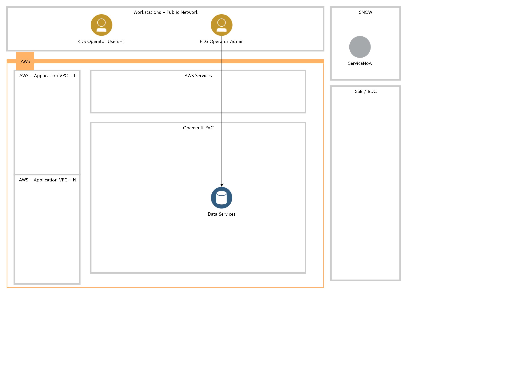

## Diagram

### Name

Openshift RDS Operator

### Description

## Element

[Expand all](#){ .md-button .diff-line }

### Actor

    

### Subsystem

    

### Location

    

AWS - Application VPC - 1

<table>
    <caption></caption>
    <thead>
        <tr>
            <th></th>
            <th></th>
        </tr>
    </thead>
    <tr>
        <td> <strong>Name</strong> </td>
        <td>AWS - Application VPC - 1</td>
    </tr>
    <tr>
        <td> <strong>Description</strong> </td>
        <td></td>
    </tr>
</table>

    

AWS - Application VPC - N

<table>
    <caption></caption>
    <thead>
        <tr>
            <th></th>
            <th></th>
        </tr>
    </thead>
    <tr>
        <td> <strong>Name</strong> </td>
        <td>AWS - Application VPC - N</td>
    </tr>
    <tr>
        <td> <strong>Description</strong> </td>
        <td></td>
    </tr>
</table>

    

AWS Services

<table>
    <caption></caption>
    <thead>
        <tr>
            <th></th>
            <th></th>
        </tr>
    </thead>
    <tr>
        <td> <strong>Name</strong> </td>
        <td>AWS Services</td>
    </tr>
    <tr>
        <td> <strong>Description</strong> </td>
        <td></td>
    </tr>
</table>

    

Openshift PVC

<table>
    <caption></caption>
    <thead>
        <tr>
            <th></th>
            <th></th>
        </tr>
    </thead>
    <tr>
        <td> <strong>Name</strong> </td>
        <td>Openshift PVC</td>
    </tr>
    <tr>
        <td> <strong>Description</strong> </td>
        <td></td>
    </tr>
</table>

    

SNOW

<table>
    <caption></caption>
    <thead>
        <tr>
            <th></th>
            <th></th>
        </tr>
    </thead>
    <tr>
        <td> <strong>Name</strong> </td>
        <td>SNOW</td>
    </tr>
    <tr>
        <td> <strong>Description</strong> </td>
        <td></td>
    </tr>
</table>

    

SSB / BDC

<table>
    <caption></caption>
    <thead>
        <tr>
            <th></th>
            <th></th>
        </tr>
    </thead>
    <tr>
        <td> <strong>Name</strong> </td>
        <td>SSB / BDC</td>
    </tr>
    <tr>
        <td> <strong>Description</strong> </td>
        <td></td>
    </tr>
</table>

    

Workstations - Public Network

<table>
    <caption></caption>
    <thead>
        <tr>
            <th></th>
            <th></th>
        </tr>
    </thead>
    <tr>
        <td> <strong>Name</strong> </td>
        <td>Workstations - Public Network</td>
    </tr>
    <tr>
        <td> <strong>Description</strong> </td>
        <td></td>
    </tr>
</table>

    

### Logical Connection

    

<table>
    <caption></caption>
    <thead>
        <tr>
            <th></th>
            <th></th>
        </tr>
    </thead>
    <tr>
        <td> <strong>Name</strong> </td>
        <td></td>
    </tr>
    <tr>
        <td> <strong>Description</strong> </td>
        <td></td>
    </tr>
</table>

    

### Logical Node

    

Data Services

<table>
    <caption></caption>
    <thead>
        <tr>
            <th></th>
            <th></th>
        </tr>
    </thead>
    <tr>
        <td> <strong>Name</strong> </td>
        <td>Data Services</td>
    </tr>
    <tr>
        <td> <strong>Description</strong> </td>
        <td></td>
    </tr>
    <tr>
        <td> <strong>Type</strong> </td>
        <td></td>
    </tr>
    <tr>
        <td> <strong>Primary Capability</strong> </td>
        <td>
            
        </td>
    </tr>
    <tr>
        <td> <strong>Implementation</strong> </td>
        <td>
            
        </td>
    </tr>
    <tr>
        <td> <strong>Architectural Decision</strong> </td>
        <td>
            
        </td>
    </tr>
    <tr>
        <td> <strong>Non Functional Requirement</strong> </td>
        <td>
            
        </td>
    </tr>
    <tr>
        <td> <strong>Generic Group</strong> </td>
        <td></td>
    </tr>
    <tr>
        <td> <strong>Sub-level Diagram</strong> </td>
        <td></td>
    </tr>
    <tr>
        <td> <strong>Related Diagrams</strong> </td>
        <td>
            
                
<a href="../../Usage Scenario/aodusagescenario_2lAyqgvkOyT_B18mG8_Wo">Example</a>

            
                
<a href="../../IT System View/aoditsystem_2b7NHHJeOye_B18mG8_Wo">Openshift RDS Operator</a>

            
        </td>
    </tr>
    <tr>
        <td> <strong>Related Elements</strong> </td>
        <td>
            
            
        </td>
    </tr>
</table>

    

RDS Operator Admin

<table>
    <caption></caption>
    <thead>
        <tr>
            <th></th>
            <th></th>
        </tr>
    </thead>
    <tr>
        <td> <strong>Name</strong> </td>
        <td>RDS Operator Admin</td>
    </tr>
    <tr>
        <td> <strong>Description</strong> </td>
        <td></td>
    </tr>
    <tr>
        <td> <strong>Type</strong> </td>
        <td></td>
    </tr>
    <tr>
        <td> <strong>Primary Capability</strong> </td>
        <td>
            
        </td>
    </tr>
    <tr>
        <td> <strong>Implementation</strong> </td>
        <td>
            
        </td>
    </tr>
    <tr>
        <td> <strong>Architectural Decision</strong> </td>
        <td>
            
        </td>
    </tr>
    <tr>
        <td> <strong>Non Functional Requirement</strong> </td>
        <td>
            
        </td>
    </tr>
    <tr>
        <td> <strong>Generic Group</strong> </td>
        <td></td>
    </tr>
    <tr>
        <td> <strong>Sub-level Diagram</strong> </td>
        <td></td>
    </tr>
    <tr>
        <td> <strong>Related Diagrams</strong> </td>
        <td>
            
                
<a href="../../Usage Scenario/aodusagescenario_2lAyqgvkOyT_B18mG8_Wo">Example</a>

            
                
<a href="../../IT System View/aoditsystem_2b7NHHJeOye_B18mG8_Wo">Openshift RDS Operator</a>

            
        </td>
    </tr>
    <tr>
        <td> <strong>Related Elements</strong> </td>
        <td>
            
            
        </td>
    </tr>
</table>

    

RDS Operator Users+1

<table>
    <caption></caption>
    <thead>
        <tr>
            <th></th>
            <th></th>
        </tr>
    </thead>
    <tr>
        <td> <strong>Name</strong> </td>
        <td>RDS Operator Users+1</td>
    </tr>
    <tr>
        <td> <strong>Description</strong> </td>
        <td></td>
    </tr>
    <tr>
        <td> <strong>Type</strong> </td>
        <td></td>
    </tr>
    <tr>
        <td> <strong>Primary Capability</strong> </td>
        <td>
            
        </td>
    </tr>
    <tr>
        <td> <strong>Implementation</strong> </td>
        <td>
            
        </td>
    </tr>
    <tr>
        <td> <strong>Architectural Decision</strong> </td>
        <td>
            
        </td>
    </tr>
    <tr>
        <td> <strong>Non Functional Requirement</strong> </td>
        <td>
            
        </td>
    </tr>
    <tr>
        <td> <strong>Generic Group</strong> </td>
        <td></td>
    </tr>
    <tr>
        <td> <strong>Sub-level Diagram</strong> </td>
        <td></td>
    </tr>
    <tr>
        <td> <strong>Related Diagrams</strong> </td>
        <td>
            
                
<a href="../../Usage Scenario/aodusagescenario_2lAyqgvkOyT_B18mG8_Wo">Example</a>

            
                
<a href="../../IT System View/aoditsystem_2b7NHHJeOye_B18mG8_Wo">Openshift RDS Operator</a>

            
        </td>
    </tr>
    <tr>
        <td> <strong>Related Elements</strong> </td>
        <td>
            
            
        </td>
    </tr>
</table>

    

ServiceNow

<table>
    <caption></caption>
    <thead>
        <tr>
            <th></th>
            <th></th>
        </tr>
    </thead>
    <tr>
        <td> <strong>Name</strong> </td>
        <td>ServiceNow</td>
    </tr>
    <tr>
        <td> <strong>Description</strong> </td>
        <td></td>
    </tr>
    <tr>
        <td> <strong>Type</strong> </td>
        <td></td>
    </tr>
    <tr>
        <td> <strong>Primary Capability</strong> </td>
        <td>
            
        </td>
    </tr>
    <tr>
        <td> <strong>Implementation</strong> </td>
        <td>
            
        </td>
    </tr>
    <tr>
        <td> <strong>Architectural Decision</strong> </td>
        <td>
            
        </td>
    </tr>
    <tr>
        <td> <strong>Non Functional Requirement</strong> </td>
        <td>
            
        </td>
    </tr>
    <tr>
        <td> <strong>Generic Group</strong> </td>
        <td></td>
    </tr>
    <tr>
        <td> <strong>Sub-level Diagram</strong> </td>
        <td></td>
    </tr>
    <tr>
        <td> <strong>Related Diagrams</strong> </td>
        <td>
            
                
<a href="../../Usage Scenario/aodusagescenario_2lAyqgvkOyT_B18mG8_Wo">Example</a>

            
                
<a href="../../IT System View/aoditsystem_2b7NHHJeOye_B18mG8_Wo">Openshift RDS Operator</a>

            
        </td>
    </tr>
    <tr>
        <td> <strong>Related Elements</strong> </td>
        <td>
            
            
        </td>
    </tr>
</table>

    

