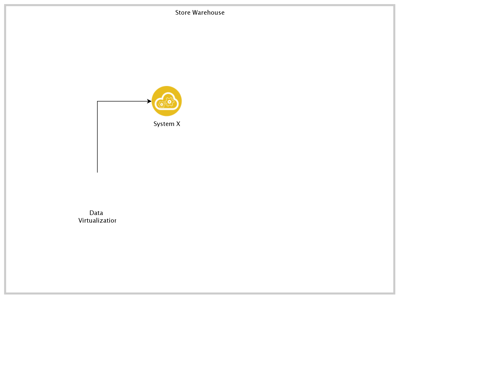

## Diagram

### Name

Show team AOD

### Description

## Element

[Expand all](#){ .md-button .diff-line }

### Actor

    

### Subsystem

    

### Location

    

Store Warehouse

<table>
    <caption></caption>
    <thead>
        <tr>
            <th></th>
            <th></th>
        </tr>
    </thead>
    <tr>
        <td> <strong>Name</strong> </td>
        <td>Store Warehouse</td>
    </tr>
    <tr>
        <td> <strong>Description</strong> </td>
        <td></td>
    </tr>
</table>

    

### Logical Connection

    

<table>
    <caption></caption>
    <thead>
        <tr>
            <th></th>
            <th></th>
        </tr>
    </thead>
    <tr>
        <td> <strong>Name</strong> </td>
        <td></td>
    </tr>
    <tr>
        <td> <strong>Description</strong> </td>
        <td></td>
    </tr>
</table>

    

### Logical Node

    

Data Virtualization

<table>
    <caption></caption>
    <thead>
        <tr>
            <th></th>
            <th></th>
        </tr>
    </thead>
    <tr>
        <td> <strong>Name</strong> </td>
        <td>Data Virtualization</td>
    </tr>
    <tr>
        <td> <strong>Description</strong> </td>
        <td>Technology that connects all of these data sources into a single self-balancing constellation. No longer are analytics queries performed on data copied and stored to a centralized location. The analytics application submits a query that is processed on the device where the data source is persisted. Results of the query are consolidated within the constellation, and returned to the origin application. No data is copied and remains persisted only at source.</td>
    </tr>
    <tr>
        <td> <strong>Type</strong> </td>
        <td></td>
    </tr>
    <tr>
        <td> <strong>Primary Capability</strong> </td>
        <td>
            
        </td>
    </tr>
    <tr>
        <td> <strong>Implementation</strong> </td>
        <td>
            
        </td>
    </tr>
    <tr>
        <td> <strong>Architectural Decision</strong> </td>
        <td>
            
        </td>
    </tr>
    <tr>
        <td> <strong>Non Functional Requirement</strong> </td>
        <td>
            
        </td>
    </tr>
    <tr>
        <td> <strong>Generic Group</strong> </td>
        <td></td>
    </tr>
    <tr>
        <td> <strong>Sub-level Diagram</strong> </td>
        <td></td>
    </tr>
    <tr>
        <td> <strong>Related Diagrams</strong> </td>
        <td>
            
                
<a href="../../IT System View/aoditsystem_2kUKWCXAuvn_B18mG8_Wo">Show team AOD</a>

            
        </td>
    </tr>
    <tr>
        <td> <strong>Related Elements</strong> </td>
        <td>
            
            
        </td>
    </tr>
</table>

    

System X

<table>
    <caption></caption>
    <thead>
        <tr>
            <th></th>
            <th></th>
        </tr>
    </thead>
    <tr>
        <td> <strong>Name</strong> </td>
        <td>System X</td>
    </tr>
    <tr>
        <td> <strong>Description</strong> </td>
        <td></td>
    </tr>
    <tr>
        <td> <strong>Type</strong> </td>
        <td></td>
    </tr>
    <tr>
        <td> <strong>Primary Capability</strong> </td>
        <td>
            
        </td>
    </tr>
    <tr>
        <td> <strong>Implementation</strong> </td>
        <td>
            
        </td>
    </tr>
    <tr>
        <td> <strong>Architectural Decision</strong> </td>
        <td>
            
        </td>
    </tr>
    <tr>
        <td> <strong>Non Functional Requirement</strong> </td>
        <td>
            
        </td>
    </tr>
    <tr>
        <td> <strong>Generic Group</strong> </td>
        <td></td>
    </tr>
    <tr>
        <td> <strong>Sub-level Diagram</strong> </td>
        <td></td>
    </tr>
    <tr>
        <td> <strong>Related Diagrams</strong> </td>
        <td>
            
                
<a href="../../IT System View/aoditsystem_2kUKWCXAuvn_B18mG8_Wo">Show team AOD</a>

            
        </td>
    </tr>
    <tr>
        <td> <strong>Related Elements</strong> </td>
        <td>
            
            
        </td>
    </tr>
</table>

    

