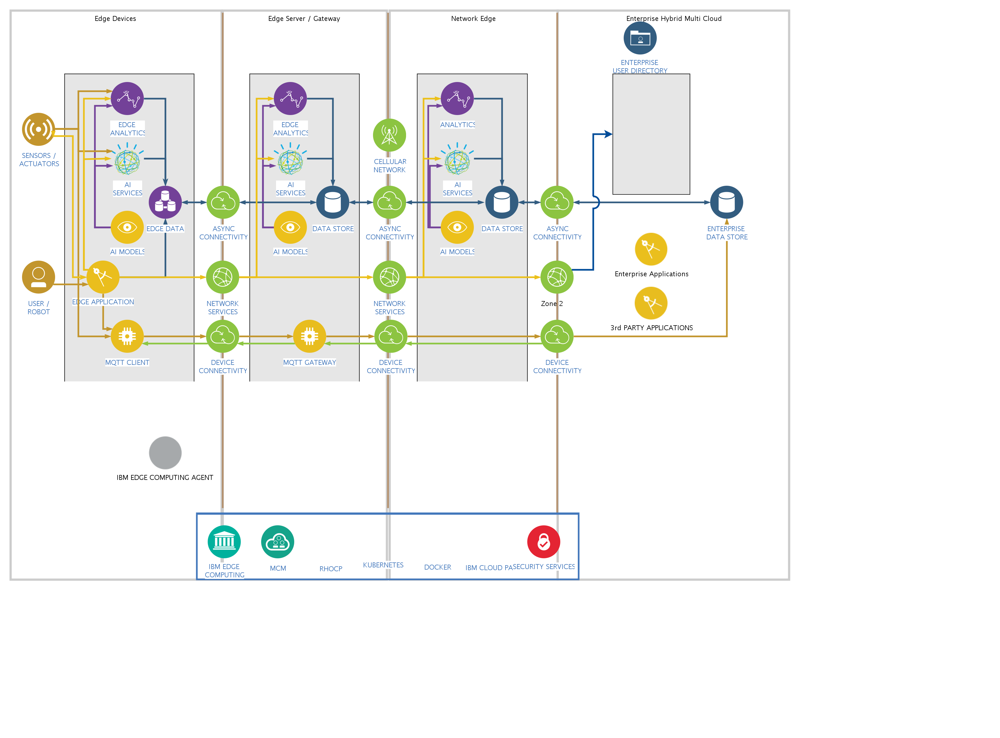

## Diagram

### Name

Edge

### Description

## Element

[Expand all](#){ .md-button .diff-line }

### Actor

    

### Subsystem

    

Edge Gateway Containerized Workloads

<table>
    <caption></caption>
    <thead>
        <tr>
            <th></th>
            <th></th>
        </tr>
    </thead>
    <tr>
        <td> <strong>Name</strong> </td>
        <td>Edge Gateway Containerized Workloads</td>
    </tr>
    <tr>
        <td> <strong>Description</strong> </td>
        <td></td>
    </tr>
</table>

    

Enterprise Analytics

<table>
    <caption></caption>
    <thead>
        <tr>
            <th></th>
            <th></th>
        </tr>
    </thead>
    <tr>
        <td> <strong>Name</strong> </td>
        <td>Enterprise Analytics</td>
    </tr>
    <tr>
        <td> <strong>Description</strong> </td>
        <td></td>
    </tr>
</table>

    

Network Containerized Workloads

<table>
    <caption></caption>
    <thead>
        <tr>
            <th></th>
            <th></th>
        </tr>
    </thead>
    <tr>
        <td> <strong>Name</strong> </td>
        <td>Network Containerized Workloads</td>
    </tr>
    <tr>
        <td> <strong>Description</strong> </td>
        <td></td>
    </tr>
</table>

    

SubSystem

<table>
    <caption></caption>
    <thead>
        <tr>
            <th></th>
            <th></th>
        </tr>
    </thead>
    <tr>
        <td> <strong>Name</strong> </td>
        <td>SubSystem</td>
    </tr>
    <tr>
        <td> <strong>Description</strong> </td>
        <td></td>
    </tr>
</table>

    

### Location

    

Edge Devices

<table>
    <caption></caption>
    <thead>
        <tr>
            <th></th>
            <th></th>
        </tr>
    </thead>
    <tr>
        <td> <strong>Name</strong> </td>
        <td>Edge Devices</td>
    </tr>
    <tr>
        <td> <strong>Description</strong> </td>
        <td></td>
    </tr>
</table>

    

Edge Server / Gateway

<table>
    <caption></caption>
    <thead>
        <tr>
            <th></th>
            <th></th>
        </tr>
    </thead>
    <tr>
        <td> <strong>Name</strong> </td>
        <td>Edge Server / Gateway</td>
    </tr>
    <tr>
        <td> <strong>Description</strong> </td>
        <td></td>
    </tr>
</table>

    

Enterprise Hybrid Multi Cloud

<table>
    <caption></caption>
    <thead>
        <tr>
            <th></th>
            <th></th>
        </tr>
    </thead>
    <tr>
        <td> <strong>Name</strong> </td>
        <td>Enterprise Hybrid Multi Cloud</td>
    </tr>
    <tr>
        <td> <strong>Description</strong> </td>
        <td></td>
    </tr>
</table>

    

Network Edge

<table>
    <caption></caption>
    <thead>
        <tr>
            <th></th>
            <th></th>
        </tr>
    </thead>
    <tr>
        <td> <strong>Name</strong> </td>
        <td>Network Edge</td>
    </tr>
    <tr>
        <td> <strong>Description</strong> </td>
        <td></td>
    </tr>
</table>

    

### Logical Connection

    

<table>
    <caption></caption>
    <thead>
        <tr>
            <th></th>
            <th></th>
        </tr>
    </thead>
    <tr>
        <td> <strong>Name</strong> </td>
        <td></td>
    </tr>
    <tr>
        <td> <strong>Description</strong> </td>
        <td></td>
    </tr>
</table>

    

<table>
    <caption></caption>
    <thead>
        <tr>
            <th></th>
            <th></th>
        </tr>
    </thead>
    <tr>
        <td> <strong>Name</strong> </td>
        <td></td>
    </tr>
    <tr>
        <td> <strong>Description</strong> </td>
        <td></td>
    </tr>
</table>

    

<table>
    <caption></caption>
    <thead>
        <tr>
            <th></th>
            <th></th>
        </tr>
    </thead>
    <tr>
        <td> <strong>Name</strong> </td>
        <td></td>
    </tr>
    <tr>
        <td> <strong>Description</strong> </td>
        <td></td>
    </tr>
</table>

    

<table>
    <caption></caption>
    <thead>
        <tr>
            <th></th>
            <th></th>
        </tr>
    </thead>
    <tr>
        <td> <strong>Name</strong> </td>
        <td></td>
    </tr>
    <tr>
        <td> <strong>Description</strong> </td>
        <td></td>
    </tr>
</table>

    

<table>
    <caption></caption>
    <thead>
        <tr>
            <th></th>
            <th></th>
        </tr>
    </thead>
    <tr>
        <td> <strong>Name</strong> </td>
        <td></td>
    </tr>
    <tr>
        <td> <strong>Description</strong> </td>
        <td></td>
    </tr>
</table>

    

<table>
    <caption></caption>
    <thead>
        <tr>
            <th></th>
            <th></th>
        </tr>
    </thead>
    <tr>
        <td> <strong>Name</strong> </td>
        <td></td>
    </tr>
    <tr>
        <td> <strong>Description</strong> </td>
        <td></td>
    </tr>
</table>

    

<table>
    <caption></caption>
    <thead>
        <tr>
            <th></th>
            <th></th>
        </tr>
    </thead>
    <tr>
        <td> <strong>Name</strong> </td>
        <td></td>
    </tr>
    <tr>
        <td> <strong>Description</strong> </td>
        <td></td>
    </tr>
</table>

    

<table>
    <caption></caption>
    <thead>
        <tr>
            <th></th>
            <th></th>
        </tr>
    </thead>
    <tr>
        <td> <strong>Name</strong> </td>
        <td></td>
    </tr>
    <tr>
        <td> <strong>Description</strong> </td>
        <td></td>
    </tr>
</table>

    

<table>
    <caption></caption>
    <thead>
        <tr>
            <th></th>
            <th></th>
        </tr>
    </thead>
    <tr>
        <td> <strong>Name</strong> </td>
        <td></td>
    </tr>
    <tr>
        <td> <strong>Description</strong> </td>
        <td></td>
    </tr>
</table>

    

<table>
    <caption></caption>
    <thead>
        <tr>
            <th></th>
            <th></th>
        </tr>
    </thead>
    <tr>
        <td> <strong>Name</strong> </td>
        <td></td>
    </tr>
    <tr>
        <td> <strong>Description</strong> </td>
        <td></td>
    </tr>
</table>

    

<table>
    <caption></caption>
    <thead>
        <tr>
            <th></th>
            <th></th>
        </tr>
    </thead>
    <tr>
        <td> <strong>Name</strong> </td>
        <td></td>
    </tr>
    <tr>
        <td> <strong>Description</strong> </td>
        <td></td>
    </tr>
</table>

    

<table>
    <caption></caption>
    <thead>
        <tr>
            <th></th>
            <th></th>
        </tr>
    </thead>
    <tr>
        <td> <strong>Name</strong> </td>
        <td></td>
    </tr>
    <tr>
        <td> <strong>Description</strong> </td>
        <td></td>
    </tr>
</table>

    

<table>
    <caption></caption>
    <thead>
        <tr>
            <th></th>
            <th></th>
        </tr>
    </thead>
    <tr>
        <td> <strong>Name</strong> </td>
        <td></td>
    </tr>
    <tr>
        <td> <strong>Description</strong> </td>
        <td></td>
    </tr>
</table>

    

<table>
    <caption></caption>
    <thead>
        <tr>
            <th></th>
            <th></th>
        </tr>
    </thead>
    <tr>
        <td> <strong>Name</strong> </td>
        <td></td>
    </tr>
    <tr>
        <td> <strong>Description</strong> </td>
        <td></td>
    </tr>
</table>

    

<table>
    <caption></caption>
    <thead>
        <tr>
            <th></th>
            <th></th>
        </tr>
    </thead>
    <tr>
        <td> <strong>Name</strong> </td>
        <td></td>
    </tr>
    <tr>
        <td> <strong>Description</strong> </td>
        <td></td>
    </tr>
</table>

    

<table>
    <caption></caption>
    <thead>
        <tr>
            <th></th>
            <th></th>
        </tr>
    </thead>
    <tr>
        <td> <strong>Name</strong> </td>
        <td></td>
    </tr>
    <tr>
        <td> <strong>Description</strong> </td>
        <td></td>
    </tr>
</table>

    

<table>
    <caption></caption>
    <thead>
        <tr>
            <th></th>
            <th></th>
        </tr>
    </thead>
    <tr>
        <td> <strong>Name</strong> </td>
        <td></td>
    </tr>
    <tr>
        <td> <strong>Description</strong> </td>
        <td></td>
    </tr>
</table>

    

<table>
    <caption></caption>
    <thead>
        <tr>
            <th></th>
            <th></th>
        </tr>
    </thead>
    <tr>
        <td> <strong>Name</strong> </td>
        <td></td>
    </tr>
    <tr>
        <td> <strong>Description</strong> </td>
        <td></td>
    </tr>
</table>

    

<table>
    <caption></caption>
    <thead>
        <tr>
            <th></th>
            <th></th>
        </tr>
    </thead>
    <tr>
        <td> <strong>Name</strong> </td>
        <td></td>
    </tr>
    <tr>
        <td> <strong>Description</strong> </td>
        <td></td>
    </tr>
</table>

    

<table>
    <caption></caption>
    <thead>
        <tr>
            <th></th>
            <th></th>
        </tr>
    </thead>
    <tr>
        <td> <strong>Name</strong> </td>
        <td></td>
    </tr>
    <tr>
        <td> <strong>Description</strong> </td>
        <td></td>
    </tr>
</table>

    

<table>
    <caption></caption>
    <thead>
        <tr>
            <th></th>
            <th></th>
        </tr>
    </thead>
    <tr>
        <td> <strong>Name</strong> </td>
        <td></td>
    </tr>
    <tr>
        <td> <strong>Description</strong> </td>
        <td></td>
    </tr>
</table>

    

<table>
    <caption></caption>
    <thead>
        <tr>
            <th></th>
            <th></th>
        </tr>
    </thead>
    <tr>
        <td> <strong>Name</strong> </td>
        <td></td>
    </tr>
    <tr>
        <td> <strong>Description</strong> </td>
        <td></td>
    </tr>
</table>

    

<table>
    <caption></caption>
    <thead>
        <tr>
            <th></th>
            <th></th>
        </tr>
    </thead>
    <tr>
        <td> <strong>Name</strong> </td>
        <td></td>
    </tr>
    <tr>
        <td> <strong>Description</strong> </td>
        <td></td>
    </tr>
</table>

    

<table>
    <caption></caption>
    <thead>
        <tr>
            <th></th>
            <th></th>
        </tr>
    </thead>
    <tr>
        <td> <strong>Name</strong> </td>
        <td></td>
    </tr>
    <tr>
        <td> <strong>Description</strong> </td>
        <td></td>
    </tr>
</table>

    

<table>
    <caption></caption>
    <thead>
        <tr>
            <th></th>
            <th></th>
        </tr>
    </thead>
    <tr>
        <td> <strong>Name</strong> </td>
        <td></td>
    </tr>
    <tr>
        <td> <strong>Description</strong> </td>
        <td></td>
    </tr>
</table>

    

<table>
    <caption></caption>
    <thead>
        <tr>
            <th></th>
            <th></th>
        </tr>
    </thead>
    <tr>
        <td> <strong>Name</strong> </td>
        <td></td>
    </tr>
    <tr>
        <td> <strong>Description</strong> </td>
        <td></td>
    </tr>
</table>

    

<table>
    <caption></caption>
    <thead>
        <tr>
            <th></th>
            <th></th>
        </tr>
    </thead>
    <tr>
        <td> <strong>Name</strong> </td>
        <td></td>
    </tr>
    <tr>
        <td> <strong>Description</strong> </td>
        <td></td>
    </tr>
</table>

    

<table>
    <caption></caption>
    <thead>
        <tr>
            <th></th>
            <th></th>
        </tr>
    </thead>
    <tr>
        <td> <strong>Name</strong> </td>
        <td></td>
    </tr>
    <tr>
        <td> <strong>Description</strong> </td>
        <td></td>
    </tr>
</table>

    

<table>
    <caption></caption>
    <thead>
        <tr>
            <th></th>
            <th></th>
        </tr>
    </thead>
    <tr>
        <td> <strong>Name</strong> </td>
        <td></td>
    </tr>
    <tr>
        <td> <strong>Description</strong> </td>
        <td></td>
    </tr>
</table>

    

<table>
    <caption></caption>
    <thead>
        <tr>
            <th></th>
            <th></th>
        </tr>
    </thead>
    <tr>
        <td> <strong>Name</strong> </td>
        <td></td>
    </tr>
    <tr>
        <td> <strong>Description</strong> </td>
        <td></td>
    </tr>
</table>

    

<table>
    <caption></caption>
    <thead>
        <tr>
            <th></th>
            <th></th>
        </tr>
    </thead>
    <tr>
        <td> <strong>Name</strong> </td>
        <td></td>
    </tr>
    <tr>
        <td> <strong>Description</strong> </td>
        <td></td>
    </tr>
</table>

    

<table>
    <caption></caption>
    <thead>
        <tr>
            <th></th>
            <th></th>
        </tr>
    </thead>
    <tr>
        <td> <strong>Name</strong> </td>
        <td></td>
    </tr>
    <tr>
        <td> <strong>Description</strong> </td>
        <td></td>
    </tr>
</table>

    

<table>
    <caption></caption>
    <thead>
        <tr>
            <th></th>
            <th></th>
        </tr>
    </thead>
    <tr>
        <td> <strong>Name</strong> </td>
        <td></td>
    </tr>
    <tr>
        <td> <strong>Description</strong> </td>
        <td></td>
    </tr>
</table>

    

<table>
    <caption></caption>
    <thead>
        <tr>
            <th></th>
            <th></th>
        </tr>
    </thead>
    <tr>
        <td> <strong>Name</strong> </td>
        <td></td>
    </tr>
    <tr>
        <td> <strong>Description</strong> </td>
        <td></td>
    </tr>
</table>

    

<table>
    <caption></caption>
    <thead>
        <tr>
            <th></th>
            <th></th>
        </tr>
    </thead>
    <tr>
        <td> <strong>Name</strong> </td>
        <td></td>
    </tr>
    <tr>
        <td> <strong>Description</strong> </td>
        <td></td>
    </tr>
</table>

    

<table>
    <caption></caption>
    <thead>
        <tr>
            <th></th>
            <th></th>
        </tr>
    </thead>
    <tr>
        <td> <strong>Name</strong> </td>
        <td></td>
    </tr>
    <tr>
        <td> <strong>Description</strong> </td>
        <td></td>
    </tr>
</table>

    

<table>
    <caption></caption>
    <thead>
        <tr>
            <th></th>
            <th></th>
        </tr>
    </thead>
    <tr>
        <td> <strong>Name</strong> </td>
        <td></td>
    </tr>
    <tr>
        <td> <strong>Description</strong> </td>
        <td></td>
    </tr>
</table>

    

<table>
    <caption></caption>
    <thead>
        <tr>
            <th></th>
            <th></th>
        </tr>
    </thead>
    <tr>
        <td> <strong>Name</strong> </td>
        <td></td>
    </tr>
    <tr>
        <td> <strong>Description</strong> </td>
        <td></td>
    </tr>
</table>

    

<table>
    <caption></caption>
    <thead>
        <tr>
            <th></th>
            <th></th>
        </tr>
    </thead>
    <tr>
        <td> <strong>Name</strong> </td>
        <td></td>
    </tr>
    <tr>
        <td> <strong>Description</strong> </td>
        <td></td>
    </tr>
</table>

    

<table>
    <caption></caption>
    <thead>
        <tr>
            <th></th>
            <th></th>
        </tr>
    </thead>
    <tr>
        <td> <strong>Name</strong> </td>
        <td></td>
    </tr>
    <tr>
        <td> <strong>Description</strong> </td>
        <td></td>
    </tr>
</table>

    

<table>
    <caption></caption>
    <thead>
        <tr>
            <th></th>
            <th></th>
        </tr>
    </thead>
    <tr>
        <td> <strong>Name</strong> </td>
        <td></td>
    </tr>
    <tr>
        <td> <strong>Description</strong> </td>
        <td></td>
    </tr>
</table>

    

<table>
    <caption></caption>
    <thead>
        <tr>
            <th></th>
            <th></th>
        </tr>
    </thead>
    <tr>
        <td> <strong>Name</strong> </td>
        <td></td>
    </tr>
    <tr>
        <td> <strong>Description</strong> </td>
        <td></td>
    </tr>
</table>

    

<table>
    <caption></caption>
    <thead>
        <tr>
            <th></th>
            <th></th>
        </tr>
    </thead>
    <tr>
        <td> <strong>Name</strong> </td>
        <td></td>
    </tr>
    <tr>
        <td> <strong>Description</strong> </td>
        <td></td>
    </tr>
</table>

    

<table>
    <caption></caption>
    <thead>
        <tr>
            <th></th>
            <th></th>
        </tr>
    </thead>
    <tr>
        <td> <strong>Name</strong> </td>
        <td></td>
    </tr>
    <tr>
        <td> <strong>Description</strong> </td>
        <td></td>
    </tr>
</table>

    

### Logical Node

    

3rd PARTY APPLICATIONS

<table>
    <caption></caption>
    <thead>
        <tr>
            <th></th>
            <th></th>
        </tr>
    </thead>
    <tr>
        <td> <strong>Name</strong> </td>
        <td>3rd PARTY APPLICATIONS</td>
    </tr>
    <tr>
        <td> <strong>Description</strong> </td>
        <td>Third-party applications such as security apps or reporting apps that might be integrated as part of the solution.</td>
    </tr>
    <tr>
        <td> <strong>Type</strong> </td>
        <td></td>
    </tr>
    <tr>
        <td> <strong>Primary Capability</strong> </td>
        <td>
            
        </td>
    </tr>
    <tr>
        <td> <strong>Implementation</strong> </td>
        <td>
            
        </td>
    </tr>
    <tr>
        <td> <strong>Architectural Decision</strong> </td>
        <td>
            
        </td>
    </tr>
    <tr>
        <td> <strong>Non Functional Requirement</strong> </td>
        <td>
            
        </td>
    </tr>
    <tr>
        <td> <strong>Generic Group</strong> </td>
        <td></td>
    </tr>
    <tr>
        <td> <strong>Sub-level Diagram</strong> </td>
        <td></td>
    </tr>
    <tr>
        <td> <strong>Related Diagrams</strong> </td>
        <td>
            
                
<a href="../../IT System View/aoditsystem_ByHojAyrD_Hk2meFtIF_B18mG8_Wo">IBM Edge Application Manager for Clusters</a>

            
                
<a href="../../IT System View/aoditsystem_2m9PYdSeqw9_B18mG8_Wo">Edge</a>

            
        </td>
    </tr>
    <tr>
        <td> <strong>Related Elements</strong> </td>
        <td>
            
            
        </td>
    </tr>
</table>

    

AI   SERVICES

<table>
    <caption></caption>
    <thead>
        <tr>
            <th></th>
            <th></th>
        </tr>
    </thead>
    <tr>
        <td> <strong>Name</strong> </td>
        <td>AI   SERVICES</td>
    </tr>
    <tr>
        <td> <strong>Description</strong> </td>
        <td>Services related to visual or acoustic recognition are key to providing analysis at the data source. These services are required in all levels of the architecture.</td>
    </tr>
    <tr>
        <td> <strong>Type</strong> </td>
        <td></td>
    </tr>
    <tr>
        <td> <strong>Primary Capability</strong> </td>
        <td>
            
        </td>
    </tr>
    <tr>
        <td> <strong>Implementation</strong> </td>
        <td>
            
                
<a href="https://www.ibm.com/products/watson-explorer">IBM Watson Explorer</a>

            
                
<a href="https://www.ibm.com/support/knowledgecenter/en/SS5RWK_3.5.0/com.ibm.discovery.es.nav.doc/contentanalytics_350.htm">IBM Watson Content Analytics</a>

            
                
<a href="https://www.ibm.com/products/cloud-pak-for-data">IBM Cloud Pak for Data</a>

            
        </td>
    </tr>
    <tr>
        <td> <strong>Architectural Decision</strong> </td>
        <td>
            
        </td>
    </tr>
    <tr>
        <td> <strong>Non Functional Requirement</strong> </td>
        <td>
            
        </td>
    </tr>
    <tr>
        <td> <strong>Generic Group</strong> </td>
        <td></td>
    </tr>
    <tr>
        <td> <strong>Sub-level Diagram</strong> </td>
        <td></td>
    </tr>
    <tr>
        <td> <strong>Related Diagrams</strong> </td>
        <td>
            
                
<a href="../../IT System View/aoditsystem_ByHojAyrD_Hk2meFtIF_B18mG8_Wo">IBM Edge Application Manager for Clusters</a>

            
                
<a href="../../IT System View/aoditsystem_2m9PYdSeqw9_B18mG8_Wo">Edge</a>

            
        </td>
    </tr>
    <tr>
        <td> <strong>Related Elements</strong> </td>
        <td>
            
            
                
SYS_DU_2sbZr1mPHYp

                
            
                
SYS_DU_2sbZr1GpDxt

                
            
                
SYS_DU_2sbZr1yHHUR

                
            
        </td>
    </tr>
</table>

    

ANALYTICS

<table>
    <caption></caption>
    <thead>
        <tr>
            <th></th>
            <th></th>
        </tr>
    </thead>
    <tr>
        <td> <strong>Name</strong> </td>
        <td>ANALYTICS</td>
    </tr>
    <tr>
        <td> <strong>Description</strong> </td>
        <td>Provides dynamic data filtering, statistical evaluation, aggregation, cleansing, compression, and preparation for further processing. </td>
    </tr>
    <tr>
        <td> <strong>Type</strong> </td>
        <td></td>
    </tr>
    <tr>
        <td> <strong>Primary Capability</strong> </td>
        <td>
            
        </td>
    </tr>
    <tr>
        <td> <strong>Implementation</strong> </td>
        <td>
            
                
<a href="">node-RED (development)</a>

            
                
<a href="https://www.ibm.com/products/operational-decision-manager">IBM Operational Decision Manager</a>

            
                
<a href="https://www.ibm.com/internet-of-things/solutions/iot-platform/watson-iot-platform">IBM Edge Analytics SDK</a>

            
        </td>
    </tr>
    <tr>
        <td> <strong>Architectural Decision</strong> </td>
        <td>
            
        </td>
    </tr>
    <tr>
        <td> <strong>Non Functional Requirement</strong> </td>
        <td>
            
        </td>
    </tr>
    <tr>
        <td> <strong>Generic Group</strong> </td>
        <td></td>
    </tr>
    <tr>
        <td> <strong>Sub-level Diagram</strong> </td>
        <td></td>
    </tr>
    <tr>
        <td> <strong>Related Diagrams</strong> </td>
        <td>
            
                
<a href="../../IT System View/aoditsystem_ByHojAyrD_Hk2meFtIF_B18mG8_Wo">IBM Edge Application Manager for Clusters</a>

            
                
<a href="../../IT System View/aoditsystem_2m9PYdSeqw9_B18mG8_Wo">Edge</a>

            
        </td>
    </tr>
    <tr>
        <td> <strong>Related Elements</strong> </td>
        <td>
            
            
                
SYS_DU_2shidtFjosO

                
            
                
SYS_DU_2shidtP9OaU

                
            
                
SYS_DU_2shidtYGJjG

                
            
        </td>
    </tr>
</table>

    

CELLULAR  NETWORK

<table>
    <caption></caption>
    <thead>
        <tr>
            <th></th>
            <th></th>
        </tr>
    </thead>
    <tr>
        <td> <strong>Name</strong> </td>
        <td>CELLULAR  NETWORK</td>
    </tr>
    <tr>
        <td> <strong>Description</strong> </td>
        <td>Fifth generation cellular technology that offers high bandwidth and low latency.</td>
    </tr>
    <tr>
        <td> <strong>Type</strong> </td>
        <td></td>
    </tr>
    <tr>
        <td> <strong>Primary Capability</strong> </td>
        <td>
            
        </td>
    </tr>
    <tr>
        <td> <strong>Implementation</strong> </td>
        <td>
            
        </td>
    </tr>
    <tr>
        <td> <strong>Architectural Decision</strong> </td>
        <td>
            
        </td>
    </tr>
    <tr>
        <td> <strong>Non Functional Requirement</strong> </td>
        <td>
            
        </td>
    </tr>
    <tr>
        <td> <strong>Generic Group</strong> </td>
        <td></td>
    </tr>
    <tr>
        <td> <strong>Sub-level Diagram</strong> </td>
        <td></td>
    </tr>
    <tr>
        <td> <strong>Related Diagrams</strong> </td>
        <td>
            
                
<a href="../../IT System View/aoditsystem_ByHojAyrD_Hk2meFtIF_B18mG8_Wo">IBM Edge Application Manager for Clusters</a>

            
                
<a href="../../IT System View/aoditsystem_2m9PYdSeqw9_B18mG8_Wo">Edge</a>

            
        </td>
    </tr>
    <tr>
        <td> <strong>Related Elements</strong> </td>
        <td>
            
            
        </td>
    </tr>
</table>

    

EDGE DATA

<table>
    <caption></caption>
    <thead>
        <tr>
            <th></th>
            <th></th>
        </tr>
    </thead>
    <tr>
        <td> <strong>Name</strong> </td>
        <td>EDGE DATA</td>
    </tr>
    <tr>
        <td> <strong>Description</strong> </td>
        <td>Typically, flash memory used to store minimal data that the device can use.</td>
    </tr>
    <tr>
        <td> <strong>Type</strong> </td>
        <td></td>
    </tr>
    <tr>
        <td> <strong>Primary Capability</strong> </td>
        <td>
            
        </td>
    </tr>
    <tr>
        <td> <strong>Implementation</strong> </td>
        <td>
            
        </td>
    </tr>
    <tr>
        <td> <strong>Architectural Decision</strong> </td>
        <td>
            
        </td>
    </tr>
    <tr>
        <td> <strong>Non Functional Requirement</strong> </td>
        <td>
            
        </td>
    </tr>
    <tr>
        <td> <strong>Generic Group</strong> </td>
        <td></td>
    </tr>
    <tr>
        <td> <strong>Sub-level Diagram</strong> </td>
        <td></td>
    </tr>
    <tr>
        <td> <strong>Related Diagrams</strong> </td>
        <td>
            
                
<a href="../../IT System View/aoditsystem_2m9PYdSeqw9_B18mG8_Wo">Edge</a>

            
        </td>
    </tr>
    <tr>
        <td> <strong>Related Elements</strong> </td>
        <td>
            
            
        </td>
    </tr>
</table>

    

EDGE ANALYTICS

<table>
    <caption></caption>
    <thead>
        <tr>
            <th></th>
            <th></th>
        </tr>
    </thead>
    <tr>
        <td> <strong>Name</strong> </td>
        <td>EDGE ANALYTICS</td>
    </tr>
    <tr>
        <td> <strong>Description</strong> </td>
        <td>Insights, alerting, and predictive analytics immediately required and applied to edge devices.</td>
    </tr>
    <tr>
        <td> <strong>Type</strong> </td>
        <td></td>
    </tr>
    <tr>
        <td> <strong>Primary Capability</strong> </td>
        <td>
            
                
edge analytics

            
        </td>
    </tr>
    <tr>
        <td> <strong>Implementation</strong> </td>
        <td>
            
                
<a href="https://www.ibm.com/products/cognos-analytics">IBM Cognos Analytics</a>

            
                
<a href="https://www.ibm.com/products/cloud-pak-for-data">IBM Cloud Pak for Data</a>

            
                
<a href="https://www.ibm.com/cloud/machine-learning">Watson Machine Learning</a>

            
                
<a href="https://www.ibm.com/us-en/marketplace/spss-predictive-analytics-enterprise">IBM SPSS Predictive Analytics Enterprise on Cloud</a>

            
                
<a href="">Apache Cassandra</a>

            
                
<a href="">Python</a>

            
                
<a href="https://www.ibm.com/analytics/predictive-analytics">IBM SPSS Predictive Analytics</a>

            
                
<a href="">SparkML</a>

            
                
<a href="">R Enterprise Products (XaaS)</a>

            
        </td>
    </tr>
    <tr>
        <td> <strong>Architectural Decision</strong> </td>
        <td>
            
        </td>
    </tr>
    <tr>
        <td> <strong>Non Functional Requirement</strong> </td>
        <td>
            
        </td>
    </tr>
    <tr>
        <td> <strong>Generic Group</strong> </td>
        <td>
                
                
<strong>SubSystem,SubSystem</strong>[Auto-Generated]

                
This group is derived from SubSystem named SubSystem.

                
            </td>
    </tr>
    <tr>
        <td> <strong>Sub-level Diagram</strong> </td>
        <td></td>
    </tr>
    <tr>
        <td> <strong>Related Diagrams</strong> </td>
        <td>
            
                
<a href="../../IT System View/aoditsystem_ByHojAyrD_Hk2meFtIF_B18mG8_Wo">IBM Edge Application Manager for Clusters</a>

            
                
<a href="../../IT System View/aoditsystem_3vn7zohOcyv_B18mG8_Wo">check refresh styles</a>

            
                
<a href="../../IT System View/aoditsystem_2m9PYdSeqw9_B18mG8_Wo">Edge</a>

            
        </td>
    </tr>
    <tr>
        <td> <strong>Related Elements</strong> </td>
        <td>
            
            
                
SYS_DU_2sbZ9aRb04l

                
            
                
SYS_DU_2sbZ9aA8aZh

                
            
                
SYS_DU_2sbZ9a3WkEy

                
            
                
SYS_DU_2sbZ9aI6ba2

                
            
                
SYS_DU_2sbZ9b1xXJx

                
            
                
SYS_DU_2sbZ9ajd95q

                
            
                
SYS_DU_2sbZ9ackwC5

                
            
                
SYS_DU_2sbZ99VtomH

                
            
                
SYS_DU_2sbZ9asV3Mx

                
            
        </td>
    </tr>
</table>

    

ENTERPRISE DATA STORE

<table>
    <caption></caption>
    <thead>
        <tr>
            <th></th>
            <th></th>
        </tr>
    </thead>
    <tr>
        <td> <strong>Name</strong> </td>
        <td>ENTERPRISE DATA STORE</td>
    </tr>
    <tr>
        <td> <strong>Description</strong> </td>
        <td>Data aggregated from sources and stored within the enterprise for future analysis, audit, and history.</td>
    </tr>
    <tr>
        <td> <strong>Type</strong> </td>
        <td></td>
    </tr>
    <tr>
        <td> <strong>Primary Capability</strong> </td>
        <td>
            
        </td>
    </tr>
    <tr>
        <td> <strong>Implementation</strong> </td>
        <td>
            
        </td>
    </tr>
    <tr>
        <td> <strong>Architectural Decision</strong> </td>
        <td>
            
        </td>
    </tr>
    <tr>
        <td> <strong>Non Functional Requirement</strong> </td>
        <td>
            
        </td>
    </tr>
    <tr>
        <td> <strong>Generic Group</strong> </td>
        <td></td>
    </tr>
    <tr>
        <td> <strong>Sub-level Diagram</strong> </td>
        <td></td>
    </tr>
    <tr>
        <td> <strong>Related Diagrams</strong> </td>
        <td>
            
                
<a href="../../IT System View/aoditsystem_2m9PYdSeqw9_B18mG8_Wo">Edge</a>

            
        </td>
    </tr>
    <tr>
        <td> <strong>Related Elements</strong> </td>
        <td>
            
            
        </td>
    </tr>
</table>

    

IBM EDGE COMPUTING

<table>
    <caption></caption>
    <thead>
        <tr>
            <th></th>
            <th></th>
        </tr>
    </thead>
    <tr>
        <td> <strong>Name</strong> </td>
        <td>IBM EDGE COMPUTING</td>
    </tr>
    <tr>
        <td> <strong>Description</strong> </td>
        <td></td>
    </tr>
    <tr>
        <td> <strong>Type</strong> </td>
        <td></td>
    </tr>
    <tr>
        <td> <strong>Primary Capability</strong> </td>
        <td>
            
        </td>
    </tr>
    <tr>
        <td> <strong>Implementation</strong> </td>
        <td>
            
        </td>
    </tr>
    <tr>
        <td> <strong>Architectural Decision</strong> </td>
        <td>
            
        </td>
    </tr>
    <tr>
        <td> <strong>Non Functional Requirement</strong> </td>
        <td>
            
        </td>
    </tr>
    <tr>
        <td> <strong>Generic Group</strong> </td>
        <td></td>
    </tr>
    <tr>
        <td> <strong>Sub-level Diagram</strong> </td>
        <td></td>
    </tr>
    <tr>
        <td> <strong>Related Diagrams</strong> </td>
        <td>
            
                
<a href="../../IT System View/aoditsystem_2m9PYdSeqw9_B18mG8_Wo">Edge</a>

            
        </td>
    </tr>
    <tr>
        <td> <strong>Related Elements</strong> </td>
        <td>
            
            
        </td>
    </tr>
</table>

    

SENSORS / ACTUATORS

<table>
    <caption></caption>
    <thead>
        <tr>
            <th></th>
            <th></th>
        </tr>
    </thead>
    <tr>
        <td> <strong>Name</strong> </td>
        <td>SENSORS / ACTUATORS</td>
    </tr>
    <tr>
        <td> <strong>Description</strong> </td>
        <td>The edge device is outfitted with sensors or actuators that collect and send data.</td>
    </tr>
    <tr>
        <td> <strong>Type</strong> </td>
        <td></td>
    </tr>
    <tr>
        <td> <strong>Primary Capability</strong> </td>
        <td>
            
        </td>
    </tr>
    <tr>
        <td> <strong>Implementation</strong> </td>
        <td>
            
        </td>
    </tr>
    <tr>
        <td> <strong>Architectural Decision</strong> </td>
        <td>
            
        </td>
    </tr>
    <tr>
        <td> <strong>Non Functional Requirement</strong> </td>
        <td>
            
        </td>
    </tr>
    <tr>
        <td> <strong>Generic Group</strong> </td>
        <td></td>
    </tr>
    <tr>
        <td> <strong>Sub-level Diagram</strong> </td>
        <td></td>
    </tr>
    <tr>
        <td> <strong>Related Diagrams</strong> </td>
        <td>
            
                
<a href="../../IT System View/aoditsystem_ByHojAyrD_Hk2meFtIF_B18mG8_Wo">IBM Edge Application Manager for Clusters</a>

            
                
<a href="../../IT System View/aoditsystem_2m9PYdSeqw9_B18mG8_Wo">Edge</a>

            
        </td>
    </tr>
    <tr>
        <td> <strong>Related Elements</strong> </td>
        <td>
            
            
        </td>
    </tr>
</table>

    

USER / ROBOT

<table>
    <caption></caption>
    <thead>
        <tr>
            <th></th>
            <th></th>
        </tr>
    </thead>
    <tr>
        <td> <strong>Name</strong> </td>
        <td>USER / ROBOT</td>
    </tr>
    <tr>
        <td> <strong>Description</strong> </td>
        <td>Person or automated system that makes use of one or more edge-type applications.</td>
    </tr>
    <tr>
        <td> <strong>Type</strong> </td>
        <td></td>
    </tr>
    <tr>
        <td> <strong>Primary Capability</strong> </td>
        <td>
            
        </td>
    </tr>
    <tr>
        <td> <strong>Implementation</strong> </td>
        <td>
            
        </td>
    </tr>
    <tr>
        <td> <strong>Architectural Decision</strong> </td>
        <td>
            
        </td>
    </tr>
    <tr>
        <td> <strong>Non Functional Requirement</strong> </td>
        <td>
            
        </td>
    </tr>
    <tr>
        <td> <strong>Generic Group</strong> </td>
        <td></td>
    </tr>
    <tr>
        <td> <strong>Sub-level Diagram</strong> </td>
        <td></td>
    </tr>
    <tr>
        <td> <strong>Related Diagrams</strong> </td>
        <td>
            
                
<a href="../../IT System View/aoditsystem_2m9PYdSeqw9_B18mG8_Wo">Edge</a>

            
        </td>
    </tr>
    <tr>
        <td> <strong>Related Elements</strong> </td>
        <td>
            
            
        </td>
    </tr>
</table>

    

IBM CLOUD PAK

<table>
    <caption></caption>
    <thead>
        <tr>
            <th></th>
            <th></th>
        </tr>
    </thead>
    <tr>
        <td> <strong>Name</strong> </td>
        <td>IBM CLOUD PAK</td>
    </tr>
    <tr>
        <td> <strong>Description</strong> </td>
        <td></td>
    </tr>
    <tr>
        <td> <strong>Type</strong> </td>
        <td></td>
    </tr>
    <tr>
        <td> <strong>Primary Capability</strong> </td>
        <td>
            
        </td>
    </tr>
    <tr>
        <td> <strong>Implementation</strong> </td>
        <td>
            
        </td>
    </tr>
    <tr>
        <td> <strong>Architectural Decision</strong> </td>
        <td>
            
        </td>
    </tr>
    <tr>
        <td> <strong>Non Functional Requirement</strong> </td>
        <td>
            
        </td>
    </tr>
    <tr>
        <td> <strong>Generic Group</strong> </td>
        <td></td>
    </tr>
    <tr>
        <td> <strong>Sub-level Diagram</strong> </td>
        <td></td>
    </tr>
    <tr>
        <td> <strong>Related Diagrams</strong> </td>
        <td>
            
                
<a href="../../IT System View/aoditsystem_2m9PYdSeqw9_B18mG8_Wo">Edge</a>

            
        </td>
    </tr>
    <tr>
        <td> <strong>Related Elements</strong> </td>
        <td>
            
            
        </td>
    </tr>
</table>

    

AI MODELS

<table>
    <caption></caption>
    <thead>
        <tr>
            <th></th>
            <th></th>
        </tr>
    </thead>
    <tr>
        <td> <strong>Name</strong> </td>
        <td>AI MODELS</td>
    </tr>
    <tr>
        <td> <strong>Description</strong> </td>
        <td>Models related to AI and machine learning that are used by applications for visualization and analytics.</td>
    </tr>
    <tr>
        <td> <strong>Type</strong> </td>
        <td></td>
    </tr>
    <tr>
        <td> <strong>Primary Capability</strong> </td>
        <td>
            
        </td>
    </tr>
    <tr>
        <td> <strong>Implementation</strong> </td>
        <td>
            
        </td>
    </tr>
    <tr>
        <td> <strong>Architectural Decision</strong> </td>
        <td>
            
        </td>
    </tr>
    <tr>
        <td> <strong>Non Functional Requirement</strong> </td>
        <td>
            
        </td>
    </tr>
    <tr>
        <td> <strong>Generic Group</strong> </td>
        <td></td>
    </tr>
    <tr>
        <td> <strong>Sub-level Diagram</strong> </td>
        <td></td>
    </tr>
    <tr>
        <td> <strong>Related Diagrams</strong> </td>
        <td>
            
                
<a href="../../IT System View/aoditsystem_ByHojAyrD_Hk2meFtIF_B18mG8_Wo">IBM Edge Application Manager for Clusters</a>

            
                
<a href="../../IT System View/aoditsystem_2m9PYdSeqw9_B18mG8_Wo">Edge</a>

            
        </td>
    </tr>
    <tr>
        <td> <strong>Related Elements</strong> </td>
        <td>
            
            
        </td>
    </tr>
</table>

    

ASYNC CONNECTIVITY

<table>
    <caption></caption>
    <thead>
        <tr>
            <th></th>
            <th></th>
        </tr>
    </thead>
    <tr>
        <td> <strong>Name</strong> </td>
        <td>ASYNC CONNECTIVITY</td>
    </tr>
    <tr>
        <td> <strong>Description</strong> </td>
        <td>Connectivity to enterprise systems, processes, and applications that provides routing, transformation, mediation, configuration, and dashboarding.</td>
    </tr>
    <tr>
        <td> <strong>Type</strong> </td>
        <td></td>
    </tr>
    <tr>
        <td> <strong>Primary Capability</strong> </td>
        <td>
            
                
connectivity & brokering

            
        </td>
    </tr>
    <tr>
        <td> <strong>Implementation</strong> </td>
        <td>
            
                
<a href="https://www.ibm.com/products/maximo">IBM Maximo</a>

            
        </td>
    </tr>
    <tr>
        <td> <strong>Architectural Decision</strong> </td>
        <td>
            
        </td>
    </tr>
    <tr>
        <td> <strong>Non Functional Requirement</strong> </td>
        <td>
            
        </td>
    </tr>
    <tr>
        <td> <strong>Generic Group</strong> </td>
        <td></td>
    </tr>
    <tr>
        <td> <strong>Sub-level Diagram</strong> </td>
        <td></td>
    </tr>
    <tr>
        <td> <strong>Related Diagrams</strong> </td>
        <td>
            
                
<a href="../../IT System View/aoditsystem_ByHojAyrD_Hk2meFtIF_B18mG8_Wo">IBM Edge Application Manager for Clusters</a>

            
                
<a href="../../IT System View/aoditsystem_2m9PYdSeqw9_B18mG8_Wo">Edge</a>

            
        </td>
    </tr>
    <tr>
        <td> <strong>Related Elements</strong> </td>
        <td>
            
            
                
SYS_DU_2sgeDbDyoQK

                
            
        </td>
    </tr>
</table>

    

DATA STORE

<table>
    <caption></caption>
    <thead>
        <tr>
            <th></th>
            <th></th>
        </tr>
    </thead>
    <tr>
        <td> <strong>Name</strong> </td>
        <td>DATA STORE</td>
    </tr>
    <tr>
        <td> <strong>Description</strong> </td>
        <td>Intermediate aggregation of data from edge devices for more holistic analysis before sending to an enterprise data store.</td>
    </tr>
    <tr>
        <td> <strong>Type</strong> </td>
        <td></td>
    </tr>
    <tr>
        <td> <strong>Primary Capability</strong> </td>
        <td>
            
        </td>
    </tr>
    <tr>
        <td> <strong>Implementation</strong> </td>
        <td>
            
                
<a href="https://www.ibm.com/cloud/cloudant">IBM Cloudant</a>

            
                
<a href="https://www.ibm.com/products/informix">IBM Informix Enterprise Edition</a>

            
                
<a href="https://www.ibm.com/cloud/db2-warehouse-on-cloud">IBM Db2 Warehouse</a>

            
        </td>
    </tr>
    <tr>
        <td> <strong>Architectural Decision</strong> </td>
        <td>
            
        </td>
    </tr>
    <tr>
        <td> <strong>Non Functional Requirement</strong> </td>
        <td>
            
        </td>
    </tr>
    <tr>
        <td> <strong>Generic Group</strong> </td>
        <td></td>
    </tr>
    <tr>
        <td> <strong>Sub-level Diagram</strong> </td>
        <td></td>
    </tr>
    <tr>
        <td> <strong>Related Diagrams</strong> </td>
        <td>
            
                
<a href="../../IT System View/aoditsystem_ByHojAyrD_Hk2meFtIF_B18mG8_Wo">IBM Edge Application Manager for Clusters</a>

            
                
<a href="../../IT System View/aoditsystem_2m9PYdSeqw9_B18mG8_Wo">Edge</a>

            
        </td>
    </tr>
    <tr>
        <td> <strong>Related Elements</strong> </td>
        <td>
            
            
                
SYS_DU_2sgeh35v78y

                
            
                
SYS_DU_2sgeh2WVRIo

                
            
                
SYS_DU_2sgeh3eVEJX

                
            
        </td>
    </tr>
</table>

    

DEVICE   CONNECTIVITY

<table>
    <caption></caption>
    <thead>
        <tr>
            <th></th>
            <th></th>
        </tr>
    </thead>
    <tr>
        <td> <strong>Name</strong> </td>
        <td>DEVICE   CONNECTIVITY</td>
    </tr>
    <tr>
        <td> <strong>Description</strong> </td>
        <td></td>
    </tr>
    <tr>
        <td> <strong>Type</strong> </td>
        <td></td>
    </tr>
    <tr>
        <td> <strong>Primary Capability</strong> </td>
        <td>
            
        </td>
    </tr>
    <tr>
        <td> <strong>Implementation</strong> </td>
        <td>
            
        </td>
    </tr>
    <tr>
        <td> <strong>Architectural Decision</strong> </td>
        <td>
            
        </td>
    </tr>
    <tr>
        <td> <strong>Non Functional Requirement</strong> </td>
        <td>
            
        </td>
    </tr>
    <tr>
        <td> <strong>Generic Group</strong> </td>
        <td></td>
    </tr>
    <tr>
        <td> <strong>Sub-level Diagram</strong> </td>
        <td></td>
    </tr>
    <tr>
        <td> <strong>Related Diagrams</strong> </td>
        <td>
            
                
<a href="../../IT System View/aoditsystem_2m9PYdSeqw9_B18mG8_Wo">Edge</a>

            
        </td>
    </tr>
    <tr>
        <td> <strong>Related Elements</strong> </td>
        <td>
            
            
        </td>
    </tr>
</table>

    

DOCKER

<table>
    <caption></caption>
    <thead>
        <tr>
            <th></th>
            <th></th>
        </tr>
    </thead>
    <tr>
        <td> <strong>Name</strong> </td>
        <td>DOCKER</td>
    </tr>
    <tr>
        <td> <strong>Description</strong> </td>
        <td>Docker is a set of platform-as-a-service products that use OS-level virtualization to deliver software in packages called containers.</td>
    </tr>
    <tr>
        <td> <strong>Type</strong> </td>
        <td></td>
    </tr>
    <tr>
        <td> <strong>Primary Capability</strong> </td>
        <td>
            
        </td>
    </tr>
    <tr>
        <td> <strong>Implementation</strong> </td>
        <td>
            
                
<a href="https://www.docker.com/">Docker</a>

            
        </td>
    </tr>
    <tr>
        <td> <strong>Architectural Decision</strong> </td>
        <td>
            
        </td>
    </tr>
    <tr>
        <td> <strong>Non Functional Requirement</strong> </td>
        <td>
            
        </td>
    </tr>
    <tr>
        <td> <strong>Generic Group</strong> </td>
        <td></td>
    </tr>
    <tr>
        <td> <strong>Sub-level Diagram</strong> </td>
        <td></td>
    </tr>
    <tr>
        <td> <strong>Related Diagrams</strong> </td>
        <td>
            
                
<a href="../../IT System View/aoditsystem_ByHojAyrD_Hk2meFtIF_B18mG8_Wo">IBM Edge Application Manager for Clusters</a>

            
                
<a href="../../IT System View/aoditsystem_2m9PYdSeqw9_B18mG8_Wo">Edge</a>

            
        </td>
    </tr>
    <tr>
        <td> <strong>Related Elements</strong> </td>
        <td>
            
            
                
SYS_DU_2sguG3xyBEe

                
            
        </td>
    </tr>
</table>

    

EDGE APPLICATION

<table>
    <caption></caption>
    <thead>
        <tr>
            <th></th>
            <th></th>
        </tr>
    </thead>
    <tr>
        <td> <strong>Name</strong> </td>
        <td>EDGE APPLICATION</td>
    </tr>
    <tr>
        <td> <strong>Description</strong> </td>
        <td>Provides extended intelligent communication, human-machine interaction, and functionality. The application is capable of communication by using Bluetooth, radio-frequency identification (RFID), WLAN, and more. Examples include screwdrivers, sensors, RFID antennas, cameras, smart gloves, watches, and glasses.</td>
    </tr>
    <tr>
        <td> <strong>Type</strong> </td>
        <td></td>
    </tr>
    <tr>
        <td> <strong>Primary Capability</strong> </td>
        <td>
            
        </td>
    </tr>
    <tr>
        <td> <strong>Implementation</strong> </td>
        <td>
            
        </td>
    </tr>
    <tr>
        <td> <strong>Architectural Decision</strong> </td>
        <td>
            
        </td>
    </tr>
    <tr>
        <td> <strong>Non Functional Requirement</strong> </td>
        <td>
            
        </td>
    </tr>
    <tr>
        <td> <strong>Generic Group</strong> </td>
        <td></td>
    </tr>
    <tr>
        <td> <strong>Sub-level Diagram</strong> </td>
        <td></td>
    </tr>
    <tr>
        <td> <strong>Related Diagrams</strong> </td>
        <td>
            
                
<a href="../../IT System View/aoditsystem_ByHojAyrD_Hk2meFtIF_B18mG8_Wo">IBM Edge Application Manager for Clusters</a>

            
                
<a href="../../IT System View/aoditsystem_2m9PYdSeqw9_B18mG8_Wo">Edge</a>

            
        </td>
    </tr>
    <tr>
        <td> <strong>Related Elements</strong> </td>
        <td>
            
            
        </td>
    </tr>
</table>

    

Enterprise Applications

<table>
    <caption></caption>
    <thead>
        <tr>
            <th></th>
            <th></th>
        </tr>
    </thead>
    <tr>
        <td> <strong>Name</strong> </td>
        <td>Enterprise Applications</td>
    </tr>
    <tr>
        <td> <strong>Description</strong> </td>
        <td>Applications, such as manufacturing dashboards, that are composed to run on top of the Edge Computing platform. These applications use the platform infrastructure to realize use cases that take advantage of existing applications and platform infrastructure in combination. Examples are integration, analytics, workflow, and visualization, mobile or otherwise. Prebuilt solutions such as those within Watson IoT for Manufacturing fit into this category.</td>
    </tr>
    <tr>
        <td> <strong>Type</strong> </td>
        <td></td>
    </tr>
    <tr>
        <td> <strong>Primary Capability</strong> </td>
        <td>
            
        </td>
    </tr>
    <tr>
        <td> <strong>Implementation</strong> </td>
        <td>
            
        </td>
    </tr>
    <tr>
        <td> <strong>Architectural Decision</strong> </td>
        <td>
            
        </td>
    </tr>
    <tr>
        <td> <strong>Non Functional Requirement</strong> </td>
        <td>
            
        </td>
    </tr>
    <tr>
        <td> <strong>Generic Group</strong> </td>
        <td></td>
    </tr>
    <tr>
        <td> <strong>Sub-level Diagram</strong> </td>
        <td></td>
    </tr>
    <tr>
        <td> <strong>Related Diagrams</strong> </td>
        <td>
            
                
<a href="../../IT System View/aoditsystem_ByHojAyrD_Hk2meFtIF_B18mG8_Wo">IBM Edge Application Manager for Clusters</a>

            
                
<a href="../../IT System View/aoditsystem_2m9PYdSeqw9_B18mG8_Wo">Edge</a>

            
        </td>
    </tr>
    <tr>
        <td> <strong>Related Elements</strong> </td>
        <td>
            
            
        </td>
    </tr>
</table>

    

ENTERPRISE USER DIRECTORY

<table>
    <caption></caption>
    <thead>
        <tr>
            <th></th>
            <th></th>
        </tr>
    </thead>
    <tr>
        <td> <strong>Name</strong> </td>
        <td>ENTERPRISE USER DIRECTORY</td>
    </tr>
    <tr>
        <td> <strong>Description</strong> </td>
        <td>User directory for the enterprise. In some cases, it can be replicated to the edge cloud. </td>
    </tr>
    <tr>
        <td> <strong>Type</strong> </td>
        <td></td>
    </tr>
    <tr>
        <td> <strong>Primary Capability</strong> </td>
        <td>
            
        </td>
    </tr>
    <tr>
        <td> <strong>Implementation</strong> </td>
        <td>
            
                
<a href="">Microsoft Active Directory</a>

            
                
<a href="https://www.ibm.com/support/knowledgecenter/en/SSVJJU_6.4.0/com.ibm.IBMDS.doc_6.4/c_po_SDS_overview.html">IBM Security Directory Server</a>

            
        </td>
    </tr>
    <tr>
        <td> <strong>Architectural Decision</strong> </td>
        <td>
            
        </td>
    </tr>
    <tr>
        <td> <strong>Non Functional Requirement</strong> </td>
        <td>
            
        </td>
    </tr>
    <tr>
        <td> <strong>Generic Group</strong> </td>
        <td></td>
    </tr>
    <tr>
        <td> <strong>Sub-level Diagram</strong> </td>
        <td></td>
    </tr>
    <tr>
        <td> <strong>Related Diagrams</strong> </td>
        <td>
            
                
<a href="../../IT System View/aoditsystem_ByHojAyrD_Hk2meFtIF_B18mG8_Wo">IBM Edge Application Manager for Clusters</a>

            
                
<a href="../../IT System View/aoditsystem_2m9PYdSeqw9_B18mG8_Wo">Edge</a>

            
        </td>
    </tr>
    <tr>
        <td> <strong>Related Elements</strong> </td>
        <td>
            
            
                
SYS_DU_2shhIUBBIf9

                
            
                
SYS_DU_2shhIUKc3FB

                
            
        </td>
    </tr>
</table>

    

IBM EDGE COMPUTING AGENT

<table>
    <caption></caption>
    <thead>
        <tr>
            <th></th>
            <th></th>
        </tr>
    </thead>
    <tr>
        <td> <strong>Name</strong> </td>
        <td>IBM EDGE COMPUTING AGENT</td>
    </tr>
    <tr>
        <td> <strong>Description</strong> </td>
        <td>Edge computing agents are installed on edge devices when the device is registered. The agent negotiates an agreement with AgBot on the edge server.</td>
    </tr>
    <tr>
        <td> <strong>Type</strong> </td>
        <td></td>
    </tr>
    <tr>
        <td> <strong>Primary Capability</strong> </td>
        <td>
            
        </td>
    </tr>
    <tr>
        <td> <strong>Implementation</strong> </td>
        <td>
            
        </td>
    </tr>
    <tr>
        <td> <strong>Architectural Decision</strong> </td>
        <td>
            
        </td>
    </tr>
    <tr>
        <td> <strong>Non Functional Requirement</strong> </td>
        <td>
            
        </td>
    </tr>
    <tr>
        <td> <strong>Generic Group</strong> </td>
        <td></td>
    </tr>
    <tr>
        <td> <strong>Sub-level Diagram</strong> </td>
        <td></td>
    </tr>
    <tr>
        <td> <strong>Related Diagrams</strong> </td>
        <td>
            
                
<a href="../../IT System View/aoditsystem_2m9PYdSeqw9_B18mG8_Wo">Edge</a>

            
        </td>
    </tr>
    <tr>
        <td> <strong>Related Elements</strong> </td>
        <td>
            
            
        </td>
    </tr>
</table>

    

KUBERNETES

<table>
    <caption></caption>
    <thead>
        <tr>
            <th></th>
            <th></th>
        </tr>
    </thead>
    <tr>
        <td> <strong>Name</strong> </td>
        <td>KUBERNETES</td>
    </tr>
    <tr>
        <td> <strong>Description</strong> </td>
        <td>Kubernetes is an open-source system for automating deployment, scaling, and management of containerized applications. </td>
    </tr>
    <tr>
        <td> <strong>Type</strong> </td>
        <td></td>
    </tr>
    <tr>
        <td> <strong>Primary Capability</strong> </td>
        <td>
            
        </td>
    </tr>
    <tr>
        <td> <strong>Implementation</strong> </td>
        <td>
            
                
<a href="https://kubernetes.io/">Kubernetes</a>

            
        </td>
    </tr>
    <tr>
        <td> <strong>Architectural Decision</strong> </td>
        <td>
            
        </td>
    </tr>
    <tr>
        <td> <strong>Non Functional Requirement</strong> </td>
        <td>
            
        </td>
    </tr>
    <tr>
        <td> <strong>Generic Group</strong> </td>
        <td></td>
    </tr>
    <tr>
        <td> <strong>Sub-level Diagram</strong> </td>
        <td></td>
    </tr>
    <tr>
        <td> <strong>Related Diagrams</strong> </td>
        <td>
            
                
<a href="../../IT System View/aoditsystem_ByHojAyrD_Hk2meFtIF_B18mG8_Wo">IBM Edge Application Manager for Clusters</a>

            
                
<a href="../../IT System View/aoditsystem_2m9PYdSeqw9_B18mG8_Wo">Edge</a>

            
        </td>
    </tr>
    <tr>
        <td> <strong>Related Elements</strong> </td>
        <td>
            
            
                
SYS_DU_2sgse81eF3M

                
            
        </td>
    </tr>
</table>

    

MCM

<table>
    <caption></caption>
    <thead>
        <tr>
            <th></th>
            <th></th>
        </tr>
    </thead>
    <tr>
        <td> <strong>Name</strong> </td>
        <td>MCM</td>
    </tr>
    <tr>
        <td> <strong>Description</strong> </td>
        <td>IBM Multicloud Manager is the enterprise-grade multicloud management solution for Kubernetes.</td>
    </tr>
    <tr>
        <td> <strong>Type</strong> </td>
        <td></td>
    </tr>
    <tr>
        <td> <strong>Primary Capability</strong> </td>
        <td>
            
        </td>
    </tr>
    <tr>
        <td> <strong>Implementation</strong> </td>
        <td>
            
        </td>
    </tr>
    <tr>
        <td> <strong>Architectural Decision</strong> </td>
        <td>
            
        </td>
    </tr>
    <tr>
        <td> <strong>Non Functional Requirement</strong> </td>
        <td>
            
        </td>
    </tr>
    <tr>
        <td> <strong>Generic Group</strong> </td>
        <td></td>
    </tr>
    <tr>
        <td> <strong>Sub-level Diagram</strong> </td>
        <td></td>
    </tr>
    <tr>
        <td> <strong>Related Diagrams</strong> </td>
        <td>
            
                
<a href="../../IT System View/aoditsystem_2m9PYdSeqw9_B18mG8_Wo">Edge</a>

            
        </td>
    </tr>
    <tr>
        <td> <strong>Related Elements</strong> </td>
        <td>
            
            
        </td>
    </tr>
</table>

    

MQTT CLIENT

<table>
    <caption></caption>
    <thead>
        <tr>
            <th></th>
            <th></th>
        </tr>
    </thead>
    <tr>
        <td> <strong>Name</strong> </td>
        <td>MQTT CLIENT</td>
    </tr>
    <tr>
        <td> <strong>Description</strong> </td>
        <td></td>
    </tr>
    <tr>
        <td> <strong>Type</strong> </td>
        <td></td>
    </tr>
    <tr>
        <td> <strong>Primary Capability</strong> </td>
        <td>
            
        </td>
    </tr>
    <tr>
        <td> <strong>Implementation</strong> </td>
        <td>
            
        </td>
    </tr>
    <tr>
        <td> <strong>Architectural Decision</strong> </td>
        <td>
            
        </td>
    </tr>
    <tr>
        <td> <strong>Non Functional Requirement</strong> </td>
        <td>
            
        </td>
    </tr>
    <tr>
        <td> <strong>Generic Group</strong> </td>
        <td></td>
    </tr>
    <tr>
        <td> <strong>Sub-level Diagram</strong> </td>
        <td></td>
    </tr>
    <tr>
        <td> <strong>Related Diagrams</strong> </td>
        <td>
            
                
<a href="../../IT System View/aoditsystem_2m9PYdSeqw9_B18mG8_Wo">Edge</a>

            
        </td>
    </tr>
    <tr>
        <td> <strong>Related Elements</strong> </td>
        <td>
            
            
        </td>
    </tr>
</table>

    

MQTT GATEWAY

<table>
    <caption></caption>
    <thead>
        <tr>
            <th></th>
            <th></th>
        </tr>
    </thead>
    <tr>
        <td> <strong>Name</strong> </td>
        <td>MQTT GATEWAY</td>
    </tr>
    <tr>
        <td> <strong>Description</strong> </td>
        <td></td>
    </tr>
    <tr>
        <td> <strong>Type</strong> </td>
        <td></td>
    </tr>
    <tr>
        <td> <strong>Primary Capability</strong> </td>
        <td>
            
        </td>
    </tr>
    <tr>
        <td> <strong>Implementation</strong> </td>
        <td>
            
        </td>
    </tr>
    <tr>
        <td> <strong>Architectural Decision</strong> </td>
        <td>
            
        </td>
    </tr>
    <tr>
        <td> <strong>Non Functional Requirement</strong> </td>
        <td>
            
        </td>
    </tr>
    <tr>
        <td> <strong>Generic Group</strong> </td>
        <td></td>
    </tr>
    <tr>
        <td> <strong>Sub-level Diagram</strong> </td>
        <td></td>
    </tr>
    <tr>
        <td> <strong>Related Diagrams</strong> </td>
        <td>
            
                
<a href="../../IT System View/aoditsystem_2m9PYdSeqw9_B18mG8_Wo">Edge</a>

            
        </td>
    </tr>
    <tr>
        <td> <strong>Related Elements</strong> </td>
        <td>
            
            
        </td>
    </tr>
</table>

    

NETWORK SERVICES

<table>
    <caption></caption>
    <thead>
        <tr>
            <th></th>
            <th></th>
        </tr>
    </thead>
    <tr>
        <td> <strong>Name</strong> </td>
        <td>NETWORK SERVICES</td>
    </tr>
    <tr>
        <td> <strong>Description</strong> </td>
        <td>Provides network capability to deliver content through the Internet (DNS, CDN, firewall, and load balancer).</td>
    </tr>
    <tr>
        <td> <strong>Type</strong> </td>
        <td></td>
    </tr>
    <tr>
        <td> <strong>Primary Capability</strong> </td>
        <td>
            
        </td>
    </tr>
    <tr>
        <td> <strong>Implementation</strong> </td>
        <td>
            
                
<a href="https://cloud.ibm.com/catalog/infrastructure/domain_registration?cm_mmc=IBMBluemixGarageMethod-_-MethodSite-_-10-19-15%3A%3A12-31-18-_-bmx_dns">Domain Name Regsitration</a>

            
        </td>
    </tr>
    <tr>
        <td> <strong>Architectural Decision</strong> </td>
        <td>
            
        </td>
    </tr>
    <tr>
        <td> <strong>Non Functional Requirement</strong> </td>
        <td>
            
        </td>
    </tr>
    <tr>
        <td> <strong>Generic Group</strong> </td>
        <td></td>
    </tr>
    <tr>
        <td> <strong>Sub-level Diagram</strong> </td>
        <td></td>
    </tr>
    <tr>
        <td> <strong>Related Diagrams</strong> </td>
        <td>
            
                
<a href="../../IT System View/aoditsystem_ByHojAyrD_Hk2meFtIF_B18mG8_Wo">IBM Edge Application Manager for Clusters</a>

            
                
<a href="../../IT System View/aoditsystem_2m9PYdSeqw9_B18mG8_Wo">Edge</a>

            
        </td>
    </tr>
    <tr>
        <td> <strong>Related Elements</strong> </td>
        <td>
            
            
                
SYS_DU_2shh91gBIvJ

                
            
        </td>
    </tr>
</table>

    

RHOCP

<table>
    <caption></caption>
    <thead>
        <tr>
            <th></th>
            <th></th>
        </tr>
    </thead>
    <tr>
        <td> <strong>Name</strong> </td>
        <td>RHOCP</td>
    </tr>
    <tr>
        <td> <strong>Description</strong> </td>
        <td>Red Hat OpenShift offers a consistent hybrid cloud foundation for building and scaling containerized applications.</td>
    </tr>
    <tr>
        <td> <strong>Type</strong> </td>
        <td></td>
    </tr>
    <tr>
        <td> <strong>Primary Capability</strong> </td>
        <td>
            
        </td>
    </tr>
    <tr>
        <td> <strong>Implementation</strong> </td>
        <td>
            
                
<a href="https://www.openshift.com/">Red Hat OpenShift Container Platform</a>

            
        </td>
    </tr>
    <tr>
        <td> <strong>Architectural Decision</strong> </td>
        <td>
            
        </td>
    </tr>
    <tr>
        <td> <strong>Non Functional Requirement</strong> </td>
        <td>
            
        </td>
    </tr>
    <tr>
        <td> <strong>Generic Group</strong> </td>
        <td></td>
    </tr>
    <tr>
        <td> <strong>Sub-level Diagram</strong> </td>
        <td></td>
    </tr>
    <tr>
        <td> <strong>Related Diagrams</strong> </td>
        <td>
            
                
<a href="../../IT System View/aoditsystem_ByHojAyrD_Hk2meFtIF_B18mG8_Wo">IBM Edge Application Manager for Clusters</a>

            
                
<a href="../../IT System View/aoditsystem_2m9PYdSeqw9_B18mG8_Wo">Edge</a>

            
        </td>
    </tr>
    <tr>
        <td> <strong>Related Elements</strong> </td>
        <td>
            
            
                
SYS_DU_2shjwHgxJDq

                
            
        </td>
    </tr>
</table>

    

SECURITY SERVICES

<table>
    <caption></caption>
    <thead>
        <tr>
            <th></th>
            <th></th>
        </tr>
    </thead>
    <tr>
        <td> <strong>Name</strong> </td>
        <td>SECURITY SERVICES</td>
    </tr>
    <tr>
        <td> <strong>Description</strong> </td>
        <td>Security is pervasive through all layers of the architecture but data security in transit is key. Edge devices have their own security models.</td>
    </tr>
    <tr>
        <td> <strong>Type</strong> </td>
        <td></td>
    </tr>
    <tr>
        <td> <strong>Primary Capability</strong> </td>
        <td>
            
        </td>
    </tr>
    <tr>
        <td> <strong>Implementation</strong> </td>
        <td>
            
        </td>
    </tr>
    <tr>
        <td> <strong>Architectural Decision</strong> </td>
        <td>
            
        </td>
    </tr>
    <tr>
        <td> <strong>Non Functional Requirement</strong> </td>
        <td>
            
        </td>
    </tr>
    <tr>
        <td> <strong>Generic Group</strong> </td>
        <td></td>
    </tr>
    <tr>
        <td> <strong>Sub-level Diagram</strong> </td>
        <td></td>
    </tr>
    <tr>
        <td> <strong>Related Diagrams</strong> </td>
        <td>
            
                
<a href="../../IT System View/aoditsystem_2m9PYdSeqw9_B18mG8_Wo">Edge</a>

            
        </td>
    </tr>
    <tr>
        <td> <strong>Related Elements</strong> </td>
        <td>
            
            
        </td>
    </tr>
</table>

    

