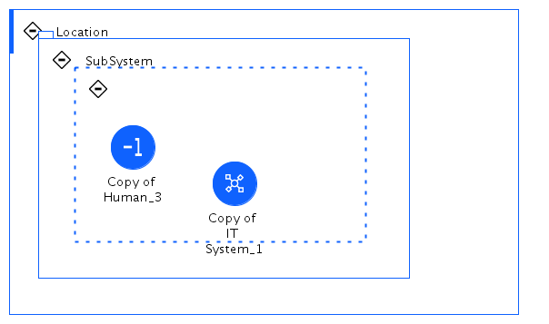

## Diagram

### Name

Copy of Generic Node_2 : Copy of Copy of itsv cp

### Description

### Reference(s)

## Element

[Expand all](#){ .md-button .diff-line }

### Actor

    

Copy of Human_3

<table>
    <caption></caption>
    <thead>
        <tr>
            <th></th>
            <th></th>
        </tr>
    </thead>
    <tr>
        <td> <strong>Name</strong> </td>
        <td>Copy of Human_3</td>
    </tr>
    <tr>
        <td> <strong>Description</strong> </td>
        <td></td>
    </tr>
    <tr>
        <td> <strong>Type</strong> </td>
        <td>Human</td>
    </tr>
    <tr>
        <td> <strong>Generic Group</strong> </td>
<td>
        
</td>
    </tr>
</table>

    

Copy of IT System_1

<table>
    <caption></caption>
    <thead>
        <tr>
            <th></th>
            <th></th>
        </tr>
    </thead>
    <tr>
        <td> <strong>Name</strong> </td>
        <td>Copy of IT System_1</td>
    </tr>
    <tr>
        <td> <strong>Description</strong> </td>
        <td></td>
    </tr>
    <tr>
        <td> <strong>Type</strong> </td>
        <td>IT System</td>
    </tr>
    <tr>
        <td> <strong>Generic Group</strong> </td>
<td>
        
</td>
    </tr>
</table>

    

### Subsystem

    

SubSystem

<table>
    <caption></caption>
    <thead>
        <tr>
            <th></th>
            <th></th>
        </tr>
    </thead>
    <tr>
        <td> <strong>Name</strong> </td>
        <td>SubSystem</td>
    </tr>
    <tr>
        <td> <strong>Description</strong> </td>
        <td></td>
    </tr>
    
</table>

    

### Location

    

Location

<table>
    <caption></caption>
    <thead>
        <tr>
            <th></th>
            <th></th>
        </tr>
    </thead>
    <tr>
        <td> <strong>Name</strong> </td>
        <td>Location</td>
    </tr>
    <tr>
        <td> <strong>Description</strong> </td>
        <td></td>
    </tr>
</table>

    

### Logical Connection

    

### Logical Node

    

