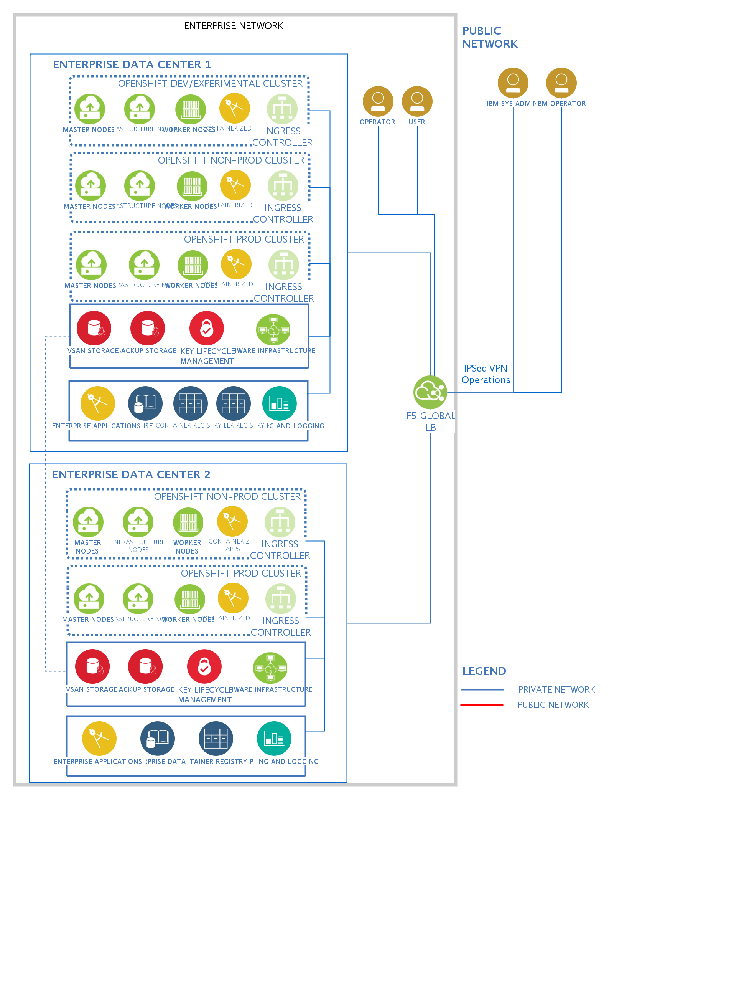

## Diagram

### Name

Armada Control Plane

### Description

## Element

[Expand all](#){ .md-button .diff-line }

### Actor

    

USER

<table>
    <caption></caption>
    <thead>
        <tr>
            <th></th>
            <th></th>
        </tr>
    </thead>
    <tr>
        <td> <strong>Name</strong> </td>
        <td>USER</td>
    </tr>
    <tr>
        <td> <strong>Description</strong> </td>
        <td></td>
    </tr>
    <tr>
        <td> <strong>Type</strong> </td>
        <td>Human</td>
    </tr>
    <tr>
        <td> <strong>Generic Group</strong> </td>
<td>
        
</td>
    </tr>
</table>

    

### Subsystem

    

### Location

    

ENTERPRISE NETWORK

<table>
    <caption></caption>
    <thead>
        <tr>
            <th></th>
            <th></th>
        </tr>
    </thead>
    <tr>
        <td> <strong>Name</strong> </td>
        <td>ENTERPRISE NETWORK</td>
    </tr>
    <tr>
        <td> <strong>Description</strong> </td>
        <td></td>
    </tr>
</table>

    

### Logical Connection

    

### Logical Node

    

F5 GLOBAL LB

<table>
    <caption></caption>
    <thead>
        <tr>
            <th></th>
            <th></th>
        </tr>
    </thead>
    <tr>
        <td> <strong>Name</strong> </td>
        <td>F5 GLOBAL LB</td>
    </tr>
    <tr>
        <td> <strong>Description</strong> </td>
        <td></td>
    </tr>
    <tr>
        <td> <strong>Type</strong> </td>
        <td></td>
    </tr>
    <tr>
        <td> <strong>Primary Capability</strong> </td>
        <td>
            
                
analytic & ai

            
        </td>
    </tr>
    <tr>
        <td> <strong>Implementation</strong> </td>
        <td>
            
                
<a href="https://www.ibm.com/analytics/predictive-analytics">IBM SPSS Predictive Analytics</a>

            
                
<a href="https://www.ibm.com/products/operational-decision-manager">IBM Operational Decision Manager</a>

            
        </td>
    </tr>
    <tr>
        <td> <strong>Architectural Decision</strong> </td>
        <td>
            
                
<a href="../../Architectural Decisions/architecturaldecision_HJJLe4_nL_B18mG8_Wo">Premises for single-tenant cloud platform</a>

            
                
<a href="../../Architectural Decisions/architecturaldecision_ryxr_kNu3L_B18mG8_Wo">A set</a>

            
        </td>
    </tr>
    <tr>
        <td> <strong>Non Functional Requirement</strong> </td>
        <td>
            
                
<a href="../../Non Functional Requirements/nonfunctionalrequirement_SJ3DD-FvJIX_B18mG8_Wo">Support microservice implementation in multiple different languages</a>

            
                
<a href="../../Non Functional Requirements/nonfunctionalrequirement_S1lsS6XTUr_B18mG8_Wo">Availability at 99.995%</a>

            
        </td>
    </tr>
    <tr>
        <td> <strong>Generic Group</strong> </td>
        <td>
                
                
<strong>HA-Mode,active</strong>[Pre-Defined]

                
High availability replica actively handling workload.

                
                
<strong>HA-Mode,passive</strong>[Pre-Defined]

                
High availability replica not handling active workload.

                
            </td>
    </tr>
    <tr>
        <td> <strong>Sub-level Diagram</strong> </td>
        <td></td>
    </tr>
    <tr>
        <td> <strong>Related Diagrams</strong> </td>
        <td>
            
                
<a href="../../IT System View/aoditsystem_BkeaLsPBMO_B18mG8_Wo">Armada Control Plane</a>

            
        </td>
    </tr>
    <tr>
        <td> <strong>Related Elements</strong> </td>
        <td>
            
                
Premises for single-tenant cloud platform

                
                    
                    <li><a href="../../IT System View/aoditsystem_BkeaLsPBMO_B18mG8_Wo">Armada Control Plane</a></li>
                    
                
            
                
Support microservice implementation in multiple different languages

                
                    
                    <li><a href="../../Prescribed Operational View/pomview_1A4wGA2HEGp_B18mG8_Wo">Linked POM</a></li>
                    
                    <li><a href="../../Prescribed Operational View/pomview_378tvn5ZB0f_B18mG8_Wo">POM view from LOM view</a></li>
                    
                    <li><a href="../../Logical Operational View/lomview_2Ir94BKErqu_B18mG8_Wo">LOM for Heatmap</a></li>
                    
                    <li><a href="../../Logical Operational View/lomview_H1PUvbtP1LX_B18mG8_Wo">LOM view</a></li>
                    
                    <li><a href="../../Logical Operational View/lomview_SkkqfI25V_B18mG8_Wo">LOM View2</a></li>
                    
                    <li><a href="../../Services View/aodservices_3pYHSLsFfzn_B18mG8_Wo">Demo1</a></li>
                    
                    <li><a href="../../IT System View/aoditsystem_BkeaLsPBMO_B18mG8_Wo">Armada Control Plane</a></li>
                    
                    <li><a href="../../IT System View/aoditsystem_SyD-nkBRD_B18mG8_Wo">banking example</a></li>
                    
                    <li><a href="../../IT System View/aoditsystem_ryJZvbYPk8X_B18mG8_Wo">Built from CAC Template</a></li>
                    
                    <li><a href="../../IT System View/aoditsystem_ryj4PaVLd_B18mG8_Wo">banking for real</a></li>
                    
                
            
                
A set

                
                    
                    <li><a href="../../Prescribed Operational View/pomview_1A4wGA2HEGp_B18mG8_Wo">Linked POM</a></li>
                    
                    <li><a href="../../Prescribed Operational View/pomview_378tvn5ZB0f_B18mG8_Wo">POM view from LOM view</a></li>
                    
                    <li><a href="../../Logical Operational View/lomview_2Ir94BKErqu_B18mG8_Wo">LOM for Heatmap</a></li>
                    
                    <li><a href="../../Logical Operational View/lomview_H1PUvbtP1LX_B18mG8_Wo">LOM view</a></li>
                    
                    <li><a href="../../Logical Operational View/lomview_SkkqfI25V_B18mG8_Wo">LOM View2</a></li>
                    
                    <li><a href="../../Services View/aodservices_3pYHSLsFfzn_B18mG8_Wo">Demo1</a></li>
                    
                    <li><a href="../../IT System View/aoditsystem_BkeaLsPBMO_B18mG8_Wo">Armada Control Plane</a></li>
                    
                
            
                
Availability at 99.995%

                
                    
                    <li><a href="../../Prescribed Operational View/pomview_1A4wGA2HEGp_B18mG8_Wo">Linked POM</a></li>
                    
                    <li><a href="../../Prescribed Operational View/pomview_378tvn5ZB0f_B18mG8_Wo">POM view from LOM view</a></li>
                    
                    <li><a href="../../Logical Operational View/lomview_2Ir94BKErqu_B18mG8_Wo">LOM for Heatmap</a></li>
                    
                    <li><a href="../../Logical Operational View/lomview_H1PUvbtP1LX_B18mG8_Wo">LOM view</a></li>
                    
                    <li><a href="../../Logical Operational View/lomview_SkkqfI25V_B18mG8_Wo">LOM View2</a></li>
                    
                    <li><a href="../../Services View/aodservices_3pYHSLsFfzn_B18mG8_Wo">Demo1</a></li>
                    
                    <li><a href="../../IT System View/aoditsystem_BkeaLsPBMO_B18mG8_Wo">Armada Control Plane</a></li>
                    
                
            
            
                
SYS_DU_3AvadeOelye

                
            
                
SYS_DU_3AvadeEXhKY

                
            
        </td>
    </tr>
</table>

    

CONTAINERIZED
APPS

<table>
    <caption></caption>
    <thead>
        <tr>
            <th></th>
            <th></th>
        </tr>
    </thead>
    <tr>
        <td> <strong>Name</strong> </td>
        <td>CONTAINERIZED
APPS</td>
    </tr>
    <tr>
        <td> <strong>Description</strong> </td>
        <td></td>
    </tr>
    <tr>
        <td> <strong>Type</strong> </td>
        <td></td>
    </tr>
    <tr>
        <td> <strong>Primary Capability</strong> </td>
        <td>
            
        </td>
    </tr>
    <tr>
        <td> <strong>Implementation</strong> </td>
        <td>
            
        </td>
    </tr>
    <tr>
        <td> <strong>Architectural Decision</strong> </td>
        <td>
            
        </td>
    </tr>
    <tr>
        <td> <strong>Non Functional Requirement</strong> </td>
        <td>
            
        </td>
    </tr>
    <tr>
        <td> <strong>Generic Group</strong> </td>
        <td></td>
    </tr>
    <tr>
        <td> <strong>Sub-level Diagram</strong> </td>
        <td></td>
    </tr>
    <tr>
        <td> <strong>Related Diagrams</strong> </td>
        <td>
            
                
<a href="../../IT System View/aoditsystem_BkeaLsPBMO_B18mG8_Wo">Armada Control Plane</a>

            
        </td>
    </tr>
    <tr>
        <td> <strong>Related Elements</strong> </td>
        <td>
            
            
        </td>
    </tr>
</table>

    

INFRASTRUCTURE 
NODES

<table>
    <caption></caption>
    <thead>
        <tr>
            <th></th>
            <th></th>
        </tr>
    </thead>
    <tr>
        <td> <strong>Name</strong> </td>
        <td>INFRASTRUCTURE 
NODES</td>
    </tr>
    <tr>
        <td> <strong>Description</strong> </td>
        <td></td>
    </tr>
    <tr>
        <td> <strong>Type</strong> </td>
        <td></td>
    </tr>
    <tr>
        <td> <strong>Primary Capability</strong> </td>
        <td>
            
        </td>
    </tr>
    <tr>
        <td> <strong>Implementation</strong> </td>
        <td>
            
        </td>
    </tr>
    <tr>
        <td> <strong>Architectural Decision</strong> </td>
        <td>
            
        </td>
    </tr>
    <tr>
        <td> <strong>Non Functional Requirement</strong> </td>
        <td>
            
        </td>
    </tr>
    <tr>
        <td> <strong>Generic Group</strong> </td>
        <td></td>
    </tr>
    <tr>
        <td> <strong>Sub-level Diagram</strong> </td>
        <td></td>
    </tr>
    <tr>
        <td> <strong>Related Diagrams</strong> </td>
        <td>
            
                
<a href="../../IT System View/aoditsystem_BkeaLsPBMO_B18mG8_Wo">Armada Control Plane</a>

            
        </td>
    </tr>
    <tr>
        <td> <strong>Related Elements</strong> </td>
        <td>
            
            
        </td>
    </tr>
</table>

    

MASTER 
NODES

<table>
    <caption></caption>
    <thead>
        <tr>
            <th></th>
            <th></th>
        </tr>
    </thead>
    <tr>
        <td> <strong>Name</strong> </td>
        <td>MASTER 
NODES</td>
    </tr>
    <tr>
        <td> <strong>Description</strong> </td>
        <td></td>
    </tr>
    <tr>
        <td> <strong>Type</strong> </td>
        <td></td>
    </tr>
    <tr>
        <td> <strong>Primary Capability</strong> </td>
        <td>
            
        </td>
    </tr>
    <tr>
        <td> <strong>Implementation</strong> </td>
        <td>
            
        </td>
    </tr>
    <tr>
        <td> <strong>Architectural Decision</strong> </td>
        <td>
            
        </td>
    </tr>
    <tr>
        <td> <strong>Non Functional Requirement</strong> </td>
        <td>
            
        </td>
    </tr>
    <tr>
        <td> <strong>Generic Group</strong> </td>
        <td></td>
    </tr>
    <tr>
        <td> <strong>Sub-level Diagram</strong> </td>
        <td></td>
    </tr>
    <tr>
        <td> <strong>Related Diagrams</strong> </td>
        <td>
            
                
<a href="../../IT System View/aoditsystem_BkeaLsPBMO_B18mG8_Wo">Armada Control Plane</a>

            
        </td>
    </tr>
    <tr>
        <td> <strong>Related Elements</strong> </td>
        <td>
            
            
        </td>
    </tr>
</table>

    

WORKER
NODES

<table>
    <caption></caption>
    <thead>
        <tr>
            <th></th>
            <th></th>
        </tr>
    </thead>
    <tr>
        <td> <strong>Name</strong> </td>
        <td>WORKER
NODES</td>
    </tr>
    <tr>
        <td> <strong>Description</strong> </td>
        <td></td>
    </tr>
    <tr>
        <td> <strong>Type</strong> </td>
        <td></td>
    </tr>
    <tr>
        <td> <strong>Primary Capability</strong> </td>
        <td>
            
        </td>
    </tr>
    <tr>
        <td> <strong>Implementation</strong> </td>
        <td>
            
        </td>
    </tr>
    <tr>
        <td> <strong>Architectural Decision</strong> </td>
        <td>
            
        </td>
    </tr>
    <tr>
        <td> <strong>Non Functional Requirement</strong> </td>
        <td>
            
        </td>
    </tr>
    <tr>
        <td> <strong>Generic Group</strong> </td>
        <td></td>
    </tr>
    <tr>
        <td> <strong>Sub-level Diagram</strong> </td>
        <td></td>
    </tr>
    <tr>
        <td> <strong>Related Diagrams</strong> </td>
        <td>
            
                
<a href="../../IT System View/aoditsystem_BkeaLsPBMO_B18mG8_Wo">Armada Control Plane</a>

            
        </td>
    </tr>
    <tr>
        <td> <strong>Related Elements</strong> </td>
        <td>
            
            
        </td>
    </tr>
</table>

    

