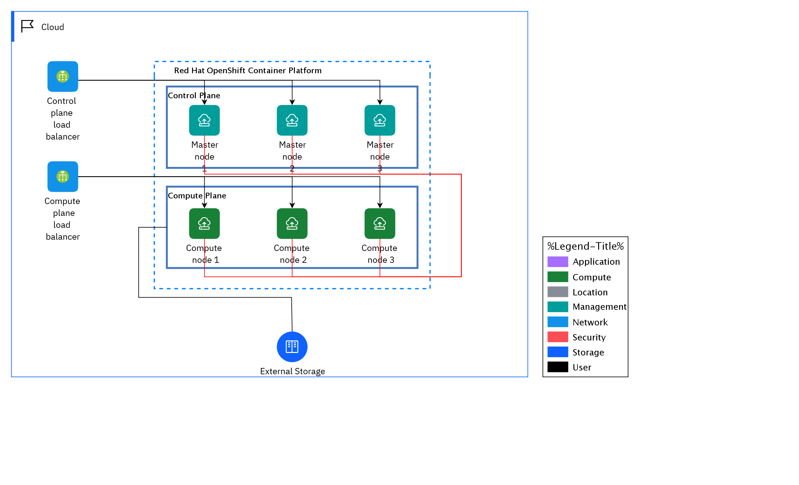

## Diagram

### Name

RHOCP-02 export

### Description

## Element

[Expand all](#){ .md-button .diff-line }

### Actor

    

### Subsystem

    

### Location

    

### Logical Connection

    

### Logical Node

    

