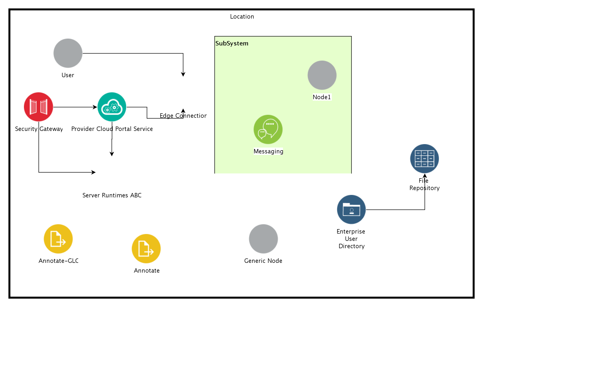

## Diagram

### Name

Runtime View

### Description

## Element

[Expand all](#){ .md-button .diff-line }

### Actor

    

### Subsystem

    

SubSystem

<table>
    <caption></caption>
    <thead>
        <tr>
            <th></th>
            <th></th>
        </tr>
    </thead>
    <tr>
        <td> <strong>Name</strong> </td>
        <td>SubSystem</td>
    </tr>
    <tr>
        <td> <strong>Description</strong> </td>
        <td></td>
    </tr>
</table>

    

### Location

    

Location

<table>
    <caption></caption>
    <thead>
        <tr>
            <th></th>
            <th></th>
        </tr>
    </thead>
    <tr>
        <td> <strong>Name</strong> </td>
        <td>Location</td>
    </tr>
    <tr>
        <td> <strong>Description</strong> </td>
        <td></td>
    </tr>
</table>

    

### Logical Connection

    

<table>
    <caption></caption>
    <thead>
        <tr>
            <th></th>
            <th></th>
        </tr>
    </thead>
    <tr>
        <td> <strong>Name</strong> </td>
        <td></td>
    </tr>
    <tr>
        <td> <strong>Description</strong> </td>
        <td></td>
    </tr>
</table>

    

<table>
    <caption></caption>
    <thead>
        <tr>
            <th></th>
            <th></th>
        </tr>
    </thead>
    <tr>
        <td> <strong>Name</strong> </td>
        <td></td>
    </tr>
    <tr>
        <td> <strong>Description</strong> </td>
        <td></td>
    </tr>
</table>

    

<table>
    <caption></caption>
    <thead>
        <tr>
            <th></th>
            <th></th>
        </tr>
    </thead>
    <tr>
        <td> <strong>Name</strong> </td>
        <td></td>
    </tr>
    <tr>
        <td> <strong>Description</strong> </td>
        <td></td>
    </tr>
</table>

    

<table>
    <caption></caption>
    <thead>
        <tr>
            <th></th>
            <th></th>
        </tr>
    </thead>
    <tr>
        <td> <strong>Name</strong> </td>
        <td></td>
    </tr>
    <tr>
        <td> <strong>Description</strong> </td>
        <td></td>
    </tr>
</table>

    

<table>
    <caption></caption>
    <thead>
        <tr>
            <th></th>
            <th></th>
        </tr>
    </thead>
    <tr>
        <td> <strong>Name</strong> </td>
        <td></td>
    </tr>
    <tr>
        <td> <strong>Description</strong> </td>
        <td></td>
    </tr>
</table>

    

<table>
    <caption></caption>
    <thead>
        <tr>
            <th></th>
            <th></th>
        </tr>
    </thead>
    <tr>
        <td> <strong>Name</strong> </td>
        <td></td>
    </tr>
    <tr>
        <td> <strong>Description</strong> </td>
        <td></td>
    </tr>
</table>

    

### Logical Node

    

Annotate

<table>
    <caption></caption>
    <thead>
        <tr>
            <th></th>
            <th></th>
        </tr>
    </thead>
    <tr>
        <td> <strong>Name</strong> </td>
        <td>Annotate</td>
    </tr>
    <tr>
        <td> <strong>Description</strong> </td>
        <td></td>
    </tr>
    <tr>
        <td> <strong>Type</strong> </td>
        <td></td>
    </tr>
    <tr>
        <td> <strong>Primary Capability</strong> </td>
        <td>
            
        </td>
    </tr>
    <tr>
        <td> <strong>Implementation</strong> </td>
        <td>
            
        </td>
    </tr>
    <tr>
        <td> <strong>Architectural Decision</strong> </td>
        <td>
            
        </td>
    </tr>
    <tr>
        <td> <strong>Non Functional Requirement</strong> </td>
        <td>
            
        </td>
    </tr>
    <tr>
        <td> <strong>Generic Group</strong> </td>
        <td></td>
    </tr>
    <tr>
        <td> <strong>Sub-level Diagram</strong> </td>
        <td></td>
    </tr>
    <tr>
        <td> <strong>Related Diagrams</strong> </td>
        <td>
            
                
<a href="../../Usage Scenario/aodusagescenario_SyKDPbYw1UQ_B18mG8_Wo">US for Runtime</a>

            
                
<a href="../../Usage Scenario/aodusagescenario_1nAUCHuYago_B18mG8_Wo">US2</a>

            
                
<a href="../../IT System View/aoditsystem_Hy-w-KwJLX_B18mG8_Wo">Runtime View</a>

            
        </td>
    </tr>
    <tr>
        <td> <strong>Related Elements</strong> </td>
        <td>
            
            
        </td>
    </tr>
</table>

    

Annotate-GLC

<table>
    <caption></caption>
    <thead>
        <tr>
            <th></th>
            <th></th>
        </tr>
    </thead>
    <tr>
        <td> <strong>Name</strong> </td>
        <td>Annotate-GLC</td>
    </tr>
    <tr>
        <td> <strong>Description</strong> </td>
        <td></td>
    </tr>
    <tr>
        <td> <strong>Type</strong> </td>
        <td></td>
    </tr>
    <tr>
        <td> <strong>Primary Capability</strong> </td>
        <td>
            
        </td>
    </tr>
    <tr>
        <td> <strong>Implementation</strong> </td>
        <td>
            
        </td>
    </tr>
    <tr>
        <td> <strong>Architectural Decision</strong> </td>
        <td>
            
        </td>
    </tr>
    <tr>
        <td> <strong>Non Functional Requirement</strong> </td>
        <td>
            
        </td>
    </tr>
    <tr>
        <td> <strong>Generic Group</strong> </td>
        <td></td>
    </tr>
    <tr>
        <td> <strong>Sub-level Diagram</strong> </td>
        <td></td>
    </tr>
    <tr>
        <td> <strong>Related Diagrams</strong> </td>
        <td>
            
                
<a href="../../Usage Scenario/aodusagescenario_SyKDPbYw1UQ_B18mG8_Wo">US for Runtime</a>

            
                
<a href="../../Usage Scenario/aodusagescenario_1nAUCHuYago_B18mG8_Wo">US2</a>

            
                
<a href="../../IT System View/aoditsystem_Hy-w-KwJLX_B18mG8_Wo">Runtime View</a>

            
        </td>
    </tr>
    <tr>
        <td> <strong>Related Elements</strong> </td>
        <td>
            
            
        </td>
    </tr>
</table>

    

Edge Connection

<table>
    <caption></caption>
    <thead>
        <tr>
            <th></th>
            <th></th>
        </tr>
    </thead>
    <tr>
        <td> <strong>Name</strong> </td>
        <td>Edge Connection</td>
    </tr>
    <tr>
        <td> <strong>Description</strong> </td>
        <td></td>
    </tr>
    <tr>
        <td> <strong>Type</strong> </td>
        <td></td>
    </tr>
    <tr>
        <td> <strong>Primary Capability</strong> </td>
        <td>
            
        </td>
    </tr>
    <tr>
        <td> <strong>Implementation</strong> </td>
        <td>
            
        </td>
    </tr>
    <tr>
        <td> <strong>Architectural Decision</strong> </td>
        <td>
            
        </td>
    </tr>
    <tr>
        <td> <strong>Non Functional Requirement</strong> </td>
        <td>
            
        </td>
    </tr>
    <tr>
        <td> <strong>Generic Group</strong> </td>
        <td>
                
                
<strong>Tier,tier1</strong>[User-Defined]

                
Tier 1 stuff

                
            </td>
    </tr>
    <tr>
        <td> <strong>Sub-level Diagram</strong> </td>
        <td></td>
    </tr>
    <tr>
        <td> <strong>Related Diagrams</strong> </td>
        <td>
            
                
<a href="../../Usage Scenario/aodusagescenario_SyKDPbYw1UQ_B18mG8_Wo">US for Runtime</a>

            
                
<a href="../../Usage Scenario/aodusagescenario_1nAUCHuYago_B18mG8_Wo">US2</a>

            
                
<a href="../../IT System View/aoditsystem_Hy-w-KwJLX_B18mG8_Wo">Runtime View</a>

            
        </td>
    </tr>
    <tr>
        <td> <strong>Related Elements</strong> </td>
        <td>
            
            
        </td>
    </tr>
</table>

    

Enterprise User Directory

<table>
    <caption></caption>
    <thead>
        <tr>
            <th></th>
            <th></th>
        </tr>
    </thead>
    <tr>
        <td> <strong>Name</strong> </td>
        <td>Enterprise User Directory</td>
    </tr>
    <tr>
        <td> <strong>Description</strong> </td>
        <td>Provides storage and access to user info for authentication, authorization or profile data.</td>
    </tr>
    <tr>
        <td> <strong>Type</strong> </td>
        <td></td>
    </tr>
    <tr>
        <td> <strong>Primary Capability</strong> </td>
        <td>
            
        </td>
    </tr>
    <tr>
        <td> <strong>Implementation</strong> </td>
        <td>
            
        </td>
    </tr>
    <tr>
        <td> <strong>Architectural Decision</strong> </td>
        <td>
            
        </td>
    </tr>
    <tr>
        <td> <strong>Non Functional Requirement</strong> </td>
        <td>
            
        </td>
    </tr>
    <tr>
        <td> <strong>Generic Group</strong> </td>
        <td></td>
    </tr>
    <tr>
        <td> <strong>Sub-level Diagram</strong> </td>
        <td></td>
    </tr>
    <tr>
        <td> <strong>Related Diagrams</strong> </td>
        <td>
            
                
<a href="../../Usage Scenario/aodusagescenario_SyKDPbYw1UQ_B18mG8_Wo">US for Runtime</a>

            
                
<a href="../../Usage Scenario/aodusagescenario_1nAUCHuYago_B18mG8_Wo">US2</a>

            
                
<a href="../../IT System View/aoditsystem_SyD-nkBRD_B18mG8_Wo">banking example</a>

            
                
<a href="../../IT System View/aoditsystem_ryJZvbYPk8X_B18mG8_Wo">Built from CAC Template</a>

            
                
<a href="../../IT System View/aoditsystem_Hy-w-KwJLX_B18mG8_Wo">Runtime View</a>

            
                
<a href="../../IT System View/aoditsystem_ryj4PaVLd_B18mG8_Wo">banking for real</a>

            
                
<a href="../../Prescribed Operational View/pomview_1A4wGA2HEGp_B18mG8_Wo">Linked POM</a>

            
        </td>
    </tr>
    <tr>
        <td> <strong>Related Elements</strong> </td>
        <td>
            
                
P. Node22

                
                    
                    <li><a href="../../Prescribed Operational View/pomview_1A4wGA2HEGp_B18mG8_Wo">Linked POM</a></li>
                    
                
            
            
        </td>
    </tr>
</table>

    

File Repository

<table>
    <caption></caption>
    <thead>
        <tr>
            <th></th>
            <th></th>
        </tr>
    </thead>
    <tr>
        <td> <strong>Name</strong> </td>
        <td>File Repository</td>
    </tr>
    <tr>
        <td> <strong>Description</strong> </td>
        <td>Provides devices or applications that store info, data, and more in the form of files.</td>
    </tr>
    <tr>
        <td> <strong>Type</strong> </td>
        <td></td>
    </tr>
    <tr>
        <td> <strong>Primary Capability</strong> </td>
        <td>
            
        </td>
    </tr>
    <tr>
        <td> <strong>Implementation</strong> </td>
        <td>
            
        </td>
    </tr>
    <tr>
        <td> <strong>Architectural Decision</strong> </td>
        <td>
            
        </td>
    </tr>
    <tr>
        <td> <strong>Non Functional Requirement</strong> </td>
        <td>
            
        </td>
    </tr>
    <tr>
        <td> <strong>Generic Group</strong> </td>
        <td></td>
    </tr>
    <tr>
        <td> <strong>Sub-level Diagram</strong> </td>
        <td></td>
    </tr>
    <tr>
        <td> <strong>Related Diagrams</strong> </td>
        <td>
            
                
<a href="../../Usage Scenario/aodusagescenario_SyKDPbYw1UQ_B18mG8_Wo">US for Runtime</a>

            
                
<a href="../../Usage Scenario/aodusagescenario_1nAUCHuYago_B18mG8_Wo">US2</a>

            
                
<a href="../../IT System View/aoditsystem_Hy-w-KwJLX_B18mG8_Wo">Runtime View</a>

            
        </td>
    </tr>
    <tr>
        <td> <strong>Related Elements</strong> </td>
        <td>
            
            
        </td>
    </tr>
</table>

    

Generic Node

<table>
    <caption></caption>
    <thead>
        <tr>
            <th></th>
            <th></th>
        </tr>
    </thead>
    <tr>
        <td> <strong>Name</strong> </td>
        <td>Generic Node</td>
    </tr>
    <tr>
        <td> <strong>Description</strong> </td>
        <td></td>
    </tr>
    <tr>
        <td> <strong>Type</strong> </td>
        <td></td>
    </tr>
    <tr>
        <td> <strong>Primary Capability</strong> </td>
        <td>
            
        </td>
    </tr>
    <tr>
        <td> <strong>Implementation</strong> </td>
        <td>
            
        </td>
    </tr>
    <tr>
        <td> <strong>Architectural Decision</strong> </td>
        <td>
            
        </td>
    </tr>
    <tr>
        <td> <strong>Non Functional Requirement</strong> </td>
        <td>
            
        </td>
    </tr>
    <tr>
        <td> <strong>Generic Group</strong> </td>
        <td></td>
    </tr>
    <tr>
        <td> <strong>Sub-level Diagram</strong> </td>
        <td></td>
    </tr>
    <tr>
        <td> <strong>Related Diagrams</strong> </td>
        <td>
            
                
<a href="../../Usage Scenario/aodusagescenario_SyKDPbYw1UQ_B18mG8_Wo">US for Runtime</a>

            
                
<a href="../../Usage Scenario/aodusagescenario_1nAUCHuYago_B18mG8_Wo">US2</a>

            
                
<a href="../../IT System View/aoditsystem_Hy-w-KwJLX_B18mG8_Wo">Runtime View</a>

            
        </td>
    </tr>
    <tr>
        <td> <strong>Related Elements</strong> </td>
        <td>
            
            
        </td>
    </tr>
</table>

    

Messaging

<table>
    <caption></caption>
    <thead>
        <tr>
            <th></th>
            <th></th>
        </tr>
    </thead>
    <tr>
        <td> <strong>Name</strong> </td>
        <td>Messaging</td>
    </tr>
    <tr>
        <td> <strong>Description</strong> </td>
        <td></td>
    </tr>
    <tr>
        <td> <strong>Type</strong> </td>
        <td></td>
    </tr>
    <tr>
        <td> <strong>Primary Capability</strong> </td>
        <td>
            
        </td>
    </tr>
    <tr>
        <td> <strong>Implementation</strong> </td>
        <td>
            
        </td>
    </tr>
    <tr>
        <td> <strong>Architectural Decision</strong> </td>
        <td>
            
        </td>
    </tr>
    <tr>
        <td> <strong>Non Functional Requirement</strong> </td>
        <td>
            
        </td>
    </tr>
    <tr>
        <td> <strong>Generic Group</strong> </td>
        <td>
                
                
<strong>SubSystem,K8S Cluster</strong>[User-Defined]

                

                
            </td>
    </tr>
    <tr>
        <td> <strong>Sub-level Diagram</strong> </td>
        <td></td>
    </tr>
    <tr>
        <td> <strong>Related Diagrams</strong> </td>
        <td>
            
                
<a href="../../Logical Operational View/lomview_H1PUvbtP1LX_B18mG8_Wo">LOM view</a>

            
                
<a href="../../Logical Operational View/lomview_SkkqfI25V_B18mG8_Wo">LOM View2</a>

            
                
<a href="../../Usage Scenario/aodusagescenario_SyKDPbYw1UQ_B18mG8_Wo">US for Runtime</a>

            
                
<a href="../../Usage Scenario/aodusagescenario_1nAUCHuYago_B18mG8_Wo">US2</a>

            
                
<a href="../../IT System View/aoditsystem_Hy-w-KwJLX_B18mG8_Wo">Runtime View</a>

            
                
<a href="../../Prescribed Operational View/pomview_1A4wGA2HEGp_B18mG8_Wo">Linked POM</a>

            
                
<a href="../../Prescribed Operational View/pomview_378tvn5ZB0f_B18mG8_Wo">POM view from LOM view</a>

            
        </td>
    </tr>
    <tr>
        <td> <strong>Related Elements</strong> </td>
        <td>
            
                
P. Node22

                
                    
                    <li><a href="../../Prescribed Operational View/pomview_1A4wGA2HEGp_B18mG8_Wo">Linked POM</a></li>
                    
                
            
                
Public Cloud Provider

                
                    
                    <li><a href="../../Prescribed Operational View/pomview_1A4wGA2HEGp_B18mG8_Wo">Linked POM</a></li>
                    
                    <li><a href="../../Prescribed Operational View/pomview_378tvn5ZB0f_B18mG8_Wo">POM view from LOM view</a></li>
                    
                    <li><a href="../../Logical Operational View/lomview_2Ir94BKErqu_B18mG8_Wo">LOM for Heatmap</a></li>
                    
                    <li><a href="../../Logical Operational View/lomview_H1PUvbtP1LX_B18mG8_Wo">LOM view</a></li>
                    
                    <li><a href="../../Logical Operational View/lomview_SkkqfI25V_B18mG8_Wo">LOM View2</a></li>
                    
                
            
            
                
E_Messaging

                
            
        </td>
    </tr>
</table>

    

Node1

<table>
    <caption></caption>
    <thead>
        <tr>
            <th></th>
            <th></th>
        </tr>
    </thead>
    <tr>
        <td> <strong>Name</strong> </td>
        <td>Node1</td>
    </tr>
    <tr>
        <td> <strong>Description</strong> </td>
        <td></td>
    </tr>
    <tr>
        <td> <strong>Type</strong> </td>
        <td></td>
    </tr>
    <tr>
        <td> <strong>Primary Capability</strong> </td>
        <td>
            
        </td>
    </tr>
    <tr>
        <td> <strong>Implementation</strong> </td>
        <td>
            
        </td>
    </tr>
    <tr>
        <td> <strong>Architectural Decision</strong> </td>
        <td>
            
        </td>
    </tr>
    <tr>
        <td> <strong>Non Functional Requirement</strong> </td>
        <td>
            
        </td>
    </tr>
    <tr>
        <td> <strong>Generic Group</strong> </td>
        <td></td>
    </tr>
    <tr>
        <td> <strong>Sub-level Diagram</strong> </td>
        <td></td>
    </tr>
    <tr>
        <td> <strong>Related Diagrams</strong> </td>
        <td>
            
                
<a href="../../Usage Scenario/aodusagescenario_SyKDPbYw1UQ_B18mG8_Wo">US for Runtime</a>

            
                
<a href="../../Usage Scenario/aodusagescenario_1nAUCHuYago_B18mG8_Wo">US2</a>

            
                
<a href="../../IT System View/aoditsystem_Hy-w-KwJLX_B18mG8_Wo">Runtime View</a>

            
        </td>
    </tr>
    <tr>
        <td> <strong>Related Elements</strong> </td>
        <td>
            
            
        </td>
    </tr>
</table>

    

Provider Cloud Portal Service

<table>
    <caption></caption>
    <thead>
        <tr>
            <th></th>
            <th></th>
        </tr>
    </thead>
    <tr>
        <td> <strong>Name</strong> </td>
        <td>Provider Cloud Portal Service</td>
    </tr>
    <tr>
        <td> <strong>Description</strong> </td>
        <td>The service for the Bluemix console which human end users use to connect to the Blockchain service running on public Bluemix cloud using browser.

Product:
* Bluemix Public Cloud Service endpoint URL for browser interaction – such as https://console.bluemix.net/</td>
    </tr>
    <tr>
        <td> <strong>Type</strong> </td>
        <td></td>
    </tr>
    <tr>
        <td> <strong>Primary Capability</strong> </td>
        <td>
            
        </td>
    </tr>
    <tr>
        <td> <strong>Implementation</strong> </td>
        <td>
            
        </td>
    </tr>
    <tr>
        <td> <strong>Architectural Decision</strong> </td>
        <td>
            
        </td>
    </tr>
    <tr>
        <td> <strong>Non Functional Requirement</strong> </td>
        <td>
            
        </td>
    </tr>
    <tr>
        <td> <strong>Generic Group</strong> </td>
        <td></td>
    </tr>
    <tr>
        <td> <strong>Sub-level Diagram</strong> </td>
        <td></td>
    </tr>
    <tr>
        <td> <strong>Related Diagrams</strong> </td>
        <td>
            
                
<a href="../../Usage Scenario/aodusagescenario_SyKDPbYw1UQ_B18mG8_Wo">US for Runtime</a>

            
                
<a href="../../Usage Scenario/aodusagescenario_1nAUCHuYago_B18mG8_Wo">US2</a>

            
                
<a href="../../IT System View/aoditsystem_Hy-w-KwJLX_B18mG8_Wo">Runtime View</a>

            
        </td>
    </tr>
    <tr>
        <td> <strong>Related Elements</strong> </td>
        <td>
            
            
        </td>
    </tr>
</table>

    

Security Gateway

<table>
    <caption></caption>
    <thead>
        <tr>
            <th></th>
            <th></th>
        </tr>
    </thead>
    <tr>
        <td> <strong>Name</strong> </td>
        <td>Security Gateway</td>
    </tr>
    <tr>
        <td> <strong>Description</strong> </td>
        <td>Network point that acts as an entrance to another network.

Products:
* IBM QRadar® and IBM Security Trusteer® for security intelligence
* IBM Security Access Manager
* IBM Security Directory Suite
* IBM Single Sign On</td>
    </tr>
    <tr>
        <td> <strong>Type</strong> </td>
        <td></td>
    </tr>
    <tr>
        <td> <strong>Primary Capability</strong> </td>
        <td>
            
        </td>
    </tr>
    <tr>
        <td> <strong>Implementation</strong> </td>
        <td>
            
                
<a href="https://www.docker.com/">Docker</a>

            
                
<a href="https://www.ibm.com/products/maximo">IBM Maximo</a>

            
        </td>
    </tr>
    <tr>
        <td> <strong>Architectural Decision</strong> </td>
        <td>
            
        </td>
    </tr>
    <tr>
        <td> <strong>Non Functional Requirement</strong> </td>
        <td>
            
        </td>
    </tr>
    <tr>
        <td> <strong>Generic Group</strong> </td>
        <td>
                
                
<strong>SubSystem,K8S Cluster</strong>[User-Defined]

                

                
            </td>
    </tr>
    <tr>
        <td> <strong>Sub-level Diagram</strong> </td>
        <td></td>
    </tr>
    <tr>
        <td> <strong>Related Diagrams</strong> </td>
        <td>
            
                
<a href="../../Logical Operational View/lomview_H1PUvbtP1LX_B18mG8_Wo">LOM view</a>

            
                
<a href="../../Logical Operational View/lomview_SkkqfI25V_B18mG8_Wo">LOM View2</a>

            
                
<a href="../../Usage Scenario/aodusagescenario_SyKDPbYw1UQ_B18mG8_Wo">US for Runtime</a>

            
                
<a href="../../Usage Scenario/aodusagescenario_1nAUCHuYago_B18mG8_Wo">US2</a>

            
                
<a href="../../IT System View/aoditsystem_Hy-w-KwJLX_B18mG8_Wo">Runtime View</a>

            
                
<a href="../../IT System View/aoditsystem_34XIsXb9za1_B18mG8_Wo">Visualization Paper</a>

            
                
<a href="../../Prescribed Operational View/pomview_1A4wGA2HEGp_B18mG8_Wo">Linked POM</a>

            
                
<a href="../../Prescribed Operational View/pomview_378tvn5ZB0f_B18mG8_Wo">POM view from LOM view</a>

            
        </td>
    </tr>
    <tr>
        <td> <strong>Related Elements</strong> </td>
        <td>
            
                
P. Node

                
                    
                    <li><a href="../../Prescribed Operational View/pomview_1A4wGA2HEGp_B18mG8_Wo">Linked POM</a></li>
                    
                
            
                
Public Cloud Provider

                
                    
                    <li><a href="../../Prescribed Operational View/pomview_1A4wGA2HEGp_B18mG8_Wo">Linked POM</a></li>
                    
                    <li><a href="../../Prescribed Operational View/pomview_378tvn5ZB0f_B18mG8_Wo">POM view from LOM view</a></li>
                    
                    <li><a href="../../Logical Operational View/lomview_2Ir94BKErqu_B18mG8_Wo">LOM for Heatmap</a></li>
                    
                    <li><a href="../../Logical Operational View/lomview_H1PUvbtP1LX_B18mG8_Wo">LOM view</a></li>
                    
                    <li><a href="../../Logical Operational View/lomview_SkkqfI25V_B18mG8_Wo">LOM View2</a></li>
                    
                
            
            
                
E_Gateway

                
                    
                    <li>
<a href="../../Prescribed Operational View/pomview_1A4wGA2HEGp_B18mG8_Wo">Linked POM</a>
</li>
                    
                    <li>
<a href="../../Logical Operational View/lomview_H1PUvbtP1LX_B18mG8_Wo">LOM view</a>
</li>
                    
                    <li>
<a href="../../Logical Operational View/lomview_SkkqfI25V_B18mG8_Wo">LOM View2</a>
</li>
                    
                    <li>
<a href="../../Services View/aodservices_3pYHSLsFfzn_B18mG8_Wo">Demo1</a>
</li>
                    
                
            
        </td>
    </tr>
</table>

    

Server Runtimes ABC

<table>
    <caption></caption>
    <thead>
        <tr>
            <th></th>
            <th></th>
        </tr>
    </thead>
    <tr>
        <td> <strong>Name</strong> </td>
        <td>Server Runtimes ABC</td>
    </tr>
    <tr>
        <td> <strong>Description</strong> </td>
        <td>Server runtimes host blockchain native applications on a server side hosting environment. Server side applications are deployed to server runtimes and are running as chaincode applications on blockchain networks in a hosted environment.

Products:
* [Blockchain service](https://console.bluemix.net/catalog/services/blockchain/) running on Bluemix in a public, dedicated, on-premises, or hybrid deployment model.
* Running on LinuxOne cloud</td>
    </tr>
    <tr>
        <td> <strong>Type</strong> </td>
        <td></td>
    </tr>
    <tr>
        <td> <strong>Primary Capability</strong> </td>
        <td>
            
        </td>
    </tr>
    <tr>
        <td> <strong>Implementation</strong> </td>
        <td>
            
                
<a href="">IOT Framework</a>

            
        </td>
    </tr>
    <tr>
        <td> <strong>Architectural Decision</strong> </td>
        <td>
            
        </td>
    </tr>
    <tr>
        <td> <strong>Non Functional Requirement</strong> </td>
        <td>
            
        </td>
    </tr>
    <tr>
        <td> <strong>Generic Group</strong> </td>
        <td></td>
    </tr>
    <tr>
        <td> <strong>Sub-level Diagram</strong> </td>
        <td></td>
    </tr>
    <tr>
        <td> <strong>Related Diagrams</strong> </td>
        <td>
            
                
<a href="../../Usage Scenario/aodusagescenario_SyKDPbYw1UQ_B18mG8_Wo">US for Runtime</a>

            
                
<a href="../../Usage Scenario/aodusagescenario_1nAUCHuYago_B18mG8_Wo">US2</a>

            
                
<a href="../../IT System View/aoditsystem_SyD-nkBRD_B18mG8_Wo">banking example</a>

            
                
<a href="../../IT System View/aoditsystem_ryJZvbYPk8X_B18mG8_Wo">Built from CAC Template</a>

            
                
<a href="../../IT System View/aoditsystem_Hy-w-KwJLX_B18mG8_Wo">Runtime View</a>

            
                
<a href="../../IT System View/aoditsystem_ryj4PaVLd_B18mG8_Wo">banking for real</a>

            
        </td>
    </tr>
    <tr>
        <td> <strong>Related Elements</strong> </td>
        <td>
            
            
                
Server Runtimes ABC_DU

                
            
        </td>
    </tr>
</table>

    

User

<table>
    <caption></caption>
    <thead>
        <tr>
            <th></th>
            <th></th>
        </tr>
    </thead>
    <tr>
        <td> <strong>Name</strong> </td>
        <td>User</td>
    </tr>
    <tr>
        <td> <strong>Description</strong> </td>
        <td></td>
    </tr>
    <tr>
        <td> <strong>Type</strong> </td>
        <td></td>
    </tr>
    <tr>
        <td> <strong>Primary Capability</strong> </td>
        <td>
            
        </td>
    </tr>
    <tr>
        <td> <strong>Implementation</strong> </td>
        <td>
            
        </td>
    </tr>
    <tr>
        <td> <strong>Architectural Decision</strong> </td>
        <td>
            
        </td>
    </tr>
    <tr>
        <td> <strong>Non Functional Requirement</strong> </td>
        <td>
            
        </td>
    </tr>
    <tr>
        <td> <strong>Generic Group</strong> </td>
        <td></td>
    </tr>
    <tr>
        <td> <strong>Sub-level Diagram</strong> </td>
        <td></td>
    </tr>
    <tr>
        <td> <strong>Related Diagrams</strong> </td>
        <td>
            
                
<a href="../../Usage Scenario/aodusagescenario_SyKDPbYw1UQ_B18mG8_Wo">US for Runtime</a>

            
                
<a href="../../Usage Scenario/aodusagescenario_1nAUCHuYago_B18mG8_Wo">US2</a>

            
                
<a href="../../IT System View/aoditsystem_Hy-w-KwJLX_B18mG8_Wo">Runtime View</a>

            
        </td>
    </tr>
    <tr>
        <td> <strong>Related Elements</strong> </td>
        <td>
            
            
        </td>
    </tr>
</table>

    

