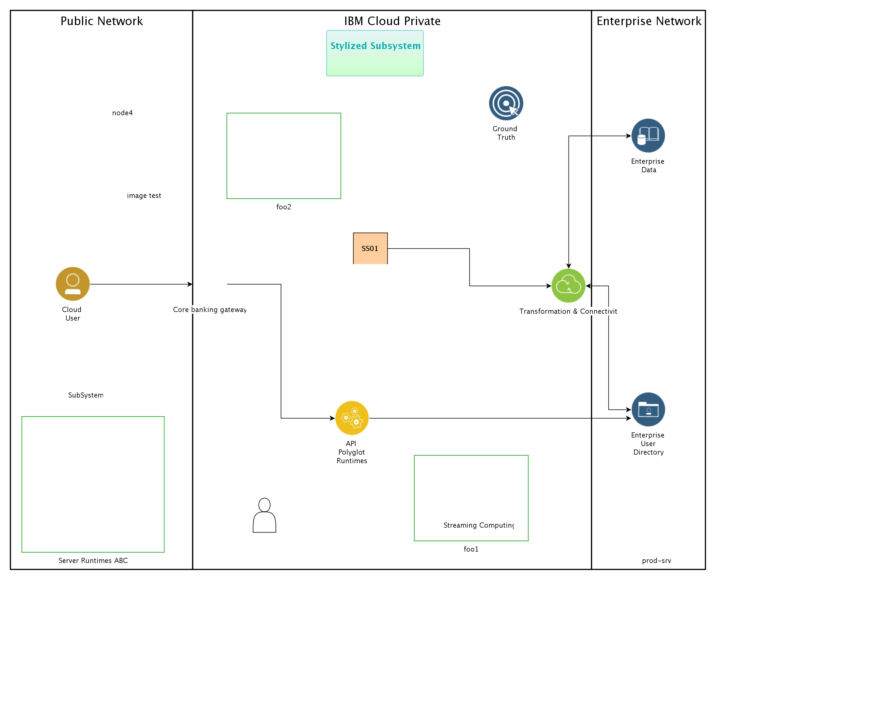

## Diagram

### Name

banking for real

### Description

## Element

[Expand all](#){ .md-button .diff-line }

### Actor

    

### Subsystem

    

foo1

<table>
    <caption></caption>
    <thead>
        <tr>
            <th></th>
            <th></th>
        </tr>
    </thead>
    <tr>
        <td> <strong>Name</strong> </td>
        <td>foo1</td>
    </tr>
    <tr>
        <td> <strong>Description</strong> </td>
        <td></td>
    </tr>
</table>

    

foo2

<table>
    <caption></caption>
    <thead>
        <tr>
            <th></th>
            <th></th>
        </tr>
    </thead>
    <tr>
        <td> <strong>Name</strong> </td>
        <td>foo2</td>
    </tr>
    <tr>
        <td> <strong>Description</strong> </td>
        <td></td>
    </tr>
</table>

    

SS01

<table>
    <caption></caption>
    <thead>
        <tr>
            <th></th>
            <th></th>
        </tr>
    </thead>
    <tr>
        <td> <strong>Name</strong> </td>
        <td>SS01</td>
    </tr>
    <tr>
        <td> <strong>Description</strong> </td>
        <td>A subsystem</td>
    </tr>
</table>

    

Stylized Subsystem

<table>
    <caption></caption>
    <thead>
        <tr>
            <th></th>
            <th></th>
        </tr>
    </thead>
    <tr>
        <td> <strong>Name</strong> </td>
        <td>Stylized Subsystem</td>
    </tr>
    <tr>
        <td> <strong>Description</strong> </td>
        <td></td>
    </tr>
</table>

    

SubSystem

<table>
    <caption></caption>
    <thead>
        <tr>
            <th></th>
            <th></th>
        </tr>
    </thead>
    <tr>
        <td> <strong>Name</strong> </td>
        <td>SubSystem</td>
    </tr>
    <tr>
        <td> <strong>Description</strong> </td>
        <td></td>
    </tr>
</table>

    

### Location

    

Enterprise Network

<table>
    <caption></caption>
    <thead>
        <tr>
            <th></th>
            <th></th>
        </tr>
    </thead>
    <tr>
        <td> <strong>Name</strong> </td>
        <td>Enterprise Network</td>
    </tr>
    <tr>
        <td> <strong>Description</strong> </td>
        <td>The enterprise network is where the on-premises systems and users are located.</td>
    </tr>
</table>

    

IBM Cloud Private

<table>
    <caption></caption>
    <thead>
        <tr>
            <th></th>
            <th></th>
        </tr>
    </thead>
    <tr>
        <td> <strong>Name</strong> </td>
        <td>IBM Cloud Private</td>
    </tr>
    <tr>
        <td> <strong>Description</strong> </td>
        <td>Get the speed of public, control of private. IBM Cloud Private. Fast. Flexible. Enterprise-grade.

Build open, cloud-native apps with public services and run them anywhere — on public cloud or on your existing on-premises systems</td>
    </tr>
</table>

    

Public Network

<table>
    <caption></caption>
    <thead>
        <tr>
            <th></th>
            <th></th>
        </tr>
    </thead>
    <tr>
        <td> <strong>Name</strong> </td>
        <td>Public Network</td>
    </tr>
    <tr>
        <td> <strong>Description</strong> </td>
        <td>A public network is a type of network wherein anyone, namely the general public, has access and through it can connect to other networks or the Internet. This is in contrast to a private network, where restrictions and access rules are established in order to relegate access to a select few.</td>
    </tr>
</table>

    

### Logical Connection

    

<table>
    <caption></caption>
    <thead>
        <tr>
            <th></th>
            <th></th>
        </tr>
    </thead>
    <tr>
        <td> <strong>Name</strong> </td>
        <td></td>
    </tr>
    <tr>
        <td> <strong>Description</strong> </td>
        <td></td>
    </tr>
</table>

    

<table>
    <caption></caption>
    <thead>
        <tr>
            <th></th>
            <th></th>
        </tr>
    </thead>
    <tr>
        <td> <strong>Name</strong> </td>
        <td></td>
    </tr>
    <tr>
        <td> <strong>Description</strong> </td>
        <td></td>
    </tr>
</table>

    

<table>
    <caption></caption>
    <thead>
        <tr>
            <th></th>
            <th></th>
        </tr>
    </thead>
    <tr>
        <td> <strong>Name</strong> </td>
        <td></td>
    </tr>
    <tr>
        <td> <strong>Description</strong> </td>
        <td></td>
    </tr>
</table>

    

<table>
    <caption></caption>
    <thead>
        <tr>
            <th></th>
            <th></th>
        </tr>
    </thead>
    <tr>
        <td> <strong>Name</strong> </td>
        <td></td>
    </tr>
    <tr>
        <td> <strong>Description</strong> </td>
        <td></td>
    </tr>
</table>

    

<table>
    <caption></caption>
    <thead>
        <tr>
            <th></th>
            <th></th>
        </tr>
    </thead>
    <tr>
        <td> <strong>Name</strong> </td>
        <td></td>
    </tr>
    <tr>
        <td> <strong>Description</strong> </td>
        <td></td>
    </tr>
</table>

    

<table>
    <caption></caption>
    <thead>
        <tr>
            <th></th>
            <th></th>
        </tr>
    </thead>
    <tr>
        <td> <strong>Name</strong> </td>
        <td></td>
    </tr>
    <tr>
        <td> <strong>Description</strong> </td>
        <td></td>
    </tr>
</table>

    

### Logical Node

    

API Polyglot Runtimes

<table>
    <caption></caption>
    <thead>
        <tr>
            <th></th>
            <th></th>
        </tr>
    </thead>
    <tr>
        <td> <strong>Name</strong> </td>
        <td>API Polyglot Runtimes</td>
    </tr>
    <tr>
        <td> <strong>Description</strong> </td>
        <td>Executes APIs, microservices applications, and other services business logic in a variety of platforms such as Node.js and Java.</td>
    </tr>
    <tr>
        <td> <strong>Type</strong> </td>
        <td></td>
    </tr>
    <tr>
        <td> <strong>Primary Capability</strong> </td>
        <td>
            
        </td>
    </tr>
    <tr>
        <td> <strong>Implementation</strong> </td>
        <td>
            
                
<a href="http://ibm.com">Buildpacks for Cloud Foundry</a>

            
                
<a href="https://www.docker.com/">Docker</a>

            
                
<a href="https://www.ibm.com/products/maximo">IBM Maximo</a>

            
        </td>
    </tr>
    <tr>
        <td> <strong>Architectural Decision</strong> </td>
        <td>
            
        </td>
    </tr>
    <tr>
        <td> <strong>Non Functional Requirement</strong> </td>
        <td>
            
                
<a href="../../Non Functional Requirements/nonfunctionalrequirement_SJ3DD-FvJIX_B18mG8_Wo">Support microservice implementation in multiple different languages</a>

            
        </td>
    </tr>
    <tr>
        <td> <strong>Generic Group</strong> </td>
        <td></td>
    </tr>
    <tr>
        <td> <strong>Sub-level Diagram</strong> </td>
        <td></td>
    </tr>
    <tr>
        <td> <strong>Related Diagrams</strong> </td>
        <td>
            
                
<a href="../../IT System View/aoditsystem_SyD-nkBRD_B18mG8_Wo">banking example</a>

            
                
<a href="../../IT System View/aoditsystem_ryJZvbYPk8X_B18mG8_Wo">Built from CAC Template</a>

            
                
<a href="../../IT System View/aoditsystem_ryj4PaVLd_B18mG8_Wo">banking for real</a>

            
        </td>
    </tr>
    <tr>
        <td> <strong>Related Elements</strong> </td>
        <td>
            
                
Support microservice implementation in multiple different languages

                
                    
                    <li><a href="../../Prescribed Operational View/pomview_1A4wGA2HEGp_B18mG8_Wo">Linked POM</a></li>
                    
                    <li><a href="../../Prescribed Operational View/pomview_378tvn5ZB0f_B18mG8_Wo">POM view from LOM view</a></li>
                    
                    <li><a href="../../Logical Operational View/lomview_2Ir94BKErqu_B18mG8_Wo">LOM for Heatmap</a></li>
                    
                    <li><a href="../../Logical Operational View/lomview_H1PUvbtP1LX_B18mG8_Wo">LOM view</a></li>
                    
                    <li><a href="../../Logical Operational View/lomview_SkkqfI25V_B18mG8_Wo">LOM View2</a></li>
                    
                    <li><a href="../../Services View/aodservices_3pYHSLsFfzn_B18mG8_Wo">Demo1</a></li>
                    
                    <li><a href="../../IT System View/aoditsystem_BkeaLsPBMO_B18mG8_Wo">Armada Control Plane</a></li>
                    
                    <li><a href="../../IT System View/aoditsystem_SyD-nkBRD_B18mG8_Wo">banking example</a></li>
                    
                    <li><a href="../../IT System View/aoditsystem_ryJZvbYPk8X_B18mG8_Wo">Built from CAC Template</a></li>
                    
                    <li><a href="../../IT System View/aoditsystem_ryj4PaVLd_B18mG8_Wo">banking for real</a></li>
                    
                
            
            
                
API Polyglot Runtimes_DU

                
                    
                    <li>
<a href="../../Services View/aodservices_3pYHSLsFfzn_B18mG8_Wo">Demo1</a>
</li>
                    
                
            
        </td>
    </tr>
</table>

    

Cloud User

<table>
    <caption></caption>
    <thead>
        <tr>
            <th></th>
            <th></th>
        </tr>
    </thead>
    <tr>
        <td> <strong>Name</strong> </td>
        <td>Cloud User</td>
    </tr>
    <tr>
        <td> <strong>Description</strong> </td>
        <td>Third-party users gain access to the provider cloud or the enterprise network through edge services.</td>
    </tr>
    <tr>
        <td> <strong>Type</strong> </td>
        <td></td>
    </tr>
    <tr>
        <td> <strong>Primary Capability</strong> </td>
        <td>
            
        </td>
    </tr>
    <tr>
        <td> <strong>Implementation</strong> </td>
        <td>
            
        </td>
    </tr>
    <tr>
        <td> <strong>Architectural Decision</strong> </td>
        <td>
            
        </td>
    </tr>
    <tr>
        <td> <strong>Non Functional Requirement</strong> </td>
        <td>
            
        </td>
    </tr>
    <tr>
        <td> <strong>Generic Group</strong> </td>
        <td></td>
    </tr>
    <tr>
        <td> <strong>Sub-level Diagram</strong> </td>
        <td></td>
    </tr>
    <tr>
        <td> <strong>Related Diagrams</strong> </td>
        <td>
            
                
<a href="../../IT System View/aoditsystem_SyD-nkBRD_B18mG8_Wo">banking example</a>

            
                
<a href="../../IT System View/aoditsystem_ryJZvbYPk8X_B18mG8_Wo">Built from CAC Template</a>

            
                
<a href="../../IT System View/aoditsystem_ryj4PaVLd_B18mG8_Wo">banking for real</a>

            
        </td>
    </tr>
    <tr>
        <td> <strong>Related Elements</strong> </td>
        <td>
            
            
        </td>
    </tr>
</table>

    

Continuous Deploy

<table>
    <caption></caption>
    <thead>
        <tr>
            <th></th>
            <th></th>
        </tr>
    </thead>
    <tr>
        <td> <strong>Name</strong> </td>
        <td>Continuous Deploy</td>
    </tr>
    <tr>
        <td> <strong>Description</strong> </td>
        <td>Continuous Deploy description</td>
    </tr>
    <tr>
        <td> <strong>Type</strong> </td>
        <td></td>
    </tr>
    <tr>
        <td> <strong>Primary Capability</strong> </td>
        <td>
            
        </td>
    </tr>
    <tr>
        <td> <strong>Implementation</strong> </td>
        <td>
            
        </td>
    </tr>
    <tr>
        <td> <strong>Architectural Decision</strong> </td>
        <td>
            
        </td>
    </tr>
    <tr>
        <td> <strong>Non Functional Requirement</strong> </td>
        <td>
            
        </td>
    </tr>
    <tr>
        <td> <strong>Generic Group</strong> </td>
        <td></td>
    </tr>
    <tr>
        <td> <strong>Sub-level Diagram</strong> </td>
        <td></td>
    </tr>
    <tr>
        <td> <strong>Related Diagrams</strong> </td>
        <td>
            
                
<a href="../../IT System View/aoditsystem_SyD-nkBRD_B18mG8_Wo">banking example</a>

            
                
<a href="../../IT System View/aoditsystem_ryJZvbYPk8X_B18mG8_Wo">Built from CAC Template</a>

            
                
<a href="../../IT System View/aoditsystem_ryj4PaVLd_B18mG8_Wo">banking for real</a>

            
        </td>
    </tr>
    <tr>
        <td> <strong>Related Elements</strong> </td>
        <td>
            
            
        </td>
    </tr>
</table>

    

Core banking gateway

<table>
    <caption></caption>
    <thead>
        <tr>
            <th></th>
            <th></th>
        </tr>
    </thead>
    <tr>
        <td> <strong>Name</strong> </td>
        <td>Core banking gateway</td>
    </tr>
    <tr>
        <td> <strong>Description</strong> </td>
        <td>Really bad stuff</td>
    </tr>
    <tr>
        <td> <strong>Type</strong> </td>
        <td></td>
    </tr>
    <tr>
        <td> <strong>Primary Capability</strong> </td>
        <td>
            
                
edge services

            
        </td>
    </tr>
    <tr>
        <td> <strong>Implementation</strong> </td>
        <td>
            
        </td>
    </tr>
    <tr>
        <td> <strong>Architectural Decision</strong> </td>
        <td>
            
        </td>
    </tr>
    <tr>
        <td> <strong>Non Functional Requirement</strong> </td>
        <td>
            
        </td>
    </tr>
    <tr>
        <td> <strong>Generic Group</strong> </td>
        <td></td>
    </tr>
    <tr>
        <td> <strong>Sub-level Diagram</strong> </td>
        <td></td>
    </tr>
    <tr>
        <td> <strong>Related Diagrams</strong> </td>
        <td>
            
                
<a href="../../IT System View/aoditsystem_SyD-nkBRD_B18mG8_Wo">banking example</a>

            
                
<a href="../../IT System View/aoditsystem_ryJZvbYPk8X_B18mG8_Wo">Built from CAC Template</a>

            
                
<a href="../../IT System View/aoditsystem_ryj4PaVLd_B18mG8_Wo">banking for real</a>

            
        </td>
    </tr>
    <tr>
        <td> <strong>Related Elements</strong> </td>
        <td>
            
            
        </td>
    </tr>
</table>

    

Enterprise Data

<table>
    <caption></caption>
    <thead>
        <tr>
            <th></th>
            <th></th>
        </tr>
    </thead>
    <tr>
        <td> <strong>Name</strong> </td>
        <td>Enterprise Data</td>
    </tr>
    <tr>
        <td> <strong>Description</strong> </td>
        <td>Systems of record and metadata about the data for enterprise applications.</td>
    </tr>
    <tr>
        <td> <strong>Type</strong> </td>
        <td></td>
    </tr>
    <tr>
        <td> <strong>Primary Capability</strong> </td>
        <td>
            
        </td>
    </tr>
    <tr>
        <td> <strong>Implementation</strong> </td>
        <td>
            
                
<a href="http://ibm.com">Buildpacks for Cloud Foundry</a>

            
        </td>
    </tr>
    <tr>
        <td> <strong>Architectural Decision</strong> </td>
        <td>
            
        </td>
    </tr>
    <tr>
        <td> <strong>Non Functional Requirement</strong> </td>
        <td>
            
        </td>
    </tr>
    <tr>
        <td> <strong>Generic Group</strong> </td>
        <td>
                
                
<strong>SubSystem,SubSystem</strong>[Auto-Generated]

                
This group is derived from SubSystem named SubSystem.

                
                
<strong>Tier,tier1</strong>[User-Defined]

                
Tier 1 stuff

                
            </td>
    </tr>
    <tr>
        <td> <strong>Sub-level Diagram</strong> </td>
        <td></td>
    </tr>
    <tr>
        <td> <strong>Related Diagrams</strong> </td>
        <td>
            
                
<a href="../../IT System View/aoditsystem_SyD-nkBRD_B18mG8_Wo">banking example</a>

            
                
<a href="../../IT System View/aoditsystem_ryJZvbYPk8X_B18mG8_Wo">Built from CAC Template</a>

            
                
<a href="../../IT System View/aoditsystem_3vn7zohOcyv_B18mG8_Wo">check refresh styles</a>

            
                
<a href="../../IT System View/aoditsystem_ryj4PaVLd_B18mG8_Wo">banking for real</a>

            
        </td>
    </tr>
    <tr>
        <td> <strong>Related Elements</strong> </td>
        <td>
            
            
                
SYS_DU_2tjwI9TsGVZ

                
            
        </td>
    </tr>
</table>

    

Enterprise User Directory

<table>
    <caption></caption>
    <thead>
        <tr>
            <th></th>
            <th></th>
        </tr>
    </thead>
    <tr>
        <td> <strong>Name</strong> </td>
        <td>Enterprise User Directory</td>
    </tr>
    <tr>
        <td> <strong>Description</strong> </td>
        <td>Provides storage and access to user info for authentication, authorization or profile data.</td>
    </tr>
    <tr>
        <td> <strong>Type</strong> </td>
        <td></td>
    </tr>
    <tr>
        <td> <strong>Primary Capability</strong> </td>
        <td>
            
        </td>
    </tr>
    <tr>
        <td> <strong>Implementation</strong> </td>
        <td>
            
        </td>
    </tr>
    <tr>
        <td> <strong>Architectural Decision</strong> </td>
        <td>
            
        </td>
    </tr>
    <tr>
        <td> <strong>Non Functional Requirement</strong> </td>
        <td>
            
        </td>
    </tr>
    <tr>
        <td> <strong>Generic Group</strong> </td>
        <td></td>
    </tr>
    <tr>
        <td> <strong>Sub-level Diagram</strong> </td>
        <td></td>
    </tr>
    <tr>
        <td> <strong>Related Diagrams</strong> </td>
        <td>
            
                
<a href="../../Usage Scenario/aodusagescenario_SyKDPbYw1UQ_B18mG8_Wo">US for Runtime</a>

            
                
<a href="../../Usage Scenario/aodusagescenario_1nAUCHuYago_B18mG8_Wo">US2</a>

            
                
<a href="../../IT System View/aoditsystem_SyD-nkBRD_B18mG8_Wo">banking example</a>

            
                
<a href="../../IT System View/aoditsystem_ryJZvbYPk8X_B18mG8_Wo">Built from CAC Template</a>

            
                
<a href="../../IT System View/aoditsystem_Hy-w-KwJLX_B18mG8_Wo">Runtime View</a>

            
                
<a href="../../IT System View/aoditsystem_ryj4PaVLd_B18mG8_Wo">banking for real</a>

            
                
<a href="../../Prescribed Operational View/pomview_1A4wGA2HEGp_B18mG8_Wo">Linked POM</a>

            
        </td>
    </tr>
    <tr>
        <td> <strong>Related Elements</strong> </td>
        <td>
            
                
P. Node22

                
                    
                    <li><a href="../../Prescribed Operational View/pomview_1A4wGA2HEGp_B18mG8_Wo">Linked POM</a></li>
                    
                
            
            
        </td>
    </tr>
</table>

    

Ground Truth

<table>
    <caption></caption>
    <thead>
        <tr>
            <th></th>
            <th></th>
        </tr>
    </thead>
    <tr>
        <td> <strong>Name</strong> </td>
        <td>Ground Truth</td>
    </tr>
    <tr>
        <td> <strong>Description</strong> </td>
        <td>The set of artifacts used to train the conversation API.</td>
    </tr>
    <tr>
        <td> <strong>Type</strong> </td>
        <td></td>
    </tr>
    <tr>
        <td> <strong>Primary Capability</strong> </td>
        <td>
            
        </td>
    </tr>
    <tr>
        <td> <strong>Implementation</strong> </td>
        <td>
            
                
<a href="hthttp://twitter_collect.com">Twitter Collector</a>

            
        </td>
    </tr>
    <tr>
        <td> <strong>Architectural Decision</strong> </td>
        <td>
            
        </td>
    </tr>
    <tr>
        <td> <strong>Non Functional Requirement</strong> </td>
        <td>
            
        </td>
    </tr>
    <tr>
        <td> <strong>Generic Group</strong> </td>
        <td></td>
    </tr>
    <tr>
        <td> <strong>Sub-level Diagram</strong> </td>
        <td></td>
    </tr>
    <tr>
        <td> <strong>Related Diagrams</strong> </td>
        <td>
            
                
<a href="../../IT System View/aoditsystem_SyD-nkBRD_B18mG8_Wo">banking example</a>

            
                
<a href="../../IT System View/aoditsystem_ryJZvbYPk8X_B18mG8_Wo">Built from CAC Template</a>

            
                
<a href="../../IT System View/aoditsystem_ryj4PaVLd_B18mG8_Wo">banking for real</a>

            
        </td>
    </tr>
    <tr>
        <td> <strong>Related Elements</strong> </td>
        <td>
            
            
                
SYS_DU_2Mzldr5137a

                
            
        </td>
    </tr>
</table>

    

image test

<table>
    <caption></caption>
    <thead>
        <tr>
            <th></th>
            <th></th>
        </tr>
    </thead>
    <tr>
        <td> <strong>Name</strong> </td>
        <td>image test</td>
    </tr>
    <tr>
        <td> <strong>Description</strong> </td>
        <td></td>
    </tr>
    <tr>
        <td> <strong>Type</strong> </td>
        <td></td>
    </tr>
    <tr>
        <td> <strong>Primary Capability</strong> </td>
        <td>
            
        </td>
    </tr>
    <tr>
        <td> <strong>Implementation</strong> </td>
        <td>
            
        </td>
    </tr>
    <tr>
        <td> <strong>Architectural Decision</strong> </td>
        <td>
            
        </td>
    </tr>
    <tr>
        <td> <strong>Non Functional Requirement</strong> </td>
        <td>
            
        </td>
    </tr>
    <tr>
        <td> <strong>Generic Group</strong> </td>
        <td></td>
    </tr>
    <tr>
        <td> <strong>Sub-level Diagram</strong> </td>
        <td></td>
    </tr>
    <tr>
        <td> <strong>Related Diagrams</strong> </td>
        <td>
            
                
<a href="../../IT System View/aoditsystem_SyD-nkBRD_B18mG8_Wo">banking example</a>

            
                
<a href="../../IT System View/aoditsystem_ryJZvbYPk8X_B18mG8_Wo">Built from CAC Template</a>

            
                
<a href="../../IT System View/aoditsystem_ryj4PaVLd_B18mG8_Wo">banking for real</a>

            
        </td>
    </tr>
    <tr>
        <td> <strong>Related Elements</strong> </td>
        <td>
            
            
        </td>
    </tr>
</table>

    

node4

<table>
    <caption></caption>
    <thead>
        <tr>
            <th></th>
            <th></th>
        </tr>
    </thead>
    <tr>
        <td> <strong>Name</strong> </td>
        <td>node4</td>
    </tr>
    <tr>
        <td> <strong>Description</strong> </td>
        <td></td>
    </tr>
    <tr>
        <td> <strong>Type</strong> </td>
        <td></td>
    </tr>
    <tr>
        <td> <strong>Primary Capability</strong> </td>
        <td>
            
        </td>
    </tr>
    <tr>
        <td> <strong>Implementation</strong> </td>
        <td>
            
        </td>
    </tr>
    <tr>
        <td> <strong>Architectural Decision</strong> </td>
        <td>
            
        </td>
    </tr>
    <tr>
        <td> <strong>Non Functional Requirement</strong> </td>
        <td>
            
        </td>
    </tr>
    <tr>
        <td> <strong>Generic Group</strong> </td>
        <td></td>
    </tr>
    <tr>
        <td> <strong>Sub-level Diagram</strong> </td>
        <td></td>
    </tr>
    <tr>
        <td> <strong>Related Diagrams</strong> </td>
        <td>
            
                
<a href="../../IT System View/aoditsystem_SyD-nkBRD_B18mG8_Wo">banking example</a>

            
                
<a href="../../IT System View/aoditsystem_ryJZvbYPk8X_B18mG8_Wo">Built from CAC Template</a>

            
                
<a href="../../IT System View/aoditsystem_ryj4PaVLd_B18mG8_Wo">banking for real</a>

            
        </td>
    </tr>
    <tr>
        <td> <strong>Related Elements</strong> </td>
        <td>
            
            
        </td>
    </tr>
</table>

    

prod-srv

<table>
    <caption></caption>
    <thead>
        <tr>
            <th></th>
            <th></th>
        </tr>
    </thead>
    <tr>
        <td> <strong>Name</strong> </td>
        <td>prod-srv</td>
    </tr>
    <tr>
        <td> <strong>Description</strong> </td>
        <td></td>
    </tr>
    <tr>
        <td> <strong>Type</strong> </td>
        <td></td>
    </tr>
    <tr>
        <td> <strong>Primary Capability</strong> </td>
        <td>
            
        </td>
    </tr>
    <tr>
        <td> <strong>Implementation</strong> </td>
        <td>
            
        </td>
    </tr>
    <tr>
        <td> <strong>Architectural Decision</strong> </td>
        <td>
            
        </td>
    </tr>
    <tr>
        <td> <strong>Non Functional Requirement</strong> </td>
        <td>
            
        </td>
    </tr>
    <tr>
        <td> <strong>Generic Group</strong> </td>
        <td></td>
    </tr>
    <tr>
        <td> <strong>Sub-level Diagram</strong> </td>
        <td></td>
    </tr>
    <tr>
        <td> <strong>Related Diagrams</strong> </td>
        <td>
            
                
<a href="../../IT System View/aoditsystem_SyD-nkBRD_B18mG8_Wo">banking example</a>

            
                
<a href="../../IT System View/aoditsystem_ryJZvbYPk8X_B18mG8_Wo">Built from CAC Template</a>

            
                
<a href="../../IT System View/aoditsystem_ryj4PaVLd_B18mG8_Wo">banking for real</a>

            
        </td>
    </tr>
    <tr>
        <td> <strong>Related Elements</strong> </td>
        <td>
            
            
        </td>
    </tr>
</table>

    

Server Runtimes ABC

<table>
    <caption></caption>
    <thead>
        <tr>
            <th></th>
            <th></th>
        </tr>
    </thead>
    <tr>
        <td> <strong>Name</strong> </td>
        <td>Server Runtimes ABC</td>
    </tr>
    <tr>
        <td> <strong>Description</strong> </td>
        <td>Server runtimes host blockchain native applications on a server side hosting environment. Server side applications are deployed to server runtimes and are running as chaincode applications on blockchain networks in a hosted environment.

Products:
* [Blockchain service](https://console.bluemix.net/catalog/services/blockchain/) running on Bluemix in a public, dedicated, on-premises, or hybrid deployment model.
* Running on LinuxOne cloud</td>
    </tr>
    <tr>
        <td> <strong>Type</strong> </td>
        <td></td>
    </tr>
    <tr>
        <td> <strong>Primary Capability</strong> </td>
        <td>
            
        </td>
    </tr>
    <tr>
        <td> <strong>Implementation</strong> </td>
        <td>
            
                
<a href="">IOT Framework</a>

            
        </td>
    </tr>
    <tr>
        <td> <strong>Architectural Decision</strong> </td>
        <td>
            
        </td>
    </tr>
    <tr>
        <td> <strong>Non Functional Requirement</strong> </td>
        <td>
            
        </td>
    </tr>
    <tr>
        <td> <strong>Generic Group</strong> </td>
        <td></td>
    </tr>
    <tr>
        <td> <strong>Sub-level Diagram</strong> </td>
        <td></td>
    </tr>
    <tr>
        <td> <strong>Related Diagrams</strong> </td>
        <td>
            
                
<a href="../../Usage Scenario/aodusagescenario_SyKDPbYw1UQ_B18mG8_Wo">US for Runtime</a>

            
                
<a href="../../Usage Scenario/aodusagescenario_1nAUCHuYago_B18mG8_Wo">US2</a>

            
                
<a href="../../IT System View/aoditsystem_SyD-nkBRD_B18mG8_Wo">banking example</a>

            
                
<a href="../../IT System View/aoditsystem_ryJZvbYPk8X_B18mG8_Wo">Built from CAC Template</a>

            
                
<a href="../../IT System View/aoditsystem_Hy-w-KwJLX_B18mG8_Wo">Runtime View</a>

            
                
<a href="../../IT System View/aoditsystem_ryj4PaVLd_B18mG8_Wo">banking for real</a>

            
        </td>
    </tr>
    <tr>
        <td> <strong>Related Elements</strong> </td>
        <td>
            
            
                
Server Runtimes ABC_DU

                
            
        </td>
    </tr>
</table>

    

Service Mesh

<table>
    <caption></caption>
    <thead>
        <tr>
            <th></th>
            <th></th>
        </tr>
    </thead>
    <tr>
        <td> <strong>Name</strong> </td>
        <td>Service Mesh</td>
    </tr>
    <tr>
        <td> <strong>Description</strong> </td>
        <td></td>
    </tr>
    <tr>
        <td> <strong>Type</strong> </td>
        <td></td>
    </tr>
    <tr>
        <td> <strong>Primary Capability</strong> </td>
        <td>
            
        </td>
    </tr>
    <tr>
        <td> <strong>Implementation</strong> </td>
        <td>
            
        </td>
    </tr>
    <tr>
        <td> <strong>Architectural Decision</strong> </td>
        <td>
            
        </td>
    </tr>
    <tr>
        <td> <strong>Non Functional Requirement</strong> </td>
        <td>
            
        </td>
    </tr>
    <tr>
        <td> <strong>Generic Group</strong> </td>
        <td></td>
    </tr>
    <tr>
        <td> <strong>Sub-level Diagram</strong> </td>
        <td></td>
    </tr>
    <tr>
        <td> <strong>Related Diagrams</strong> </td>
        <td>
            
                
<a href="../../IT System View/aoditsystem_SyD-nkBRD_B18mG8_Wo">banking example</a>

            
                
<a href="../../IT System View/aoditsystem_ryJZvbYPk8X_B18mG8_Wo">Built from CAC Template</a>

            
                
<a href="../../IT System View/aoditsystem_ryj4PaVLd_B18mG8_Wo">banking for real</a>

            
        </td>
    </tr>
    <tr>
        <td> <strong>Related Elements</strong> </td>
        <td>
            
            
        </td>
    </tr>
</table>

    

Streaming Computing

<table>
    <caption></caption>
    <thead>
        <tr>
            <th></th>
            <th></th>
        </tr>
    </thead>
    <tr>
        <td> <strong>Name</strong> </td>
        <td>Streaming Computing</td>
    </tr>
    <tr>
        <td> <strong>Description</strong> </td>
        <td></td>
    </tr>
    <tr>
        <td> <strong>Type</strong> </td>
        <td></td>
    </tr>
    <tr>
        <td> <strong>Primary Capability</strong> </td>
        <td>
            
        </td>
    </tr>
    <tr>
        <td> <strong>Implementation</strong> </td>
        <td>
            
        </td>
    </tr>
    <tr>
        <td> <strong>Architectural Decision</strong> </td>
        <td>
            
        </td>
    </tr>
    <tr>
        <td> <strong>Non Functional Requirement</strong> </td>
        <td>
            
        </td>
    </tr>
    <tr>
        <td> <strong>Generic Group</strong> </td>
        <td></td>
    </tr>
    <tr>
        <td> <strong>Sub-level Diagram</strong> </td>
        <td></td>
    </tr>
    <tr>
        <td> <strong>Related Diagrams</strong> </td>
        <td>
            
                
<a href="../../IT System View/aoditsystem_SyD-nkBRD_B18mG8_Wo">banking example</a>

            
                
<a href="../../IT System View/aoditsystem_ryJZvbYPk8X_B18mG8_Wo">Built from CAC Template</a>

            
                
<a href="../../IT System View/aoditsystem_ryj4PaVLd_B18mG8_Wo">banking for real</a>

            
        </td>
    </tr>
    <tr>
        <td> <strong>Related Elements</strong> </td>
        <td>
            
            
        </td>
    </tr>
</table>

    

Transformation & Connectivity

<table>
    <caption></caption>
    <thead>
        <tr>
            <th></th>
            <th></th>
        </tr>
    </thead>
    <tr>
        <td> <strong>Name</strong> </td>
        <td>Transformation & Connectivity</td>
    </tr>
    <tr>
        <td> <strong>Description</strong> </td>
        <td></td>
    </tr>
    <tr>
        <td> <strong>Type</strong> </td>
        <td></td>
    </tr>
    <tr>
        <td> <strong>Primary Capability</strong> </td>
        <td>
            
        </td>
    </tr>
    <tr>
        <td> <strong>Implementation</strong> </td>
        <td>
            
        </td>
    </tr>
    <tr>
        <td> <strong>Architectural Decision</strong> </td>
        <td>
            
        </td>
    </tr>
    <tr>
        <td> <strong>Non Functional Requirement</strong> </td>
        <td>
            
        </td>
    </tr>
    <tr>
        <td> <strong>Generic Group</strong> </td>
        <td></td>
    </tr>
    <tr>
        <td> <strong>Sub-level Diagram</strong> </td>
        <td></td>
    </tr>
    <tr>
        <td> <strong>Related Diagrams</strong> </td>
        <td>
            
                
<a href="../../IT System View/aoditsystem_SyD-nkBRD_B18mG8_Wo">banking example</a>

            
                
<a href="../../IT System View/aoditsystem_ryJZvbYPk8X_B18mG8_Wo">Built from CAC Template</a>

            
                
<a href="../../IT System View/aoditsystem_ryj4PaVLd_B18mG8_Wo">banking for real</a>

            
        </td>
    </tr>
    <tr>
        <td> <strong>Related Elements</strong> </td>
        <td>
            
            
        </td>
    </tr>
</table>

    

