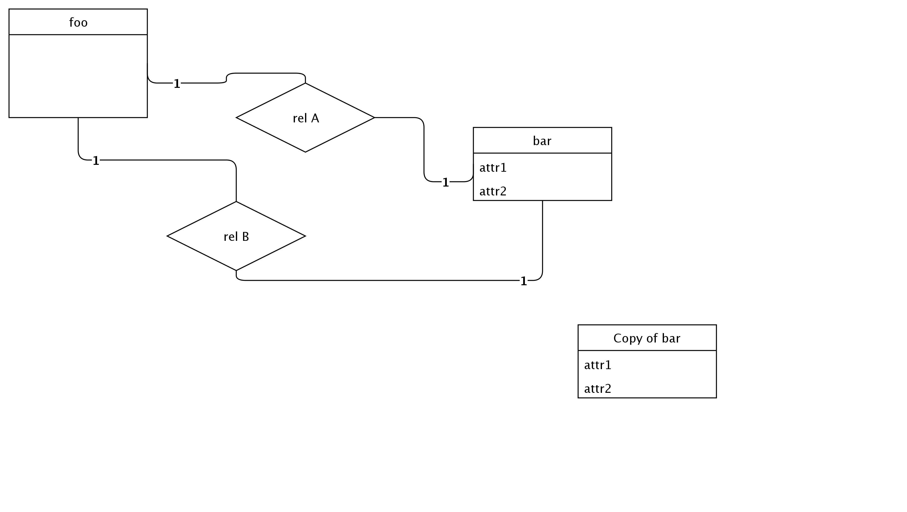

## Diagram

### Name

data model 1

### Description

## Element

[Expand all](#){ .md-button .diff-line }

### Entities

    

bar

<table>
    <caption></caption>
    <thead>
        <tr>
            <th></th>
            <th></th>
        </tr>
    </thead>
    <tr>
        <td> <strong>Name</strong> </td>
        <td>bar</td>
    </tr>
    <tr>
        <td> <strong>Description</strong> </td>
        <td></td>
    </tr>
    <tr>
        <td> <strong>Attributes</strong> </td>
        
        <td>
                
                
<strong>attr1,</strong>[String]

                

                
                
<strong>attr2,</strong>[Integer]

                

                
            </td>
        
    </tr>
</table>

    

Copy of bar

<table>
    <caption></caption>
    <thead>
        <tr>
            <th></th>
            <th></th>
        </tr>
    </thead>
    <tr>
        <td> <strong>Name</strong> </td>
        <td>Copy of bar</td>
    </tr>
    <tr>
        <td> <strong>Description</strong> </td>
        <td></td>
    </tr>
    <tr>
        <td> <strong>Attributes</strong> </td>
        
        <td>
                
                
<strong>attr1,</strong>[String]

                

                
                
<strong>attr2,</strong>[Integer]

                

                
            </td>
        
    </tr>
</table>

    

foo

<table>
    <caption></caption>
    <thead>
        <tr>
            <th></th>
            <th></th>
        </tr>
    </thead>
    <tr>
        <td> <strong>Name</strong> </td>
        <td>foo</td>
    </tr>
    <tr>
        <td> <strong>Description</strong> </td>
        <td></td>
    </tr>
    <tr>
        <td> <strong>Attributes</strong> </td>
        
        <td>
                
            </td>
        
    </tr>
</table>

    

### Relationships

    

rel A

<table>
    <caption></caption>
    <thead>
        <tr>
            <th></th>
            <th></th>
        </tr>
    </thead>
    <tr>
        <td> <strong>Name</strong> </td>
        <td>rel A</td>
    </tr>
    <tr>
        <td> <strong>Description</strong> </td>
        <td></td>
    </tr>
    <tr>
        <td> <strong>Attributes</strong> </td>
        
        <td>
                
            </td>
        
    </tr>
    <tr>
        <td> <strong>Relationship Connections</strong> </td>
        
        <td>
                
                
<strong>1,</strong>[1]

                
bar

                
                
<strong>1,</strong>[1]

                
foo

                
            </td>
        
    </tr>
</table>

    

rel B

<table>
    <caption></caption>
    <thead>
        <tr>
            <th></th>
            <th></th>
        </tr>
    </thead>
    <tr>
        <td> <strong>Name</strong> </td>
        <td>rel B</td>
    </tr>
    <tr>
        <td> <strong>Description</strong> </td>
        <td></td>
    </tr>
    <tr>
        <td> <strong>Attributes</strong> </td>
        
        <td>
                
            </td>
        
    </tr>
    <tr>
        <td> <strong>Relationship Connections</strong> </td>
        
        <td>
                
                
<strong>1,</strong>[1]

                
bar

                
                
<strong>1,</strong>[1]

                
foo

                
            </td>
        
    </tr>
</table>

    

