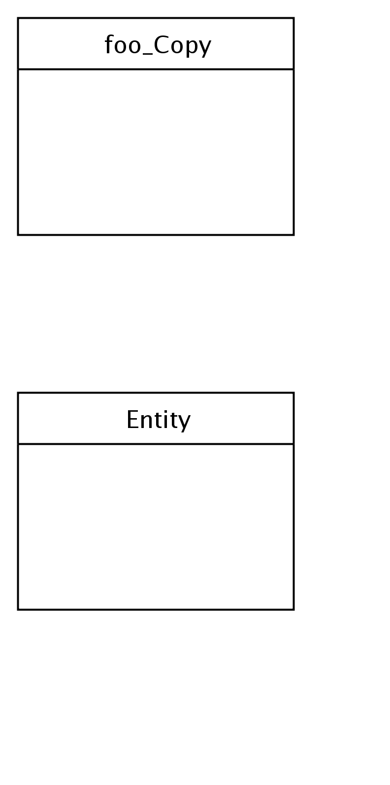

## Diagram

### Name

data model 2

### Description

## Element

[Expand all](#){ .md-button .diff-line }

### Entities

    

Entity

<table>
    <caption></caption>
    <thead>
        <tr>
            <th></th>
            <th></th>
        </tr>
    </thead>
    <tr>
        <td> <strong>Name</strong> </td>
        <td>Entity</td>
    </tr>
    <tr>
        <td> <strong>Description</strong> </td>
        <td></td>
    </tr>
    <tr>
        <td> <strong>Attributes</strong> </td>
        
        <td>
                
            </td>
        
    </tr>
</table>

    

foo_Copy

<table>
    <caption></caption>
    <thead>
        <tr>
            <th></th>
            <th></th>
        </tr>
    </thead>
    <tr>
        <td> <strong>Name</strong> </td>
        <td>foo_Copy</td>
    </tr>
    <tr>
        <td> <strong>Description</strong> </td>
        <td></td>
    </tr>
    <tr>
        <td> <strong>Attributes</strong> </td>
        
        <td>
                
            </td>
        
    </tr>
</table>

    

### Relationships

    

