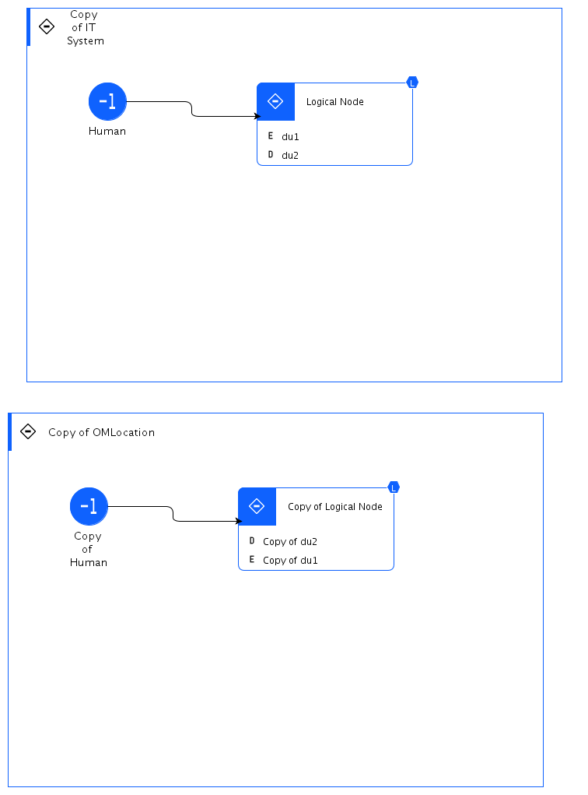

## Diagram

### Name

lom

### Description

### Reference(s)

## Element

[Expand all](#){ .md-button .diff-line }

### Actor

    

Human

<table>
    <caption></caption>
    <thead>
        <tr>
            <th></th>
            <th></th>
        </tr>
    </thead>
    <tr>
        <td> <strong>Name</strong> </td>
        <td>Human</td>
    </tr>
    <tr>
        <td> <strong>Description</strong> </td>
        <td></td>
    </tr>
    <tr>
        <td> <strong>Type</strong> </td>
        <td>Human</td>
    </tr>
    <tr>
        <td> <strong>Generic Group</strong> </td>
<td>
        
                
                
<strong>Zone,Zone</strong>[Auto-Generated]

                
This group is derived from Zone named Zone.

                
                
</td>
    </tr>
</table>

    

Copy of Human

<table>
    <caption></caption>
    <thead>
        <tr>
            <th></th>
            <th></th>
        </tr>
    </thead>
    <tr>
        <td> <strong>Name</strong> </td>
        <td>Copy of Human</td>
    </tr>
    <tr>
        <td> <strong>Description</strong> </td>
        <td></td>
    </tr>
    <tr>
        <td> <strong>Type</strong> </td>
        <td>Human</td>
    </tr>
    <tr>
        <td> <strong>Generic Group</strong> </td>
<td>
        
</td>
    </tr>
</table>

    

### Subsystem

### OMLocation

    

Copy of OMLocation

<table>
    <caption></caption>
    <thead>
        <tr>
            <th></th>
            <th></th>
        </tr>
    </thead>
    <tr>
        <td> <strong>Name</strong> </td>
        <td>Copy of OMLocation</td>
    </tr>
    <tr>
        <td> <strong>Description</strong> </td>
        <td></td>
    </tr>
</table>

    

OMLocation

<table>
    <caption></caption>
    <thead>
        <tr>
            <th></th>
            <th></th>
        </tr>
    </thead>
    <tr>
        <td> <strong>Name</strong> </td>
        <td>OMLocation</td>
    </tr>
    <tr>
        <td> <strong>Description</strong> </td>
        <td></td>
    </tr>
</table>

    

### Logical Connection

    

<table>
    <caption></caption>
    <thead>
        <tr>
            <th></th>
            <th></th>
        </tr>
    </thead>
    <tr>
        <td> <strong>Name</strong> </td>
        <td></td>
    </tr>
    <tr>
        <td> <strong>Description</strong> </td>
        <td></td>
    </tr>
</table>

    

<table>
    <caption></caption>
    <thead>
        <tr>
            <th></th>
            <th></th>
        </tr>
    </thead>
    <tr>
        <td> <strong>Name</strong> </td>
        <td></td>
    </tr>
    <tr>
        <td> <strong>Description</strong> </td>
        <td></td>
    </tr>
</table>

    

### Logical Node

    

Copy of Logical Node

<table>
    <caption></caption>
    <thead>
        <tr>
            <th></th>
            <th></th>
        </tr>
    </thead>
    <tr>
        <td> <strong>Name</strong> </td>
        <td>Copy of Logical Node</td>
    </tr>
    <tr>
        <td> <strong>Description</strong> </td>
        <td></td>
    </tr>
    <tr>
        <td> <strong>Type</strong> </td>
        <td></td>
    </tr>
    <tr>
        <td> <strong>Primary Capability</strong> </td>
        <td>
            
                
app analysis

            
        </td>
    </tr>
    <tr>
        <td> <strong>Implementation</strong> </td>
        <td>
            
        </td>
    </tr>
    <tr>
        <td> <strong>Architectural Decision</strong> </td>
        <td>
            
        </td>
    </tr>
    <tr>
        <td> <strong>Non Functional Requirement</strong> </td>
        <td>
            
        </td>
    </tr>
    <tr>
        <td> <strong>Generic Group</strong> </td>
        <td></td>
    </tr>
    <tr>
        <td> <strong>Sub-level Diagram</strong> </td>
        <td></td>
    </tr>
    <tr>
        <td> <strong>Related Diagrams</strong> </td>
        <td>
            
                
<a href="../../Logical Operational View/lomview_3JmU6I1WoJD">lom</a>

            
        </td>
    </tr>
    <tr>
        <td> <strong>Related Elements</strong> </td>
        <td>
            
                
Copy of OMLocation

                
                    
                    <li><a href="../../Logical Operational View/lomview_3JmU6I1WoJD">lom</a></li>
                    
                
            
            
                
Copy of du2

                
            
                
Copy of du1

                
            
                
app analysis

                
            
        </td>
    </tr>
    
</table>

    

Logical Node

<table>
    <caption></caption>
    <thead>
        <tr>
            <th></th>
            <th></th>
        </tr>
    </thead>
    <tr>
        <td> <strong>Name</strong> </td>
        <td>Logical Node</td>
    </tr>
    <tr>
        <td> <strong>Description</strong> </td>
        <td></td>
    </tr>
    <tr>
        <td> <strong>Type</strong> </td>
        <td></td>
    </tr>
    <tr>
        <td> <strong>Primary Capability</strong> </td>
        <td>
            
                
app analysis

            
        </td>
    </tr>
    <tr>
        <td> <strong>Implementation</strong> </td>
        <td>
            
        </td>
    </tr>
    <tr>
        <td> <strong>Architectural Decision</strong> </td>
        <td>
            
                
<a href="../../Architectural Decisions/architecturaldecision_rklQTKh9tj">ad1</a>

            
                
<a href="../../Architectural Decisions/architecturaldecision_r1WmTt3cKi">Data Replication</a>

            
        </td>
    </tr>
    <tr>
        <td> <strong>Non Functional Requirement</strong> </td>
        <td>
            
                
<a href="../../Non Functional Requirements/nfr_H1xbejhqFs">Data residency compliance is actively enforced</a>

            
                
<a href="../../Non Functional Requirements/nonfunctionalrequirement_HyZlo2qFj">Highly Available Decision management</a>

            
        </td>
    </tr>
    <tr>
        <td> <strong>Generic Group</strong> </td>
        <td></td>
    </tr>
    <tr>
        <td> <strong>Sub-level Diagram</strong> </td>
        <td></td>
    </tr>
    <tr>
        <td> <strong>Related Diagrams</strong> </td>
        <td>
            
                
<a href="../../Logical Operational View/lomview_ryFok65Fs">lom2</a>

            
                
<a href="../../Logical Operational View/lomview_3JmU6I1WoJD">lom</a>

            
                
<a href="../../Prescribed Operational View/pomview_S1xK1TqYi">pom2</a>

            
                
<a href="../../Prescribed Operational View/pomview_3JmVa4XrMlG">pom</a>

            
        </td>
    </tr>
    <tr>
        <td> <strong>Related Elements</strong> </td>
        <td>
            
                
Data residency compliance is actively enforced

                
                    
                    <li><a href="../../Prescribed Operational View/pomview_S1xK1TqYi">pom2</a></li>
                    
                    <li><a href="../../Prescribed Operational View/pomview_3JmVa4XrMlG">pom</a></li>
                    
                    <li><a href="../../Logical Operational View/lomview_ryFok65Fs">lom2</a></li>
                    
                    <li><a href="../../Logical Operational View/lomview_3JmURkknKcA">sub1</a></li>
                    
                    <li><a href="../../Logical Operational View/lomview_3JmU6I1WoJD">lom</a></li>
                    
                    <li><a href="../../IT System View/aoditsystem_r1dwHn9Fj">itsv cp</a></li>
                    
                    <li><a href="../../IT System View/aoditsystem_3JmKv5ALHdz">itsv</a></li>
                    
                
            
                
Highly Available Decision management

                
                    
                    <li><a href="../../Prescribed Operational View/pomview_S1xK1TqYi">pom2</a></li>
                    
                    <li><a href="../../Prescribed Operational View/pomview_3JmVa4XrMlG">pom</a></li>
                    
                    <li><a href="../../Logical Operational View/lomview_ryFok65Fs">lom2</a></li>
                    
                    <li><a href="../../Logical Operational View/lomview_3JmURkknKcA">sub1</a></li>
                    
                    <li><a href="../../Logical Operational View/lomview_3JmU6I1WoJD">lom</a></li>
                    
                    <li><a href="../../IT System View/aoditsystem_r1dwHn9Fj">itsv cp</a></li>
                    
                    <li><a href="../../IT System View/aoditsystem_3JmKv5ALHdz">itsv</a></li>
                    
                
            
                
ad1

                
            
                
Data Replication

                
                    
                    <li><a href="../../Prescribed Operational View/pomview_S1xK1TqYi">pom2</a></li>
                    
                    <li><a href="../../Prescribed Operational View/pomview_3JmVa4XrMlG">pom</a></li>
                    
                    <li><a href="../../Logical Operational View/lomview_ryFok65Fs">lom2</a></li>
                    
                    <li><a href="../../Logical Operational View/lomview_3JmURkknKcA">sub1</a></li>
                    
                    <li><a href="../../Logical Operational View/lomview_3JmU6I1WoJD">lom</a></li>
                    
                    <li><a href="../../IT System View/aoditsystem_3JmKv5ALHdz">itsv</a></li>
                    
                    <li><a href="../../IT System View/aoditsystem_r1dwHn9Fj">itsv cp</a></li>
                    
                
            
                
PN

                
                    
                    <li><a href="../../Prescribed Operational View/pomview_S1xK1TqYi">pom2</a></li>
                    
                    <li><a href="../../Prescribed Operational View/pomview_3JmVa4XrMlG">pom</a></li>
                    
                
            
                
OMLocation

                
                    
                    <li><a href="../../Prescribed Operational View/pomview_S1xK1TqYi">pom2</a></li>
                    
                    <li><a href="../../Prescribed Operational View/pomview_3JmVa4XrMlG">pom</a></li>
                    
                    <li><a href="../../Logical Operational View/lomview_ryFok65Fs">lom2</a></li>
                    
                    <li><a href="../../Logical Operational View/lomview_3JmURkknKcA">sub1</a></li>
                    
                    <li><a href="../../Logical Operational View/lomview_3JmU6I1WoJD">lom</a></li>
                    
                
            
            
                
app analysis

                
            
                
du2

                
            
                
du1

                
                    
                    <li>
<a href="../../Prescribed Operational View/pomview_S1xK1TqYi">pom2</a>
</li>
                    
                    <li>
<a href="../../Prescribed Operational View/pomview_3JmVa4XrMlG">pom</a>
</li>
                    
                    <li>
<a href="../../Logical Operational View/lomview_ryFok65Fs">lom2</a>
</li>
                    
                    <li>
<a href="../../Logical Operational View/lomview_3JmU6I1WoJD">lom</a>
</li>
                    
                    <li>
<a href="../../Services View/aodservices_3JVEjUwMRJY">sv</a>
</li>
                    
                
            
        </td>
    </tr>
    
    <tr>
        <td> <strong>Sub-Diagram</strong> </td>
        
        <td><a href="../../Logical Operational View/lomview_3JmURkknKcA">
                Logical Node : sub1
        </a></td>
        
        
    </tr>
    
</table>

    

