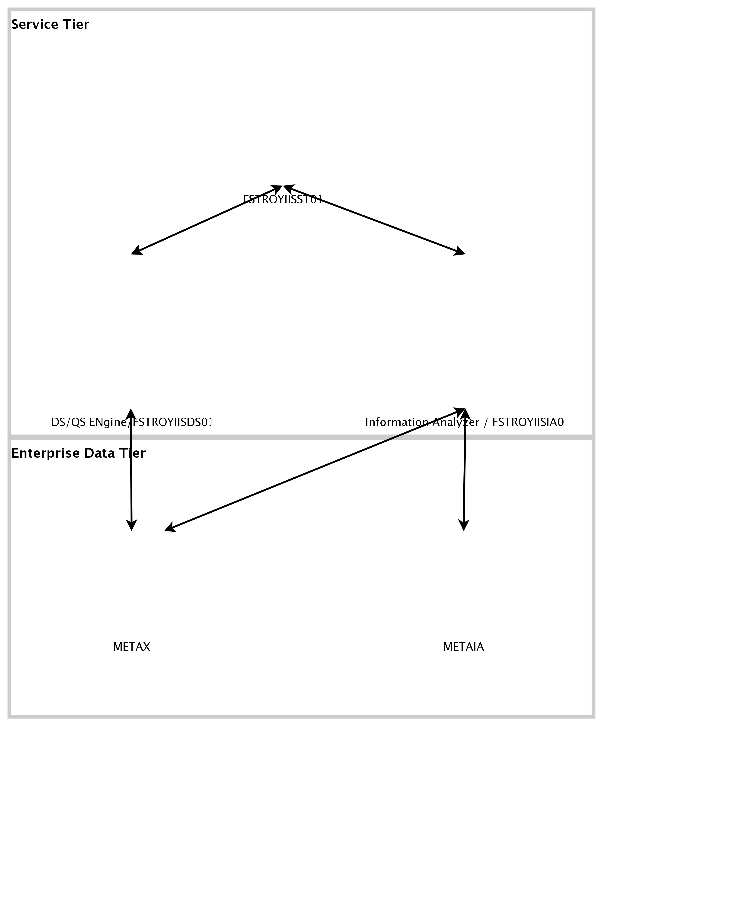

## Diagram

### Name

Sample Production Sized POM

### Description

## Element

[Expand all](#){ .md-button .diff-line }

### Actor

    

### Subsystem

### OMLocation

    

Enterprise Data Tier

<table>
    <caption></caption>
    <thead>
        <tr>
            <th></th>
            <th></th>
        </tr>
    </thead>
    <tr>
        <td> <strong>Name</strong> </td>
        <td>Enterprise Data Tier</td>
    </tr>
    <tr>
        <td> <strong>Description</strong> </td>
        <td></td>
    </tr>
</table>

    

Service Tier

<table>
    <caption></caption>
    <thead>
        <tr>
            <th></th>
            <th></th>
        </tr>
    </thead>
    <tr>
        <td> <strong>Name</strong> </td>
        <td>Service Tier</td>
    </tr>
    <tr>
        <td> <strong>Description</strong> </td>
        <td></td>
    </tr>
</table>

    

### Logical Connection

    

### Logical Node

    

### Physical Connection

    

<table>
    <caption></caption>
    <thead>
        <tr>
            <th></th>
            <th></th>
        </tr>
    </thead>
    <tr>
        <td> <strong>Name</strong> </td>
        <td></td>
    </tr>
    <tr>
        <td> <strong>Description</strong> </td>
        <td></td>
    </tr>
</table>

    

<table>
    <caption></caption>
    <thead>
        <tr>
            <th></th>
            <th></th>
        </tr>
    </thead>
    <tr>
        <td> <strong>Name</strong> </td>
        <td></td>
    </tr>
    <tr>
        <td> <strong>Description</strong> </td>
        <td></td>
    </tr>
</table>

    

<table>
    <caption></caption>
    <thead>
        <tr>
            <th></th>
            <th></th>
        </tr>
    </thead>
    <tr>
        <td> <strong>Name</strong> </td>
        <td></td>
    </tr>
    <tr>
        <td> <strong>Description</strong> </td>
        <td></td>
    </tr>
</table>

    

<table>
    <caption></caption>
    <thead>
        <tr>
            <th></th>
            <th></th>
        </tr>
    </thead>
    <tr>
        <td> <strong>Name</strong> </td>
        <td></td>
    </tr>
    <tr>
        <td> <strong>Description</strong> </td>
        <td></td>
    </tr>
</table>

    

<table>
    <caption></caption>
    <thead>
        <tr>
            <th></th>
            <th></th>
        </tr>
    </thead>
    <tr>
        <td> <strong>Name</strong> </td>
        <td></td>
    </tr>
    <tr>
        <td> <strong>Description</strong> </td>
        <td></td>
    </tr>
</table>

    

### Physical Node

    

DS/QS ENgine/FSTROYIISDS01

<table>
    <caption></caption>
    <thead>
        <tr>
            <th></th>
            <th></th>
        </tr>
    </thead>
    <tr>
        <td> <strong>Name</strong> </td>
        <td>DS/QS ENgine/FSTROYIISDS01</td>
    </tr>
    <tr>
        <td> <strong>Description</strong> </td>
        <td>C:200 D:300 J:1T K:500G</td>
    </tr>
    <tr>
        <td> <strong>Cardinality</strong> </td>
        <td>1</td>
    </tr>
    <tr>
        <td> <strong>CPU/Cores</strong> </td>
        <td>8-core</td>
    </tr>
    <tr>
        <td> <strong>Memory</strong> </td>
        <td>256 GB</td>
    </tr>
    <tr>
        <td> <strong>Network ports</strong> </td>
        <td></td>
    </tr>
    <tr>
        <td> <strong>OS/Hyper-visor</strong> </td>
        <td>Windows 2012 Edition</td>
    </tr>
    <tr>
        <td> <strong>Deploy</strong> </td>
        <td></td>
    </tr>
    <tr>
        <td> <strong>Deploy Provisioning</strong> </td>
        <td></td>
    </tr>
</table>

    

FSTROYIISST01

<table>
    <caption></caption>
    <thead>
        <tr>
            <th></th>
            <th></th>
        </tr>
    </thead>
    <tr>
        <td> <strong>Name</strong> </td>
        <td>FSTROYIISST01</td>
    </tr>
    <tr>
        <td> <strong>Description</strong> </td>
        <td>C:100 D:100 K:300 Gb Storage</td>
    </tr>
    <tr>
        <td> <strong>Cardinality</strong> </td>
        <td>1</td>
    </tr>
    <tr>
        <td> <strong>CPU/Cores</strong> </td>
        <td>3-Core</td>
    </tr>
    <tr>
        <td> <strong>Memory</strong> </td>
        <td>256 GB</td>
    </tr>
    <tr>
        <td> <strong>Network ports</strong> </td>
        <td></td>
    </tr>
    <tr>
        <td> <strong>OS/Hyper-visor</strong> </td>
        <td>Windows 2012 Edition</td>
    </tr>
    <tr>
        <td> <strong>Deploy</strong> </td>
        <td></td>
    </tr>
    <tr>
        <td> <strong>Deploy Provisioning</strong> </td>
        <td></td>
    </tr>
</table>

    

Information Analyzer / FSTROYIISIA01

<table>
    <caption></caption>
    <thead>
        <tr>
            <th></th>
            <th></th>
        </tr>
    </thead>
    <tr>
        <td> <strong>Name</strong> </td>
        <td>Information Analyzer / FSTROYIISIA01</td>
    </tr>
    <tr>
        <td> <strong>Description</strong> </td>
        <td>C:200 D:300 K:1T</td>
    </tr>
    <tr>
        <td> <strong>Cardinality</strong> </td>
        <td>1</td>
    </tr>
    <tr>
        <td> <strong>CPU/Cores</strong> </td>
        <td>8-core</td>
    </tr>
    <tr>
        <td> <strong>Memory</strong> </td>
        <td>256 GB</td>
    </tr>
    <tr>
        <td> <strong>Network ports</strong> </td>
        <td></td>
    </tr>
    <tr>
        <td> <strong>OS/Hyper-visor</strong> </td>
        <td>Windows 2012 Edition</td>
    </tr>
    <tr>
        <td> <strong>Deploy</strong> </td>
        <td></td>
    </tr>
    <tr>
        <td> <strong>Deploy Provisioning</strong> </td>
        <td></td>
    </tr>
</table>

    

METAIA

<table>
    <caption></caption>
    <thead>
        <tr>
            <th></th>
            <th></th>
        </tr>
    </thead>
    <tr>
        <td> <strong>Name</strong> </td>
        <td>METAIA</td>
    </tr>
    <tr>
        <td> <strong>Description</strong> </td>
        <td>1000 GB Storage Clock Size: 32K</td>
    </tr>
    <tr>
        <td> <strong>Cardinality</strong> </td>
        <td>1</td>
    </tr>
    <tr>
        <td> <strong>CPU/Cores</strong> </td>
        <td>2-core</td>
    </tr>
    <tr>
        <td> <strong>Memory</strong> </td>
        <td>32 GB</td>
    </tr>
    <tr>
        <td> <strong>Network ports</strong> </td>
        <td></td>
    </tr>
    <tr>
        <td> <strong>OS/Hyper-visor</strong> </td>
        <td></td>
    </tr>
    <tr>
        <td> <strong>Deploy</strong> </td>
        <td></td>
    </tr>
    <tr>
        <td> <strong>Deploy Provisioning</strong> </td>
        <td></td>
    </tr>
</table>

    

METAX

<table>
    <caption></caption>
    <thead>
        <tr>
            <th></th>
            <th></th>
        </tr>
    </thead>
    <tr>
        <td> <strong>Name</strong> </td>
        <td>METAX</td>
    </tr>
    <tr>
        <td> <strong>Description</strong> </td>
        <td>70 GB Storage Block Size: 8K</td>
    </tr>
    <tr>
        <td> <strong>Cardinality</strong> </td>
        <td>1</td>
    </tr>
    <tr>
        <td> <strong>CPU/Cores</strong> </td>
        <td>2-core</td>
    </tr>
    <tr>
        <td> <strong>Memory</strong> </td>
        <td>32 GB</td>
    </tr>
    <tr>
        <td> <strong>Network ports</strong> </td>
        <td></td>
    </tr>
    <tr>
        <td> <strong>OS/Hyper-visor</strong> </td>
        <td></td>
    </tr>
    <tr>
        <td> <strong>Deploy</strong> </td>
        <td></td>
    </tr>
    <tr>
        <td> <strong>Deploy Provisioning</strong> </td>
        <td></td>
    </tr>
</table>

    

