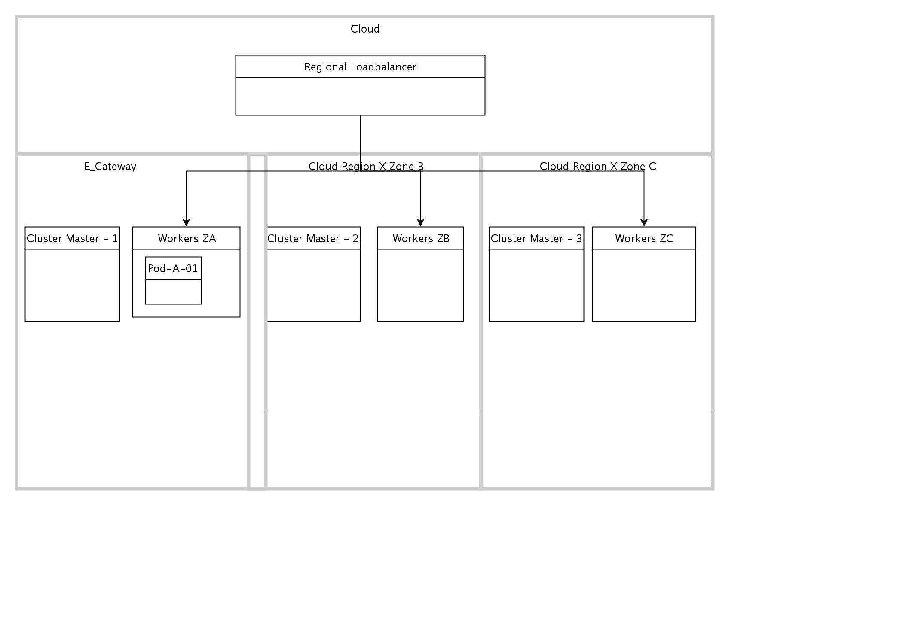

## Diagram

### Name

Multi-zone Kube Clusters

### Description

## Element

[Expand all](#){ .md-button .diff-line }

### Actor

    

### Subsystem

### OMLocation

    

Cloud

<table>
    <caption></caption>
    <thead>
        <tr>
            <th></th>
            <th></th>
        </tr>
    </thead>
    <tr>
        <td> <strong>Name</strong> </td>
        <td>Cloud</td>
    </tr>
    <tr>
        <td> <strong>Description</strong> </td>
        <td></td>
    </tr>
</table>

    

Cloud Region X Zone A

<table>
    <caption></caption>
    <thead>
        <tr>
            <th></th>
            <th></th>
        </tr>
    </thead>
    <tr>
        <td> <strong>Name</strong> </td>
        <td>Cloud Region X Zone A</td>
    </tr>
    <tr>
        <td> <strong>Description</strong> </td>
        <td></td>
    </tr>
</table>

    

Cloud Region X Zone B

<table>
    <caption></caption>
    <thead>
        <tr>
            <th></th>
            <th></th>
        </tr>
    </thead>
    <tr>
        <td> <strong>Name</strong> </td>
        <td>Cloud Region X Zone B</td>
    </tr>
    <tr>
        <td> <strong>Description</strong> </td>
        <td></td>
    </tr>
</table>

    

Cloud Region X Zone C

<table>
    <caption></caption>
    <thead>
        <tr>
            <th></th>
            <th></th>
        </tr>
    </thead>
    <tr>
        <td> <strong>Name</strong> </td>
        <td>Cloud Region X Zone C</td>
    </tr>
    <tr>
        <td> <strong>Description</strong> </td>
        <td></td>
    </tr>
</table>

    

### Logical Connection

    

### Logical Node

    

Pod-A-01

<table>
    <caption></caption>
    <thead>
        <tr>
            <th></th>
            <th></th>
        </tr>
    </thead>
    <tr>
        <td> <strong>Name</strong> </td>
        <td>Pod-A-01</td>
    </tr>
    <tr>
        <td> <strong>Description</strong> </td>
        <td></td>
    </tr>
    <tr>
        <td> <strong>Type</strong> </td>
        <td></td>
    </tr>
    <tr>
        <td> <strong>Primary Capability</strong> </td>
        <td>
            
        </td>
    </tr>
    <tr>
        <td> <strong>Implementation</strong> </td>
        <td>
            
        </td>
    </tr>
    <tr>
        <td> <strong>Architectural Decision</strong> </td>
        <td>
            
        </td>
    </tr>
    <tr>
        <td> <strong>Non Functional Requirement</strong> </td>
        <td>
            
        </td>
    </tr>
    <tr>
        <td> <strong>Generic Group</strong> </td>
        <td></td>
    </tr>
    <tr>
        <td> <strong>Sub-level Diagram</strong> </td>
        <td></td>
    </tr>
    <tr>
        <td> <strong>Related Diagrams</strong> </td>
        <td>
            
                
<a href="../../Logical Operational View/lomview_H1PUvbtP1LX_B18mG8_Wo">LOM view</a>

            
                
<a href="../../Prescribed Operational View/pomview_1VE6fAN6Gs2_B18mG8_Wo">Multi-zone Kube Clusters</a>

            
                
<a href="../../Prescribed Operational View/pomview_1A4wGA2HEGp_B18mG8_Wo">Linked POM</a>

            
                
<a href="../../Prescribed Operational View/pomview_378tvn5ZB0f_B18mG8_Wo">POM view from LOM view</a>

            
        </td>
    </tr>
    <tr>
        <td> <strong>Related Elements</strong> </td>
        <td>
            
                
Workers ZA

                
                    
                    <li><a href="../../Prescribed Operational View/pomview_1VE6fAN6Gs2_B18mG8_Wo">Multi-zone Kube Clusters</a></li>
                    
                
            
                
P. Node

                
                    
                    <li><a href="../../Prescribed Operational View/pomview_1A4wGA2HEGp_B18mG8_Wo">Linked POM</a></li>
                    
                
            
                
Public Cloud Provider

                
                    
                    <li><a href="../../Prescribed Operational View/pomview_1A4wGA2HEGp_B18mG8_Wo">Linked POM</a></li>
                    
                    <li><a href="../../Prescribed Operational View/pomview_378tvn5ZB0f_B18mG8_Wo">POM view from LOM view</a></li>
                    
                    <li><a href="../../Logical Operational View/lomview_2Ir94BKErqu_B18mG8_Wo">LOM for Heatmap</a></li>
                    
                    <li><a href="../../Logical Operational View/lomview_H1PUvbtP1LX_B18mG8_Wo">LOM view</a></li>
                    
                    <li><a href="../../Logical Operational View/lomview_SkkqfI25V_B18mG8_Wo">LOM View2</a></li>
                    
                
            
            
        </td>
    </tr>
</table>

    

### Physical Connection

    

<table>
    <caption></caption>
    <thead>
        <tr>
            <th></th>
            <th></th>
        </tr>
    </thead>
    <tr>
        <td> <strong>Name</strong> </td>
        <td></td>
    </tr>
    <tr>
        <td> <strong>Description</strong> </td>
        <td></td>
    </tr>
</table>

    

<table>
    <caption></caption>
    <thead>
        <tr>
            <th></th>
            <th></th>
        </tr>
    </thead>
    <tr>
        <td> <strong>Name</strong> </td>
        <td></td>
    </tr>
    <tr>
        <td> <strong>Description</strong> </td>
        <td></td>
    </tr>
</table>

    

<table>
    <caption></caption>
    <thead>
        <tr>
            <th></th>
            <th></th>
        </tr>
    </thead>
    <tr>
        <td> <strong>Name</strong> </td>
        <td></td>
    </tr>
    <tr>
        <td> <strong>Description</strong> </td>
        <td></td>
    </tr>
</table>

    

### Physical Node

    

Cluster Master - 1

<table>
    <caption></caption>
    <thead>
        <tr>
            <th></th>
            <th></th>
        </tr>
    </thead>
    <tr>
        <td> <strong>Name</strong> </td>
        <td>Cluster Master - 1</td>
    </tr>
    <tr>
        <td> <strong>Description</strong> </td>
        <td></td>
    </tr>
    <tr>
        <td> <strong>Cardinality</strong> </td>
        <td>3</td>
    </tr>
    <tr>
        <td> <strong>CPU/Cores</strong> </td>
        <td>8</td>
    </tr>
    <tr>
        <td> <strong>Memory</strong> </td>
        <td>16G</td>
    </tr>
    <tr>
        <td> <strong>Network ports</strong> </td>
        <td></td>
    </tr>
    <tr>
        <td> <strong>OS/Hyper-visor</strong> </td>
        <td>CoreOS</td>
    </tr>
    <tr>
        <td> <strong>Deploy</strong> </td>
        <td></td>
    </tr>
    <tr>
        <td> <strong>Deploy Provisioning</strong> </td>
        <td></td>
    </tr>
</table>

    

Cluster Master - 2

<table>
    <caption></caption>
    <thead>
        <tr>
            <th></th>
            <th></th>
        </tr>
    </thead>
    <tr>
        <td> <strong>Name</strong> </td>
        <td>Cluster Master - 2</td>
    </tr>
    <tr>
        <td> <strong>Description</strong> </td>
        <td></td>
    </tr>
    <tr>
        <td> <strong>Cardinality</strong> </td>
        <td>3</td>
    </tr>
    <tr>
        <td> <strong>CPU/Cores</strong> </td>
        <td>8</td>
    </tr>
    <tr>
        <td> <strong>Memory</strong> </td>
        <td>16G</td>
    </tr>
    <tr>
        <td> <strong>Network ports</strong> </td>
        <td></td>
    </tr>
    <tr>
        <td> <strong>OS/Hyper-visor</strong> </td>
        <td>CoreOS</td>
    </tr>
    <tr>
        <td> <strong>Deploy</strong> </td>
        <td></td>
    </tr>
    <tr>
        <td> <strong>Deploy Provisioning</strong> </td>
        <td></td>
    </tr>
</table>

    

Cluster Master - 3

<table>
    <caption></caption>
    <thead>
        <tr>
            <th></th>
            <th></th>
        </tr>
    </thead>
    <tr>
        <td> <strong>Name</strong> </td>
        <td>Cluster Master - 3</td>
    </tr>
    <tr>
        <td> <strong>Description</strong> </td>
        <td></td>
    </tr>
    <tr>
        <td> <strong>Cardinality</strong> </td>
        <td>3</td>
    </tr>
    <tr>
        <td> <strong>CPU/Cores</strong> </td>
        <td>8</td>
    </tr>
    <tr>
        <td> <strong>Memory</strong> </td>
        <td>16G</td>
    </tr>
    <tr>
        <td> <strong>Network ports</strong> </td>
        <td></td>
    </tr>
    <tr>
        <td> <strong>OS/Hyper-visor</strong> </td>
        <td>CoreOS</td>
    </tr>
    <tr>
        <td> <strong>Deploy</strong> </td>
        <td></td>
    </tr>
    <tr>
        <td> <strong>Deploy Provisioning</strong> </td>
        <td></td>
    </tr>
</table>

    

Regional Loadbalancer

<table>
    <caption></caption>
    <thead>
        <tr>
            <th></th>
            <th></th>
        </tr>
    </thead>
    <tr>
        <td> <strong>Name</strong> </td>
        <td>Regional Loadbalancer</td>
    </tr>
    <tr>
        <td> <strong>Description</strong> </td>
        <td></td>
    </tr>
    <tr>
        <td> <strong>Cardinality</strong> </td>
        <td>2</td>
    </tr>
    <tr>
        <td> <strong>CPU/Cores</strong> </td>
        <td></td>
    </tr>
    <tr>
        <td> <strong>Memory</strong> </td>
        <td></td>
    </tr>
    <tr>
        <td> <strong>Network ports</strong> </td>
        <td></td>
    </tr>
    <tr>
        <td> <strong>OS/Hyper-visor</strong> </td>
        <td></td>
    </tr>
    <tr>
        <td> <strong>Deploy</strong> </td>
        <td></td>
    </tr>
    <tr>
        <td> <strong>Deploy Provisioning</strong> </td>
        <td></td>
    </tr>
</table>

    

Workers ZA

<table>
    <caption></caption>
    <thead>
        <tr>
            <th></th>
            <th></th>
        </tr>
    </thead>
    <tr>
        <td> <strong>Name</strong> </td>
        <td>Workers ZA</td>
    </tr>
    <tr>
        <td> <strong>Description</strong> </td>
        <td></td>
    </tr>
    <tr>
        <td> <strong>Cardinality</strong> </td>
        <td>5</td>
    </tr>
    <tr>
        <td> <strong>CPU/Cores</strong> </td>
        <td>8</td>
    </tr>
    <tr>
        <td> <strong>Memory</strong> </td>
        <td>16G</td>
    </tr>
    <tr>
        <td> <strong>Network ports</strong> </td>
        <td></td>
    </tr>
    <tr>
        <td> <strong>OS/Hyper-visor</strong> </td>
        <td>CoreOS</td>
    </tr>
    <tr>
        <td> <strong>Deploy</strong> </td>
        <td></td>
    </tr>
    <tr>
        <td> <strong>Deploy Provisioning</strong> </td>
        <td></td>
    </tr>
</table>

    

Workers ZB

<table>
    <caption></caption>
    <thead>
        <tr>
            <th></th>
            <th></th>
        </tr>
    </thead>
    <tr>
        <td> <strong>Name</strong> </td>
        <td>Workers ZB</td>
    </tr>
    <tr>
        <td> <strong>Description</strong> </td>
        <td></td>
    </tr>
    <tr>
        <td> <strong>Cardinality</strong> </td>
        <td>5</td>
    </tr>
    <tr>
        <td> <strong>CPU/Cores</strong> </td>
        <td>8</td>
    </tr>
    <tr>
        <td> <strong>Memory</strong> </td>
        <td>16G</td>
    </tr>
    <tr>
        <td> <strong>Network ports</strong> </td>
        <td></td>
    </tr>
    <tr>
        <td> <strong>OS/Hyper-visor</strong> </td>
        <td>CoreOS</td>
    </tr>
    <tr>
        <td> <strong>Deploy</strong> </td>
        <td></td>
    </tr>
    <tr>
        <td> <strong>Deploy Provisioning</strong> </td>
        <td></td>
    </tr>
</table>

    

Workers ZC

<table>
    <caption></caption>
    <thead>
        <tr>
            <th></th>
            <th></th>
        </tr>
    </thead>
    <tr>
        <td> <strong>Name</strong> </td>
        <td>Workers ZC</td>
    </tr>
    <tr>
        <td> <strong>Description</strong> </td>
        <td></td>
    </tr>
    <tr>
        <td> <strong>Cardinality</strong> </td>
        <td>5</td>
    </tr>
    <tr>
        <td> <strong>CPU/Cores</strong> </td>
        <td>8</td>
    </tr>
    <tr>
        <td> <strong>Memory</strong> </td>
        <td>16G</td>
    </tr>
    <tr>
        <td> <strong>Network ports</strong> </td>
        <td></td>
    </tr>
    <tr>
        <td> <strong>OS/Hyper-visor</strong> </td>
        <td>CoreOS</td>
    </tr>
    <tr>
        <td> <strong>Deploy</strong> </td>
        <td></td>
    </tr>
    <tr>
        <td> <strong>Deploy Provisioning</strong> </td>
        <td></td>
    </tr>
</table>

    

