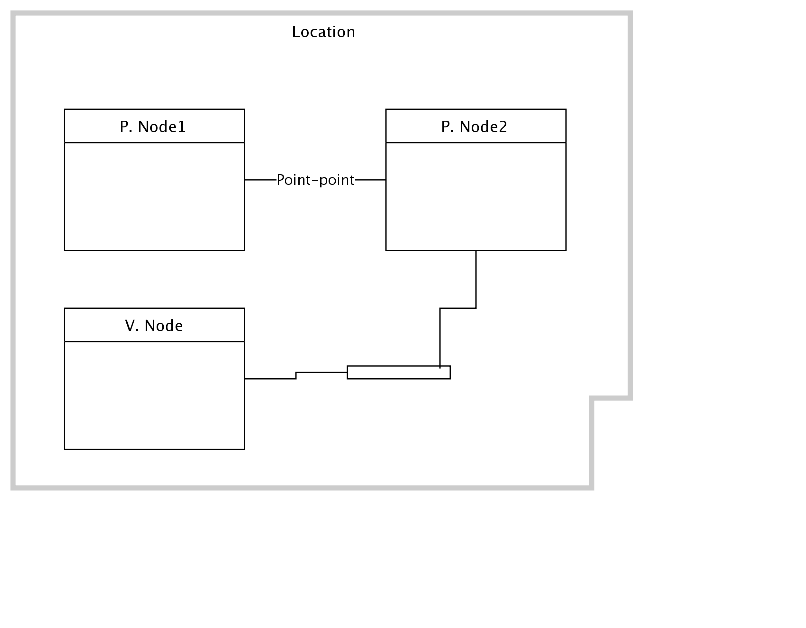

## Diagram

### Name

Sample Pom

### Description

## Element

[Expand all](#){ .md-button .diff-line }

### Actor

    

### Subsystem

### OMLocation

    

Location

<table>
    <caption></caption>
    <thead>
        <tr>
            <th></th>
            <th></th>
        </tr>
    </thead>
    <tr>
        <td> <strong>Name</strong> </td>
        <td>Location</td>
    </tr>
    <tr>
        <td> <strong>Description</strong> </td>
        <td></td>
    </tr>
</table>

    

### Logical Connection

    

### Logical Node

    

### Physical Connection

    

<table>
    <caption></caption>
    <thead>
        <tr>
            <th></th>
            <th></th>
        </tr>
    </thead>
    <tr>
        <td> <strong>Name</strong> </td>
        <td></td>
    </tr>
    <tr>
        <td> <strong>Description</strong> </td>
        <td></td>
    </tr>
</table>

    

<table>
    <caption></caption>
    <thead>
        <tr>
            <th></th>
            <th></th>
        </tr>
    </thead>
    <tr>
        <td> <strong>Name</strong> </td>
        <td></td>
    </tr>
    <tr>
        <td> <strong>Description</strong> </td>
        <td></td>
    </tr>
</table>

    

Point-point

<table>
    <caption></caption>
    <thead>
        <tr>
            <th></th>
            <th></th>
        </tr>
    </thead>
    <tr>
        <td> <strong>Name</strong> </td>
        <td>Point-point</td>
    </tr>
    <tr>
        <td> <strong>Description</strong> </td>
        <td></td>
    </tr>
</table>

    

### Physical Node

    

P. Node1

<table>
    <caption></caption>
    <thead>
        <tr>
            <th></th>
            <th></th>
        </tr>
    </thead>
    <tr>
        <td> <strong>Name</strong> </td>
        <td>P. Node1</td>
    </tr>
    <tr>
        <td> <strong>Description</strong> </td>
        <td></td>
    </tr>
    <tr>
        <td> <strong>Cardinality</strong> </td>
        <td>1</td>
    </tr>
    <tr>
        <td> <strong>CPU/Cores</strong> </td>
        <td></td>
    </tr>
    <tr>
        <td> <strong>Memory</strong> </td>
        <td></td>
    </tr>
    <tr>
        <td> <strong>Network ports</strong> </td>
        <td></td>
    </tr>
    <tr>
        <td> <strong>OS/Hyper-visor</strong> </td>
        <td></td>
    </tr>
    <tr>
        <td> <strong>Deploy</strong> </td>
        <td></td>
    </tr>
    <tr>
        <td> <strong>Deploy Provisioning</strong> </td>
        <td></td>
    </tr>
</table>

    

P. Node2

<table>
    <caption></caption>
    <thead>
        <tr>
            <th></th>
            <th></th>
        </tr>
    </thead>
    <tr>
        <td> <strong>Name</strong> </td>
        <td>P. Node2</td>
    </tr>
    <tr>
        <td> <strong>Description</strong> </td>
        <td></td>
    </tr>
    <tr>
        <td> <strong>Cardinality</strong> </td>
        <td>1</td>
    </tr>
    <tr>
        <td> <strong>CPU/Cores</strong> </td>
        <td></td>
    </tr>
    <tr>
        <td> <strong>Memory</strong> </td>
        <td></td>
    </tr>
    <tr>
        <td> <strong>Network ports</strong> </td>
        <td></td>
    </tr>
    <tr>
        <td> <strong>OS/Hyper-visor</strong> </td>
        <td></td>
    </tr>
    <tr>
        <td> <strong>Deploy</strong> </td>
        <td></td>
    </tr>
    <tr>
        <td> <strong>Deploy Provisioning</strong> </td>
        <td></td>
    </tr>
</table>

    

V. Node

<table>
    <caption></caption>
    <thead>
        <tr>
            <th></th>
            <th></th>
        </tr>
    </thead>
    <tr>
        <td> <strong>Name</strong> </td>
        <td>V. Node</td>
    </tr>
    <tr>
        <td> <strong>Description</strong> </td>
        <td></td>
    </tr>
    <tr>
        <td> <strong>Cardinality</strong> </td>
        <td>1</td>
    </tr>
    <tr>
        <td> <strong>CPU/Cores</strong> </td>
        <td></td>
    </tr>
    <tr>
        <td> <strong>Memory</strong> </td>
        <td></td>
    </tr>
    <tr>
        <td> <strong>Network ports</strong> </td>
        <td></td>
    </tr>
    <tr>
        <td> <strong>OS/Hyper-visor</strong> </td>
        <td></td>
    </tr>
    <tr>
        <td> <strong>Deploy</strong> </td>
        <td></td>
    </tr>
    <tr>
        <td> <strong>Deploy Provisioning</strong> </td>
        <td></td>
    </tr>
</table>

    

