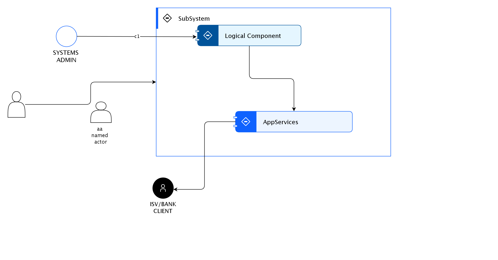

## Diagram

### Name

Demo1

### Description

this a te
fthis is a test fthis is a test fthis is a test fthis is a test fthis is a test fthis is a test fthis is a test fthis is a test fthis is a test fthis is a test fthis is a test fthis is a test fthis is a test fthis is a test fthis is a test fthis is a test fthis is a test fthis is a test fthis is a test fthis is a test fthis is a test fthis is a test fthis is a test fthis is a test fthis is a test fthis is a test fthis is a test fthis is a test fthis is a test fthis is a test fthis is a test fthis is a test fthis is a test fthis is a test fthis is a test fthis is a test fthis is a test fthis is a test fthis is a test fthis is a test fthis is a test fthis is a test fthis is a test fthis is a test fthis is a test fthis is a test fthis is a test fthis is a test fthis is a test fthis is a test fthis is a test fthis is a test fthis is a test fthis is a test fthis is a test fthis is a test fthis is a test fthis is a test fthis is a test fthis is a test fthis is a test 

 

 
<table style="width:100%" id="tableInRichEditor_1664160530059"><tbody><tr><td class="border-normal" style="height:42px;width:33%" id="0-0"> 1</td><td class="border-normal" style="height:42px;width:33%" id="0-1"> </td><td class="border-normal" style="height:42px;width:33%" id="0-2"> </td></tr><tr><td class="border-normal" style="height:42px;width:33%" id="1-0"> </td><td class="border-normal" style="height: 42px; width: 33%; background-color: rgb(0, 151, 149);" id="1-1"> 2</td><td class="border-normal" style="height:42px;width:33%" id="1-2"> </td></tr><tr><td class="border-normal" style="height:42px;width:33%" id="2-0"> </td><td class="border-normal" style="height: 42px; width: 33%; background-color: rgb(0, 151, 149);" id="2-1"> 3dfs</td><td class="border-normal" style="height:42px;width:33%" id="2-2"> </td></tr><tr><td class="border-normal" style="height:42px;width:33%" id="3-0"> </td><td class="border-normal" style="height: 42px; width: 33%; background-color: rgb(0, 151, 149);" id="3-1"> </td><td class="border-normal" style="height:42px;width:33%" id="3-2"> 4</td></tr><tr><td class="border-normal" style="height:42px;width:33%" id="4-0"> </td><td class="border-normal" style="height:42px;width:33%" id="4-1"> </td><td class="border-normal" style="height:42px;width:33%" id="4-2"> 5</td></tr></tbody></table> 

## Element

[Expand all](#){ .md-button .diff-line }

### Actor

    

ISV/BANK CLIENT

<table>
    <caption></caption>
    <thead>
        <tr>
            <th></th>
            <th></th>
        </tr>
    </thead>
    <tr>
        <td> <strong>Name</strong> </td>
        <td>ISV/BANK CLIENT</td>
    </tr>
    <tr>
        <td> <strong>Description</strong> </td>
        <td></td>
    </tr>
    <tr>
        <td> <strong>Type</strong> </td>
        <td>Human</td>
    </tr>
    <tr>
        <td> <strong>Generic Group</strong> </td>
<td>
        
</td>
    </tr>
</table>

    

SYSTEMS ADMIN

<table>
    <caption></caption>
    <thead>
        <tr>
            <th></th>
            <th></th>
        </tr>
    </thead>
    <tr>
        <td> <strong>Name</strong> </td>
        <td>SYSTEMS ADMIN</td>
    </tr>
    <tr>
        <td> <strong>Description</strong> </td>
        <td></td>
    </tr>
    <tr>
        <td> <strong>Type</strong> </td>
        <td>Human</td>
    </tr>
    <tr>
        <td> <strong>Generic Group</strong> </td>
<td>
        
</td>
    </tr>
</table>

    

aa named actor

<table>
    <caption></caption>
    <thead>
        <tr>
            <th></th>
            <th></th>
        </tr>
    </thead>
    <tr>
        <td> <strong>Name</strong> </td>
        <td>aa named actor</td>
    </tr>
    <tr>
        <td> <strong>Description</strong> </td>
        <td></td>
    </tr>
    <tr>
        <td> <strong>Type</strong> </td>
        <td>Human</td>
    </tr>
    <tr>
        <td> <strong>Generic Group</strong> </td>
<td>
        
</td>
    </tr>
</table>

    

### Subsystem

    

SubSystem

<table>
    <caption></caption>
    <thead>
        <tr>
            <th></th>
            <th></th>
        </tr>
    </thead>
    <tr>
        <td> <strong>Name</strong> </td>
        <td>SubSystem</td>
    </tr>
    <tr>
        <td> <strong>Description</strong> </td>
        <td></td>
    </tr>
</table>

    

### Logical Component

    

AppServices

<table>
    <caption></caption>
    <thead>
        <tr>
            <th></th>
            <th></th>
        </tr>
    </thead>
    <tr>
        <td> <strong>Name</strong> </td>
        <td>AppServices</td>
    </tr>
    <tr>
        <td> <strong>Description</strong> </td>
        <td></td>
    </tr>
</table>

    

Logical Component

<table>
    <caption></caption>
    <thead>
        <tr>
            <th></th>
            <th></th>
        </tr>
    </thead>
    <tr>
        <td> <strong>Name</strong> </td>
        <td>Logical Component</td>
    </tr>
    <tr>
        <td> <strong>Description</strong> </td>
        <td>fthis is a test fthis is a test fthis is a test fthis is a test fthis is a test fthis is a test fthis is a test fthis is a test fthis is a test fthis is a test fthis is a test fthis is a test fthis is a test fthis is a test fthis is a test fthis is a test fthis is a test fthis is a test fthis is a test fthis is a test fthis is a test fthis is a test fthis is a test fthis is a test fthis is a test fthis is a test fthis is a test fthis is a test fthis is a test fthis is a test fthis is a test fthis is a test fthis is a test fthis is a test fthis is a test fthis is a test fthis is a test fthis is a test fthis is a test fthis is a test fthis is a test fthis is a test fthis is a test fthis is a test fthis is a test fthis is a test fthis is a test fthis is a test fthis is a test fthis is a test fthis is a test fthis is a test fthis is a test fthis is a test fthis is a test fthis is a test fthis is a test fthis is a test fthis is a test fthis is a test fthis is a test </td>
    </tr>
</table>

    

### Logical Connector

    

<table>
    <caption></caption>
    <thead>
        <tr>
            <th></th>
            <th></th>
        </tr>
    </thead>
    <tr>
        <td> <strong>Name</strong> </td>
        <td></td>
    </tr>
    <tr>
        <td> <strong>Description</strong> </td>
        <td></td>
    </tr>
</table>

    

<table>
    <caption></caption>
    <thead>
        <tr>
            <th></th>
            <th></th>
        </tr>
    </thead>
    <tr>
        <td> <strong>Name</strong> </td>
        <td></td>
    </tr>
    <tr>
        <td> <strong>Description</strong> </td>
        <td></td>
    </tr>
</table>

    

c1

<table>
    <caption></caption>
    <thead>
        <tr>
            <th></th>
            <th></th>
        </tr>
    </thead>
    <tr>
        <td> <strong>Name</strong> </td>
        <td>c1</td>
    </tr>
    <tr>
        <td> <strong>Description</strong> </td>
        <td>c1111111111111</td>
    </tr>
</table>

    

