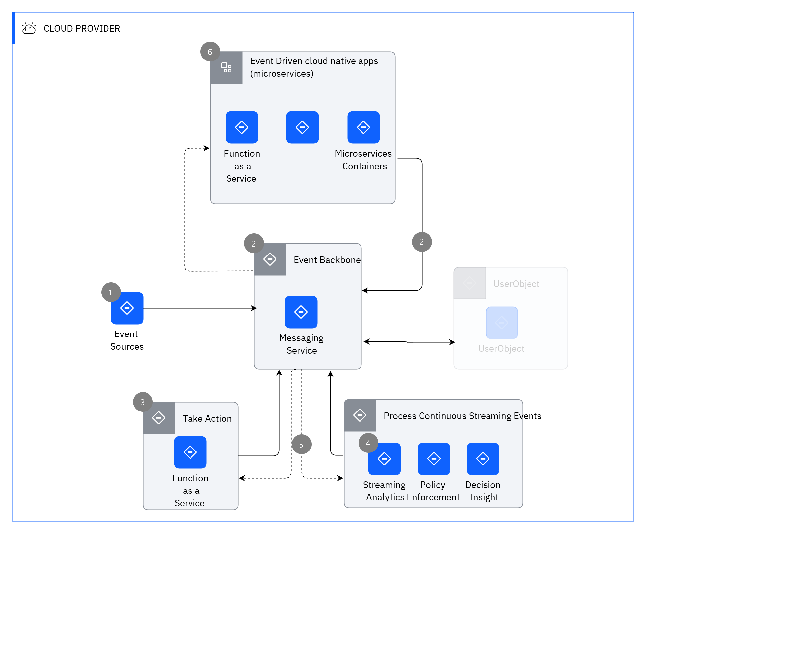

## Diagram

### Name

Event Based Usage Scenario

### Description

[Expand all](#){ .md-button .same-line }

## Step List

    

1

<table>
    <caption></caption>
    <thead>
        <tr>
            <th></th>
            <th></th>
        </tr>
    </thead>
    <tr>
        <td> <strong>Name</strong> </td>
        <td>1</td>
    </tr>
    <tr>
        <td> <strong>Description</strong> </td>
        <td>Event sources generate events and event streams from sources such as IoT devices, web apps, mobile apps, and microservices.</td>
    </tr>
</table>

    

2

<table>
    <caption></caption>
    <thead>
        <tr>
            <th></th>
            <th></th>
        </tr>
    </thead>
    <tr>
        <td> <strong>Name</strong> </td>
        <td>2</td>
    </tr>
    <tr>
        <td> <strong>Description</strong> </td>
        <td>IBM Event Streams provides an event backbone that supports publish/subscribe communication, an event log, and simple event stream processing based on Apache Kafka.</td>
    </tr>
</table>

    

3

<table>
    <caption></caption>
    <thead>
        <tr>
            <th></th>
            <th></th>
        </tr>
    </thead>
    <tr>
        <td> <strong>Name</strong> </td>
        <td>3</td>
    </tr>
    <tr>
        <td> <strong>Description</strong> </td>
        <td>IBM Cloud Functions provides a simplified programming model to take action on an event through a serverless function-based compute model.</td>
    </tr>
</table>

    

4

<table>
    <caption></caption>
    <thead>
        <tr>
            <th></th>
            <th></th>
        </tr>
    </thead>
    <tr>
        <td> <strong>Name</strong> </td>
        <td>4</td>
    </tr>
    <tr>
        <td> <strong>Description</strong> </td>
        <td>Streaming Analytics provide continuous ingest and analytical processing across multiple event streams. Decision Server Insights provides the means to take action on events and event streams through business rules.</td>
    </tr>
</table>

    

5

<table>
    <caption></caption>
    <thead>
        <tr>
            <th></th>
            <th></th>
        </tr>
    </thead>
    <tr>
        <td> <strong>Name</strong> </td>
        <td>5</td>
    </tr>
    <tr>
        <td> <strong>Description</strong> </td>
        <td>vent Stores provide optimized persistence (data stores), for event sourcing, Command Query Response Separation (CQRS), and analytical use cases.</td>
    </tr>
</table>

    

6

<table>
    <caption></caption>
    <thead>
        <tr>
            <th></th>
            <th></th>
        </tr>
    </thead>
    <tr>
        <td> <strong>Name</strong> </td>
        <td>6</td>
    </tr>
    <tr>
        <td> <strong>Description</strong> </td>
        <td>Event-driven microservices run as serverless functions or containerized workloads that are connected by using publish/subscribe event communication through the event backbone.</td>
    </tr>
</table>

    

