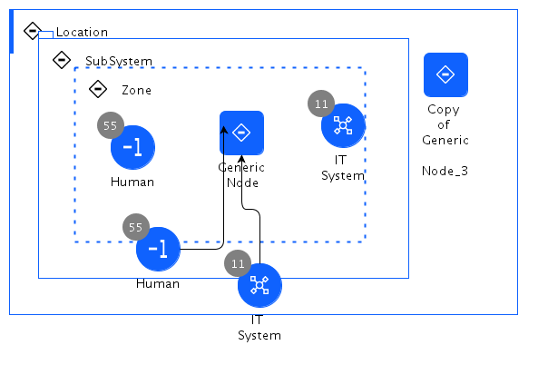

## Diagram

### Name

usage from itsv

### Description

### Reference(s)

[Expand all](#){ .md-button .same-line }

## Step List

    

11

<table>
    <caption></caption>
    <thead>
        <tr>
            <th></th>
            <th></th>
        </tr>
    </thead>
    <tr>
        <td> <strong>Name</strong> </td>
        <td>11</td>
    </tr>
    <tr>
        <td> <strong>Description</strong> </td>
        <td>yyyyyyyyyy</td>
    </tr>
</table>

    

55

<table>
    <caption></caption>
    <thead>
        <tr>
            <th></th>
            <th></th>
        </tr>
    </thead>
    <tr>
        <td> <strong>Name</strong> </td>
        <td>55</td>
    </tr>
    <tr>
        <td> <strong>Description</strong> </td>
        <td>gkhg</td>
    </tr>
</table>

    

